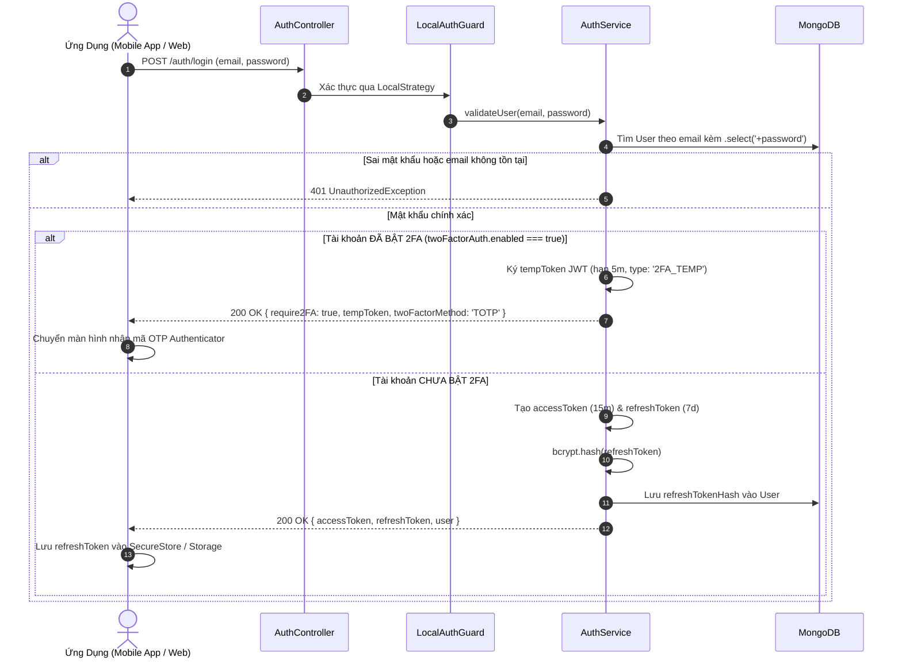
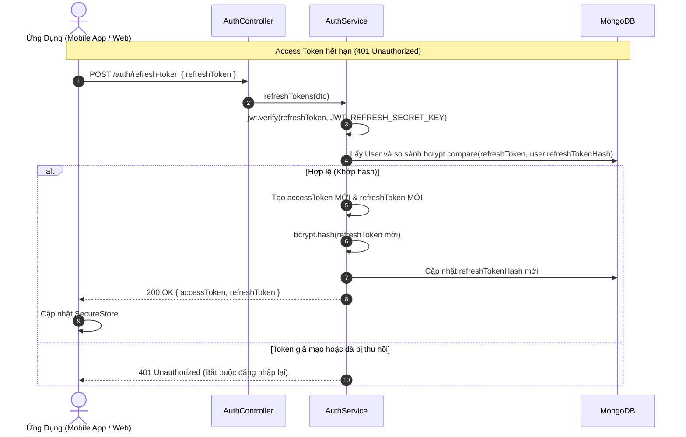
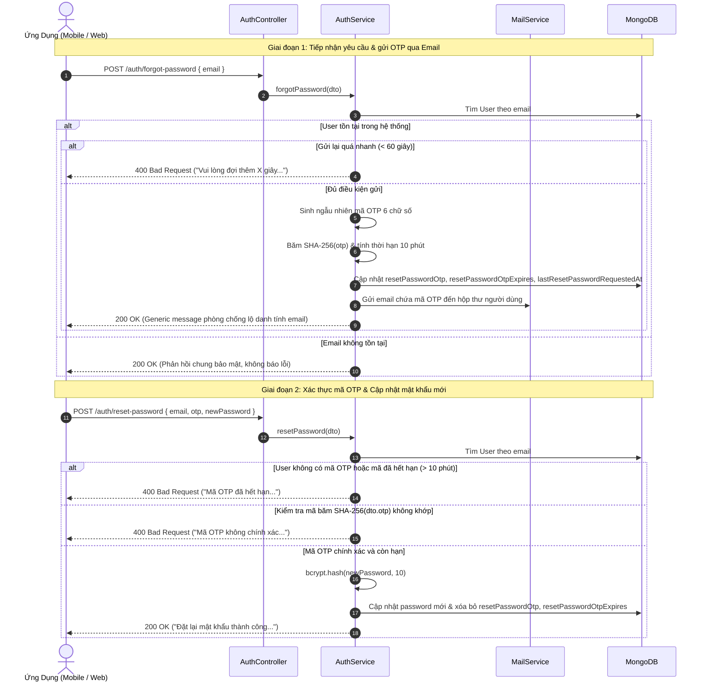
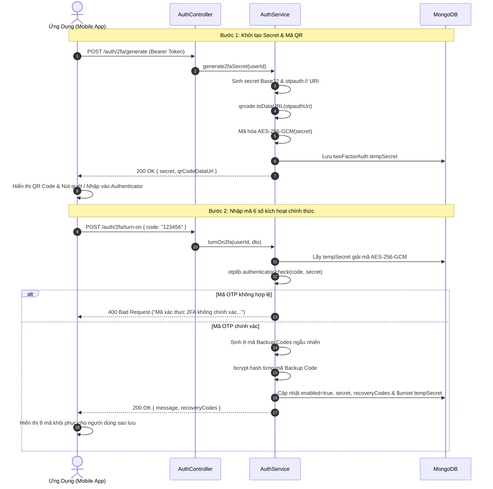
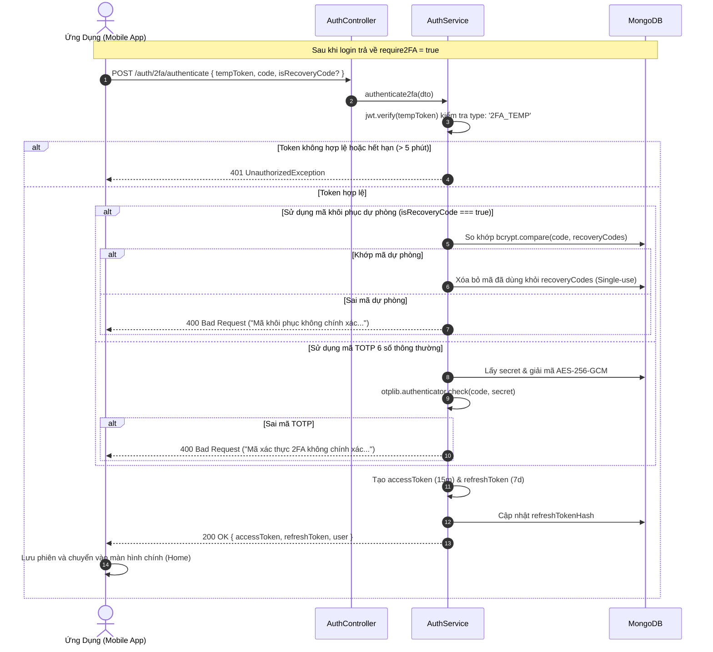

# Module Xác Thực Danh Tính (Auth Module)

## 1. Tổng Quan Module

Module `Auth` đóng vai trò là cổng xác thực trung tâm (Authentication Gateway) của hệ thống Smart Locker, đảm nhận việc:

- Đăng ký tài khoản Cư Dân (`RESIDENT`) gắn với Tòa Nhà và Căn Hộ.
- Đăng ký tài khoản Tài Xế Giao Hàng (`SHIPPER`) gắn với Đơn Vị Vận Chuyển.
- Đăng nhập xác thực bằng Email / Password qua `LocalStrategy` và cấp phát cặp mã `JWT Access Token` (15 phút) & `Refresh Token` (7 ngày).
- Tích hợp **Xác thực hai yếu tố (2FA TOTP - RFC 6238)** tương thích ứng dụng Google Authenticator, Microsoft Authenticator, Authy, Apple Passwords kèm cơ chế 8 mã khôi phục dự phòng (**Backup Codes**).
- Cấp lại Access Token mới qua cơ chế xoay vòng token (**Refresh Token Rotation**) tại endpoint `POST /auth/refresh-token`.
- Khôi phục mật khẩu an toàn qua mã OTP gửi về Email (`POST /auth/forgot-password`) và xác thực đổi mật khẩu mới (`POST /auth/reset-password`).
- Đăng xuất an toàn và thu hồi token tại `POST /auth/logout`.

---

## 2. Vai Trò Người Dùng (Roles) & Trạng Thái Duyệt (Approval Status)

### 2.1. Danh Sách Vai Trò (`Role`)

- `SYSTEM_ADMIN`: Quản trị viên cấp cao nhất của toàn bộ hệ thống Smart Locker.
- `BUILDING_ADMIN`: Ban Quản Lý của một tòa nhà chung cư cụ thể.
- `RESIDENT`: Cư dân sinh sống tại căn hộ của tòa nhà.
- `SHIPPER`: Tài xế giao hàng thuộc đơn vị vận chuyển (Shopee Xpress, GHTK, Viettel Post,...).

### 2.2. Trạng Thái Duyệt Hồ Sơ (`ApprovalStatus`)

- `PENDING`: Trạng thái mặc định khi Cư Dân vừa đăng ký tài khoản, chờ Ban Quản Lý tòa nhà xác minh.
- `ACTIVE`: Tài khoản đã được kích hoạt (mặc định với Shipper hoặc sau khi Cư Dân được BQL phê duyệt).
- `REJECTED`: Hồ sơ Cư Dân bị Ban Quản Lý từ chối do thông tin căn hộ không hợp lệ.

---

## 3. Cấu Trúc JWT Token Payload & Bảo Mật

### 3.1. Cấu Trúc Payload

Mã JWT Token được ký bằng thuật toán `HS256`, chứa thông tin định danh phiên làm việc:

```typescript
interface JwtPayload {
  sub: string; // Mã định danh MongoDB ObjectId của người dùng
  email: string; // Địa chỉ email đăng nhập
  role: Role; // Vai trò (SYSTEM_ADMIN | BUILDING_ADMIN | SHIPPER | RESIDENT)
  buildingId?: string; // Mã tòa nhà liên kết (dành cho BUILDING_ADMIN và RESIDENT)
  approvalStatus?: ApprovalStatus; // Trạng thái xét duyệt (PENDING | ACTIVE | REJECTED)
  iat?: number; // Thời điểm phát hành token
  exp?: number; // Thời điểm hết hạn token
}
```

### 3.2. Cơ Chế Bảo Mật Refresh Token

- **Mã băm bcrypt**: Server không bao giờ lưu Refresh Token nguyên bản vào Database mà luôn băm qua `bcrypt.hash(refreshToken, 10)` và lưu vào trường `refreshTokenHash` trong `UserSchema`.
- **Token Rotation (Xoay vòng Token)**: Mỗi lần client gọi `POST /auth/refresh-token`, server lập tức hủy token cũ và sinh ra cả cặp `accessToken` mới và `refreshToken` mới.

---

## 4. Sơ Đồ Quy Trình Nghiệp Vụ (Workflows)

### 4.1. Quy Trình Đăng Nhập & Phân Nhánh 2FA



---

### 4.2. Quy Trình Cấp Lại Token (Refresh Token Rotation)



---

### 4.3. Quy Trình Quên Mật Khẩu & Đặt Lại Mật Khẩu Qua Mã OTP



---

### 4.4. Quy Trình Khởi Tạo & Kích Hoạt Xác Thực Hai Bước (2FA TOTP)



---

### 4.5. Quy Trình Xác Thực Bước Hai Khi Đăng Nhập (2FA Authenticate)



---

## 5. Danh Sách Chi Tiết API (API Specifications)

### 5.1. Đăng Ký Tài Khoản Cư Dân

- **Endpoint**: `POST /auth/register/resident`
- **Quyền truy cập**: Public
- **Request Body**:

```json
{
  "name": "Nguyễn Văn A",
  "email": "nguyenvana@gmail.com",
  "phone": "0912345678",
  "password": "MatKhau123@",
  "buildingId": "6543210fedcba9876543210f",
  "apartment": "A1204"
}
```

- **Response Thành Công (201 Created)**:

```json
{
  "message": "Đăng ký tài khoản cư dân thành công",
  "user": {
    "_id": "67890fedcba9876543210fed",
    "name": "Nguyễn Văn A",
    "email": "nguyenvana@gmail.com",
    "phone": "0912345678",
    "role": "RESIDENT",
    "buildingId": "6543210fedcba9876543210f",
    "apartment": "A1204",
    "approvalStatus": "PENDING"
  }
}
```

---

### 5.2. Đăng Ký Tài Khoản Tài Xế Giao Hàng

- **Endpoint**: `POST /auth/register/shipper`
- **Quyền truy cập**: Public
- **Request Body**:

```json
{
  "name": "Trần Văn B",
  "email": "tranvanb.shipper@gmail.com",
  "phone": "0987654321",
  "password": "ShipperPass123@",
  "carrierName": "Shopee Xpress"
}
```

- **Response Thành Công (201 Created)**:

```json
{
  "message": "Đăng ký tài khoản tài xế thành công",
  "user": {
    "_id": "67890fedcba9876543210fee",
    "name": "Trần Văn B",
    "email": "tranvanb.shipper@gmail.com",
    "phone": "0987654321",
    "role": "SHIPPER",
    "approvalStatus": "ACTIVE",
    "carrierName": "Shopee Xpress"
  }
}
```

---

### 5.3. Đăng Nhập Hệ Thống

- **Endpoint**: `POST /auth/login`
- **Quyền truy cập**: Public
- **Request Body**:

```json
{
  "email": "nguyenvana@gmail.com",
  "password": "MatKhau123@"
}
```

- **Response Trường Hợp 1: Tài khoản chưa kích hoạt 2FA (200 OK)**:

```json
{
  "accessToken": "eyJhbGciOiJIUzI1NiIsInR5cCI6IkpXVCJ9...",
  "refreshToken": "eyJhbGciOiJIUzI1NiIsInR5cCI6IkpXVCJ9...",
  "user": {
    "id": "67890fedcba9876543210fed",
    "email": "nguyenvana@gmail.com",
    "name": "Nguyễn Văn A",
    "phone": "0912345678",
    "role": "RESIDENT",
    "buildingId": "6543210fedcba9876543210f",
    "buildingName": "Chung cư Green Park (Tòa A)",
    "apartment": "A1204",
    "approvalStatus": "ACTIVE",
    "avatar": "https://res.cloudinary.com/drngsxvb3/image/upload/v1788768429/user-image_kmnk9y.png",
    "twoFactorEnabled": false
  }
}
```

- **Response Trường Hợp 2: Tài khoản ĐÃ KÍCH HOẠT 2FA (200 OK)**:

```json
{
  "require2FA": true,
  "tempToken": "eyJhbGciOiJIUzI1NiIsInR5cCI6IkpXVCJ9... (hiệu lực 5 phút, type: 2FA_TEMP)",
  "twoFactorMethod": "TOTP"
}
```
> Khi nhận được phản hồi này, ứng dụng chuyển người dùng sang giao diện nhập mã 6 số từ Google Authenticator hoặc mã dự phòng Backup Code để gọi tiếp API `POST /auth/2fa/authenticate`.

---

### 5.4. Làm Mới Token (Refresh Token)

- **Endpoint**: `POST /auth/refresh-token`
- **Quyền truy cập**: Public
- **Request Body**:

```json
{
  "refreshToken": "eyJhbGciOiJIUzI1NiIsInR5cCI6IkpXVCJ9..."
}
```

- **Response (200 OK)**:

```json
{
  "accessToken": "eyJhbGciOiJIUzI1NiIsInR5cCI6IkpXVCJ9... (mới)",
  "refreshToken": "eyJhbGciOiJIUzI1NiIsInR5cCI6IkpXVCJ9... (mới)"
}
```

---

### 5.5. Đăng Xuất (Logout)

- **Endpoint**: `POST /auth/logout`
- **Quyền truy cập**: `Bearer Token` (`Authorization: Bearer <accessToken>`)
- **Response (200 OK)**:

```json
{
  "message": "Đăng xuất tài khoản thành công"
}
```

---

### 5.6. Yêu Cầu Quên Mật Khẩu (Forgot Password)

- **Endpoint**: `POST /auth/forgot-password`
- **Quyền truy cập**: Public
- **Request Body**:

```json
{
  "email": "nguyenvana@gmail.com"
}
```

- **Hành vi xử lý**:
  1. Kiểm tra địa chỉ email trong hệ thống.
  2. Nếu email tồn tại và khoảng cách giữa 2 lần yêu cầu $\ge$ 60 giây:
     - Sinh mã OTP 6 số ngẫu nhiên (`100000` – `999999`).
     - Băm mã OTP bằng `SHA-256` và lưu vào `resetPasswordOtp`.
     - Thiết lập thời gian hết hạn sau 10 phút (`resetPasswordOtpExpires`).
     - Gửi email chứa mã OTP đến địa chỉ email của người dùng.
  3. Nếu yêu cầu gửi lại trong vòng 60 giây, trả về lỗi `400 Bad Request`.
  4. Nếu email không tồn tại trong hệ thống, vẫn trả về phản hồi thành công `200 OK` giống hệt (Cơ chế chống lộ danh tính người dùng - Email Enumeration Protection).

- **Response Thành Công (200 OK)**:

```json
{
  "statusCode": 200,
  "message": "Nếu email tồn tại trên hệ thống, mã xác thực OTP đã được gửi đến hộp thư của bạn."
}
```

- **Response Lỗi Giới Hạn Tần Suất (400 Bad Request)**:

```json
{
  "statusCode": 400,
  "message": "Vui lòng đợi thêm 47 giây trước khi gửi lại yêu cầu",
  "error": "Bad Request"
}
```

---

### 5.7. Xác Thực OTP & Đặt Lại Mật Khẩu Mới (Reset Password)

- **Endpoint**: `POST /auth/reset-password`
- **Quyền truy cập**: Public
- **Request Body**:

```json
{
  "email": "nguyenvana@gmail.com",
  "otp": "849201",
  "newPassword": "NewSecurePassword@123"
}
```

- **Ràng buộc dữ liệu (Validation Rules)**:
  - `email`: Bắt buộc, đúng định dạng email.
  - `otp`: Bắt buộc, chuỗi số đúng 6 ký tự.
  - `newPassword`: Bắt buộc, độ dài tối thiểu 8 ký tự (`@MinLength(8)`).

- **Hành vi xử lý**:
  1. Tìm tài khoản người dùng theo email.
  2. Kiểm tra mã OTP: Bắt buộc tồn tại và thời điểm hiện tại chưa vượt quá `resetPasswordOtpExpires`.
  3. Băm mã OTP gửi lên bằng `SHA-256` và so sánh với `resetPasswordOtp` trong CSDL.
  4. Băm mật khẩu mới bằng `bcrypt.hash(newPassword, 10)`.
  5. Cập nhật `password` mới, đồng thời xóa bỏ hoàn toàn `resetPasswordOtp` và `resetPasswordOtpExpires` (ngăn chặn tái sử dụng mã).

- **Response Thành Công (200 OK)**:

```json
{
  "statusCode": 200,
  "message": "Đặt lại mật khẩu thành công. Bạn đã có thể đăng nhập bằng mật khẩu mới."
}
```

- **Response Lỗi (400 Bad Request)**:
  - Khi OTP sai: `{"statusCode": 400, "message": "Mã OTP không chính xác. Vui lòng kiểm tra lại"}`
  - Khi OTP hết hạn: `{"statusCode": 400, "message": "Mã OTP đã hết hạn. Vui lòng gửi lại yêu cầu mới"}`

---

### 5.8. Khởi Tạo Khóa Bí Mật 2FA TOTP & Mã QR

- **Endpoint**: `POST /auth/2fa/generate`
- **Quyền truy cập**: `Bearer Token` (`Authorization: Bearer <accessToken>`)
- **Mục đích**: Bắt đầu quy trình cài đặt ứng dụng xác thực hai yếu tố (Google Authenticator, Authy, Apple Passwords).
- **Hành vi xử lý**:
  1. Kiểm tra tài khoản người dùng, nếu đã bật 2FA thì từ chối (`400 Bad Request`).
  2. Dùng thư viện `otplib` sinh chuỗi khóa bí mật Base32 ngẫu nhiên (`secret`).
  3. Sinh URI cấu hình: `otpauth://totp/SmartLocker:{email}?secret={secret}&issuer=SmartLocker`.
  4. Dùng thư viện `qrcode` sinh ảnh mã QR Data URL Base64 (`data:image/png;base64,...`).
  5. Mã hóa đối xứng `secret` bằng thuật toán `AES-256-GCM` và lưu tạm thời vào `twoFactorAuth.tempSecret`.
- **Response Thành Công (200 OK)**:

```json
{
  "secret": "JBSWY3DPEHPK3PXP",
  "qrCodeDataUrl": "data:image/png;base64,iVBORw0KGgoAAAANSUhEUgAA..."
}
```

---

### 5.9. Kích Hoạt Xác Thực Hai Bước (Turn On 2FA)

- **Endpoint**: `POST /auth/2fa/turn-on`
- **Quyền truy cập**: `Bearer Token` (`Authorization: Bearer <accessToken>`)
- **Request Body**:

```json
{
  "code": "582910"
}
```

- **Hành vi xử lý**:
  1. Lấy `twoFactorAuth.tempSecret` của người dùng và giải mã bằng `AES-256-GCM`.
  2. Xác minh mã 6 số gửi lên bằng `otplib.authenticator.check(code, plainSecret)` với dung sai thời gian `window: 1` ($\pm 30$ giây).
  3. Nếu mã hợp lệ:
     - Sinh ngẫu nhiên **8 mã khôi phục dự phòng** (Backup Codes), mỗi mã 10 ký tự Hex viết hoa (ví dụ: `8F3A2B1C9D`).
     - Băm bảo mật từng mã Backup Code bằng thuật toán một chiều `bcrypt.hash(code, 10)`.
     - Mã hóa `plainSecret` bằng `AES-256-GCM` và cập nhật chính thức vào `twoFactorAuth.secret`.
     - Cập nhật `twoFactorAuth.enabled = true`, lưu danh sách mã băm vào `twoFactorAuth.recoveryCodes`, đồng thời xóa bỏ `$unset: tempSecret`.
- **Response Thành Công (200 OK)**:

```json
{
  "message": "Kích hoạt xác thực hai bước thành công",
  "recoveryCodes": [
    "A1B2C3D4E5",
    "F6G7H8I9J0",
    "K1L2M3N4O5",
    "P6Q7R8S9T0",
    "U1V2W3X4Y5",
    "Z6A7B8C9D0",
    "E1F2G3H4I5",
    "J6K7L8M9N0"
  ]
}
```
> **Lưu ý quan trọng**: Danh sách `recoveryCodes` dạng văn bản thô chỉ được trả về **duy nhất một lần** tại thời điểm kích hoạt thành công để người dùng sao lưu an toàn.

---

### 5.10. Vô Hiệu Hóa Xác Thực Hai Bước (Turn Off 2FA)

- **Endpoint**: `POST /auth/2fa/turn-off`
- **Quyền truy cập**: `Bearer Token` (`Authorization: Bearer <accessToken>`)
- **Request Body**:

```json
{
  "currentPassword": "MySecurePassword@123"
}
```

- **Hành vi xử lý**:
  1. Lấy thông tin tài khoản kèm trường mật khẩu `.select('+password')`.
  2. Xác minh mật khẩu hiện tại bằng `bcrypt.compare(currentPassword, user.password)`.
  3. Nếu mật khẩu chính xác, cập nhật `twoFactorAuth.enabled = false`, gán `twoFactorAuth.recoveryCodes = []` và xóa bỏ (`$unset`) trường `secret` cùng `tempSecret`.
- **Response Thành Công (200 OK)**:

```json
{
  "message": "Hủy kích hoạt xác thực hai bước thành công"
}
```

---

### 5.11. Xác Thực Bước Hai Hoàn Tất Đăng Nhập (2FA Authenticate)

- **Endpoint**: `POST /auth/2fa/authenticate`
- **Quyền truy cập**: Public
- **Request Body (Sử dụng mã OTP Authenticator)**:

```json
{
  "tempToken": "eyJhbGciOiJIUzI1NiIsInR5cCI6IkpXVCJ9... (nhận từ bước login)",
  "code": "482019"
}
```

- **Request Body (Sử dụng mã khôi phục dự phòng)**:

```json
{
  "tempToken": "eyJhbGciOiJIUzI1NiIsInR5cCI6IkpXVCJ9...",
  "code": "A1B2C3D4E5",
  "isRecoveryCode": true
}
```

- **Hành vi xử lý**:
  1. Giải mã `tempToken` qua `jwt.verifyAsync`, kiểm tra thời hạn (tối đa 5 phút) và xác nhận payload có `type === '2FA_TEMP'`.
  2. Nạp dữ liệu người dùng kèm `twoFactorAuth.secret` và `twoFactorAuth.recoveryCodes`.
  3. **Nếu sử dụng mã khôi phục (`isRecoveryCode === true` hoặc `isBackupCode === true`)**:
     - Duyệt danh sách mã băm trong `recoveryCodes` và so khớp với `bcrypt.compare(code, hashedCode)`.
     - Nếu khớp: Tiêu hủy mã đó khỏi danh sách (`consumeRecoveryCode`) để ngăn chặn việc tái sử dụng.
     - Nếu không khớp mã nào: Báo lỗi `400 Bad Request ("Mã khôi phục không chính xác hoặc đã từng được sử dụng")`.
  4. **Nếu sử dụng mã TOTP 6 số thông thường**:
     - Giải mã `twoFactorAuth.secret` bằng `AES-256-GCM`.
     - Xác thực mã 6 số qua `otplib.authenticator.check(code, secret)` với dung sai `window: 1`.
  5. Cấp phát cặp mã JWT chính thức (`accessToken` 15 phút, `refreshToken` 7 ngày) và lưu mã băm `refreshTokenHash`.
- **Response Thành Công (200 OK)**:

```json
{
  "accessToken": "eyJhbGciOiJIUzI1NiIsInR5cCI6IkpXVCJ9...",
  "refreshToken": "eyJhbGciOiJIUzI1NiIsInR5cCI6IkpXVCJ9...",
  "user": {
    "id": "67890fedcba9876543210fed",
    "email": "nguyenvana@gmail.com",
    "name": "Nguyễn Văn A",
    "phone": "0912345678",
    "role": "RESIDENT",
    "buildingId": "6543210fedcba9876543210f",
    "buildingName": "Chung cư Green Park (Tòa A)",
    "apartment": "A1204",
    "approvalStatus": "ACTIVE",
    "avatar": "https://res.cloudinary.com/drngsxvb3/image/upload/v1788768429/user-image_kmnk9y.png",
    "twoFactorEnabled": true
  }
}
```

---

## 6. Tiêu Chuẩn Bảo Mật & Best Practices

1. **Phòng chống dò quét tài khoản (Email Enumeration Prevention)**:
   - Endpoint `POST /auth/forgot-password` luôn trả về cùng một thông điệp phản hồi `200 OK` dù email có tồn tại hay không, ngăn chặn kẻ tấn công lợi dụng endpoint để rà quét danh sách email người dùng trong hệ thống.
2. **Bảo mật mã OTP một chiều (SHA-256 Hashing)**:
   - Tuyệt đối không lưu trữ mã OTP dạng văn bản thuần trong CSDL. Mã OTP chỉ được băm `SHA-256` trước khi lưu vào `resetPasswordOtp`.
3. **Mã OTP dùng một lần (Single-Use OTP) & Hạn dùng chặt chẽ**:
   - Mã OTP tự động hết hiệu lực sau 10 phút.
   - Ngay sau khi đổi mật khẩu thành công, mã lập tức bị vô hiệu hóa (`$unset`) để ngăn chặn tấn công phát lại (Replay Attacks).
4. **Giới hạn tần suất gửi mã (Rate Limiting & Cooldown)**:
   - Áp dụng thời gian chờ (cooldown) bắt buộc 60 giây giữa các lần yêu cầu gửi OTP dựa trên trường `lastResetPasswordRequestedAt`, ngăn chặn hành vi spam email hoặc cạn kiệt hạn ngạch SMTP.
5. **Đồng bộ chính sách mật khẩu (Password Policy)**:
   - Cả hai luồng Đăng ký (`register`) và Đặt lại mật khẩu (`reset-password`) đều áp dụng chính sách mật khẩu tối thiểu 8 ký tự ở server (`@MinLength(8)`) và kiểm tra độ an toàn thời gian thực (`PasswordStrengthIndicator`) ở phía client.
6. **Bảo mật Xác thực Hai Yếu Tố (2FA TOTP - RFC 6238)**:
   - **Mã hóa đối xứng dữ liệu tĩnh (Encryption at Rest)**: Khóa bí mật TOTP (`secret`) không bao giờ lưu trữ dạng plain-text mà luôn được mã hóa đối xứng bằng thuật toán `AES-256-GCM` trước khi lưu vào MongoDB (`iv:cipherText:authTag`). Khóa mã hóa `TWO_FACTOR_ENCRYPTION_KEY` được bảo vệ độc lập qua biến môi trường.
   - **Dung sai thời gian (Time-drift Tolerance)**: Cấu hình `window: 1` cho phép lệch $\pm 30$ giây giữa đồng hồ điện thoại người dùng và máy chủ, hạn chế rủi ro trễ mạng hoặc lệch giờ thiết bị.
   - **Mã khôi phục dùng một lần (Single-use Backup Codes)**: 8 mã khôi phục được băm một chiều bằng `bcrypt (10 rounds)` và lưu trong CSDL. Khi đăng nhập thành công bằng bất kỳ mã dự phòng nào, hệ thống tự động loại bỏ mã đó khỏi danh sách để ngăn chặn tái sử dụng.
   - **Phiên đăng nhập tạm thời bảo mật (`tempToken`)**: Khi tài khoản bật 2FA đăng nhập mật khẩu đúng, server chỉ phát hành token tạm thời có thời hạn ngắn (5 phút) và giới hạn quyền (`type: '2FA_TEMP'`). Token này không thể sử dụng để gọi các API nghiệp vụ thông thường mà chỉ có tác dụng hoàn tất bước xác thực thứ hai.
