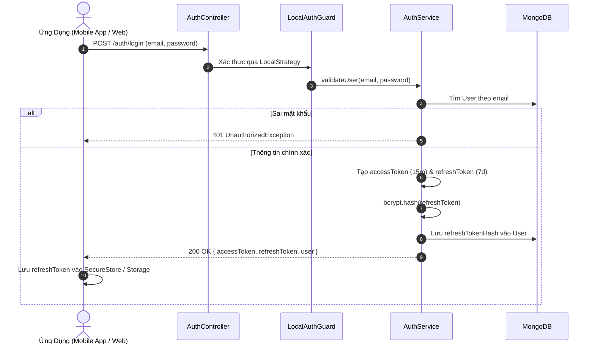
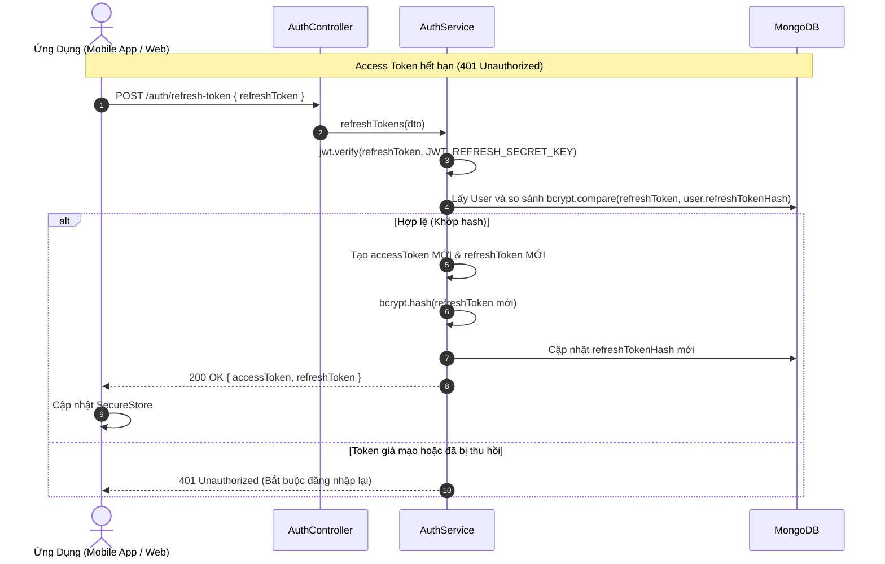

# Module Xác Thực Danh Tính (Auth Module)

## 1. Tổng Quan Module

Module `Auth` đóng vai trò là cổng xác thực trung tâm (Authentication Gateway) của hệ thống Smart Locker, đảm nhận việc:

- Đăng ký tài khoản Cư Dân (`RESIDENT`) gắn với Tòa Nhà và Căn Hộ.
- Đăng ký tài khoản Tài Xế Giao Hàng (`SHIPPER`) gắn với Đơn Vị Vận Chuyển.
- Đăng nhập xác thực bằng Email / Password qua `LocalStrategy` và cấp phát cặp mã `JWT Access Token` (15 phút) & `Refresh Token` (7 ngày).
- Cấp lại Access Token mới qua cơ chế xoay vòng token (**Refresh Token Rotation**) tại endpoint `POST /auth/refresh-token`.
- Đăng xuất an toàn và thu hồi token tại `POST /auth/logout`.

---

## 2. Vai Trò Người Dùng (Roles) & Trạng Thái Duyệt (Approval Status)

### 2.1. Danh Sách Vai Trò (`Role`)

- `SYSTEM_ADMIN`: Quản trị viên cấp cao nhất của toàn bộ hệ thống Smart Locker.
- `BUILDING_ADMIN`: Ban Quản Lý của một tòa nhà chung cư cụ thể.
- `RESIDENT`: Cư dân sinh sống tại căn hộ của tòa nhà.
- `SHIPPER`: Tài xế giao hàng thuộc đơn vị vận chuyển (Shopee Xpress, GHTK, Viettel Post,...).

### 2.2. Trạng Thái Duyệt Hồ Sơ (`ApprovalStatus`)

- `PENDING`: Trạng thái mặc định khi Cư Dân vừa đăng ký tài khoản, chờ Ban Quản Lý tòa nhà xác minh.
- `ACTIVE`: Tài khoản đã được kích hoạt (mặc định với Shipper hoặc sau khi Cư Dân được BQL phê duyệt).
- `REJECTED`: Hồ sơ Cư Dân bị Ban Quản Lý từ chối do thông tin căn hộ không hợp lệ.

---

## 3. Cấu Trúc JWT Token Payload & Bảo Mật

### 3.1. Cấu Trúc Payload

Mã JWT Token được ký bằng thuật toán `HS256`, chứa thông tin định danh phiên làm việc:

```typescript
interface JwtPayload {
  sub: string; // Mã định danh MongoDB ObjectId của người dùng
  email: string; // Địa chỉ email đăng nhập
  role: Role; // Vai trò (SYSTEM_ADMIN | BUILDING_ADMIN | SHIPPER | RESIDENT)
  buildingId?: string; // Mã tòa nhà liên kết (dành cho BUILDING_ADMIN và RESIDENT)
  approvalStatus?: ApprovalStatus; // Trạng thái xét duyệt (PENDING | ACTIVE | REJECTED)
  iat?: number; // Thời điểm phát hành token
  exp?: number; // Thời điểm hết hạn token
}
```

### 3.2. Cơ Chế Bảo Mật Refresh Token

- **Mã băm bcrypt**: Server không bao giờ lưu Refresh Token nguyên bản vào Database mà luôn băm qua `bcrypt.hash(refreshToken, 10)` và lưu vào trường `refreshTokenHash` trong `UserSchema`.
- **Token Rotation (Xoay vòng Token)**: Mỗi lần client gọi `POST /auth/refresh-token`, server lập tức hủy token cũ và sinh ra cả cặp `accessToken` mới và `refreshToken` mới.

---

## 4. Sơ Đồ Quy Trình Nghiệp Vụ (Workflows)

### 4.1. Quy Trình Đăng Nhập & Cấp Cặp Token



---

### 4.2. Quy Trình Cấp Lại Token (Refresh Token Rotation)



---

## 5. Danh Sách Chi Tiết API (API Specifications)

### 5.1. Đăng Ký Tài Khoản Cư Dân

- **Endpoint**: `POST /auth/register/resident`
- **Quyền truy cập**: Public
- **Request Body**:

```json
{
  "name": "Nguyễn Văn A",
  "email": "nguyenvana@gmail.com",
  "phone": "0912345678",
  "password": "MatKhau123@",
  "buildingId": "6543210fedcba9876543210f",
  "apartment": "A1204"
}
```

- **Response Thành Công (201 Created)**:

```json
{
  "message": "Đăng ký tài khoản cư dân thành công",
  "user": {
    "_id": "67890fedcba9876543210fed",
    "name": "Nguyễn Văn A",
    "email": "nguyenvana@gmail.com",
    "phone": "0912345678",
    "role": "RESIDENT",
    "buildingId": "6543210fedcba9876543210f",
    "apartment": "A1204",
    "approvalStatus": "PENDING"
  }
}
```

---

### 5.2. Đăng Ký Tài Khoản Tài Xế Giao Hàng

- **Endpoint**: `POST /auth/register/shipper`
- **Quyền truy cập**: Public
- **Request Body**:

```json
{
  "name": "Trần Văn B",
  "email": "tranvanb.shipper@gmail.com",
  "phone": "0987654321",
  "password": "ShipperPass123@",
  "carrierName": "Shopee Xpress"
}
```

- **Response Thành Công (201 Created)**:

```json
{
  "message": "Đăng ký tài khoản tài xế thành công",
  "user": {
    "_id": "67890fedcba9876543210fee",
    "name": "Trần Văn B",
    "email": "tranvanb.shipper@gmail.com",
    "phone": "0987654321",
    "role": "SHIPPER",
    "approvalStatus": "ACTIVE",
    "carrierName": "Shopee Xpress"
  }
}
```

---

### 5.3. Đăng Nhập Hệ Thống

- **Endpoint**: `POST /auth/login`
- **Quyền truy cập**: Public
- **Request Body**:

```json
{
  "email": "nguyenvana@gmail.com",
  "password": "MatKhau123@"
}
```

- **Response (200 OK)**:

```json
{
  "accessToken": "eyJhbGciOiJIUzI1NiIsInR5cCI6IkpXVCJ9...",
  "refreshToken": "eyJhbGciOiJIUzI1NiIsInR5cCI6IkpXVCJ9...",
  "user": {
    "id": "67890fedcba9876543210fed",
    "email": "nguyenvana@gmail.com",
    "name": "Nguyễn Văn A",
    "phone": "0912345678",
    "role": "RESIDENT",
    "buildingId": "6543210fedcba9876543210f",
    "apartment": "A1204",
    "approvalStatus": "PENDING"
  }
}
```

---

### 5.4. Làm Mới Token (Refresh Token)

- **Endpoint**: `POST /auth/refresh-token`
- **Quyền truy cập**: Public
- **Request Body**:

```json
{
  "refreshToken": "eyJhbGciOiJIUzI1NiIsInR5cCI6IkpXVCJ9..."
}
```

- **Response (200 OK)**:

```json
{
  "accessToken": "eyJhbGciOiJIUzI1NiIsInR5cCI6IkpXVCJ9... (mới)",
  "refreshToken": "eyJhbGciOiJIUzI1NiIsInR5cCI6IkpXVCJ9... (mới)"
}
```

---

### 5.5. Đăng Xuất (Logout)

- **Endpoint**: `POST /auth/logout`
- **Quyền truy cập**: `Bearer Token` (`Authorization: Bearer <accessToken>`)
- **Response (200 OK)**:

```json
{
  "message": "Đăng xuất tài khoản thành công"
}
```
