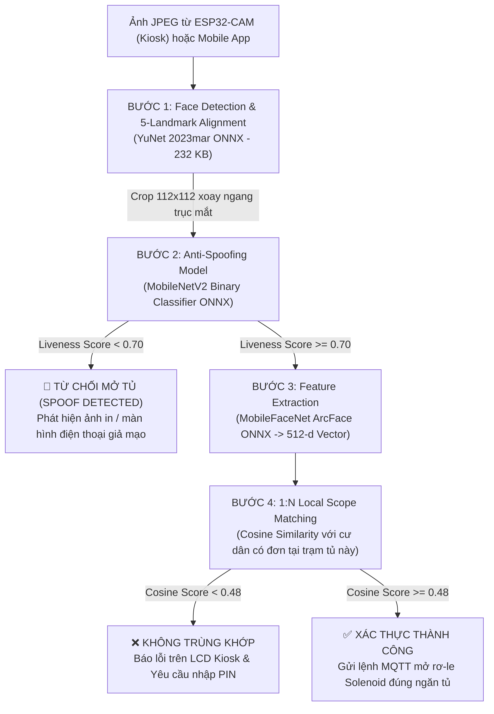
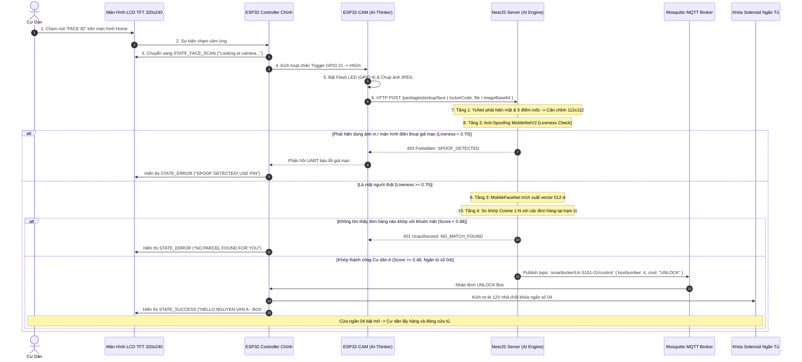

# Đặc Tả Kỹ Thuật Hệ Thống Nhận Diện Khuôn Mặt AI (AI Face Verification & Anti-Spoofing Specification)

> **Dự án:** Smart Locker System (Hệ thống Tủ đồ Thông minh)  
> **Module:** AI Biometric Verification (Xác thực Sinh trắc học Khuôn mặt Kiosk & Mobile)  
> **Phần cứng:** ESP32 Controller chính + ESP32-CAM (OV2640) + Màn hình cảm ứng LCD TFT 320x240  
> **Tài liệu tham chiếu:** `delivery_retrieval_system.md`, `smart_locker_master_plan.md`, `smart-locker-iot/`  
> **Phiên bản:** 2.3.0 — Tích hợp YuNet 2023mar Landmark Alignment, MobileNetV2 Anti-Spoofing & ArcFace 512-d

---

## 1. TỔNG QUAN & MỤC TIÊU HỆ THỐNG

### 1.1. Mục Tiêu Nghiệp Vụ
1. **Lấy hàng rảnh tay không cần điện thoại (Phone-less Kiosk Touchless Pickup):** Cư dân đi tập thể dục, dắt thú cưng, để quên điện thoại ở nhà hoặc điện thoại hết pin vẫn có thể lấy hàng bằng cách chạm chọn "FACE ID" trên màn hình LCD trạm tủ và nhìn vào camera ESP32-CAM.
2. **Linh hoạt đa phương thức (Dual-Channel Verification):** Hỗ trợ nhận diện khuôn mặt qua cả 2 kênh:
   - **Kênh Kiosk vật lý:** Camera nhúng ESP32-CAM tại trạm tủ kết hợp màn hình LCD cảm ứng.
   - **Kênh Di động (Mobile App):** Camera trước của smartphone thông qua ứng dụng React Native.
3. **Bảo vệ bưu phẩm giá trị cao (High-Value Parcels KYC):** Đối với các bưu kiện đắt tiền, hệ thống bắt buộc xác thực sinh trắc học để ký nhận điện tử và lưu vết bằng chứng đối soát (`Audit Log`), loại bỏ 100% rủi ro chối bỏ nhận hàng.
4. **Phòng chống gian lận đa dạng (Anti-Spoofing):** Phát hiện và từ chối các hành vi dùng ảnh in màu, video quay lại từ màn hình điện thoại/tablet (Replay Attack) hoặc mặt nạ silicon để qua mặt hệ thống.
5. **Thu thập mẫu khuôn mặt chuẩn & Hỗ trợ eKYC (Mobile Biometric Enrollment & eKYC):** Cư dân đăng ký khuôn mặt mẫu đối chứng (Ground Truth) thông qua camera selfie của điện thoại với cơ chế linh hoạt (cho phép bỏ qua lúc tạo tài khoản và thiết lập sau trong cài đặt bảo mật), đồng thời hỗ trợ Ban Quản Lý (BQL) xem xét ảnh chân dung thực tế khi duyệt cư dân vào tòa nhà.
6. **Điểm nhấn học thuật đồ án (Academic AIoT Value):** Kết hợp trọn vẹn 3 trụ cột: **IoT nhúng (ESP32 + ESP32-CAM + LCD)**, **Điện toán đám mây (NestJS + MQTT)** và **Trí tuệ nhân tạo (Mô hình Anti-Spoofing MobileNetV2 + YuNet Landmark Alignment + MobileFaceNet ArcFace 512-d)** với độ trễ phản hồi toàn trình dưới 1.0 giây và tiết kiệm tối đa bộ nhớ RAM.

---

## 2. KIẾN TRÚC MÔ HÌNH AI (AI PIPELINE ARCHITECTURE)

Pipeline nhận diện khuôn mặt gồm **4 tầng xử lý liên hoàn (Sequential Pipeline)** chạy trên Server NestJS thông qua `onnxruntime-node`:



### Danh Sách Trọng Số Mô Hình Trong Bộ Nhớ RAM (`server/src/ai/models/`):
| STT | Tên File Mô Hình | Kiến Trúc Mạng | Dung Lượng | Chức Năng Chính |
| :--- | :--- | :--- | :--- | :--- |
| 1 | `face_detection_yunet_2023mar.onnx` | YuNet (Libfacedetection) | 232 KB | Phát hiện khuôn mặt và 5 điểm mốc (Landmarks) |
| 2 | `anti_spoofing_mobilenetv2.onnx` | MobileNetV2 Binary | 16.0 MB | Kiểm tra độ sống/chân thực, chống tấn công màn hình/ảnh in |
| 3 | `mobilefacenet_arcface.onnx` | MobileFaceNet ArcFace | 13.6 MB | Trích xuất vector đặc trưng khuôn mặt 512 chiều |

*(Các file mô hình cũ không cần thiết như `version-RFB-320.onnx` và `anti_spoofing_model.pt` đã được loại bỏ hoàn toàn để tiết kiệm ~18.2 MB bộ nhớ RAM).*

---

## 3. CHI TIẾT KỸ THUẬT TỪNG TẦNG AI

### 3.1. Tầng 1: Phát Hiện & Căn Chỉnh Trục Mắt (Face Detection & 5-Landmark Alignment)
* **Nhiệm vụ:** Phát hiện vùng mặt, trích xuất chính xác 5 điểm mốc đặc trưng, xoay ảnh để trục 2 mắt nằm ngang tuyệt đối và co giãn về kích thước chuẩn $112 \times 112$.
* **Mô hình:** **YuNet 2023mar (`face_detection_yunet_2023mar.onnx`)** với cấu trúc FPN nhẹ:
  - 3 tầng Feature Map Strides: $S \in \{8, 16, 32\}$.
  - 4 đầu ra (Heads): `cls_S` (phân loại mặt), `obj_S` (độ tin cậy objectness), `bbox_S` (hộp giới hạn), `kps_S` (5 tọa độ điểm mốc).
  - Điểm số tự tin: $\text{score} = \sqrt{\text{clamp}(\text{cls}, 0, 1) \times \text{clamp}(\text{obj}, 0, 1)}$.
* **5 Điểm mốc (Facial Landmarks):**
  1. Mắt phải của người ($n=0$, bên trái ảnh)
  2. Mắt trái của người ($n=1$, bên phải ảnh)
  3. Chóp mũi ($n=2$)
  4. Khóe miệng phải ($n=3$)
  5. Khóe miệng trái ($n=4$)
* **Kỹ thuật Căn Chỉnh Hình Học (Affine Similarity Alignment):**
  - Góc nghiêng trục mắt: $\theta = \operatorname{atan2}(\Delta y, \Delta x) = \operatorname{atan2}(y_{\text{left}} - y_{\text{right}}, x_{\text{left}} - x_{\text{right}})$.
  - Xoay ảnh góc $-\theta$ quanh tâm ảnh để 2 mắt nằm ngang tuyệt đối.
  - Tỷ lệ co giãn: Dựa theo khoảng cách chuẩn của ArcFace trong ảnh $112 \times 112$ là $d_{\text{target}} \approx 35.2372\text{px}$.
  - Tọa độ tâm mắt chuẩn trong ảnh $112 \times 112$: $(x_{\text{center}}, y_{\text{center}}) = (55.91\text{px}, 51.60\text{px})$.
  - Cắt vùng mặt và đệm biên an toàn (Black Padding) tránh lỗi tràn viền khi mặt sát mép khung hình.

---

### 3.2. Tầng 2: Kiểm Tra Mặt Thật / Mặt Giả (Anti-Spoofing)
* **Bản chất bài toán:** Phân loại nhị phân (Binary Classification: `0 = Spoof/Fake`, `1 = Real/Live`).
* **Kiến trúc mạng:** **MobileNetV2** (Định dạng ONNX, inference ~20ms trên CPU).
* **Đầu vào:** Ảnh khuôn mặt đã tiền xử lý kích thước $224 \times 224$ (chuẩn hóa ImageNet Mean `[0.485, 0.456, 0.406]`, Std `[0.229, 0.224, 0.225]`).
* **Đầu ra:** Điểm tin cậy `livenessScore` $\in [0, 1]$.
* **Ngưỡng quyết định:** $\text{Liveness Score} \ge 0.70$ được xác định là người thật.

---

### 3.3. Tầng 3: Trích Xuất Vector Đặc Trưng (Face Embedding)
* **Mô hình:** **MobileFaceNet ArcFace (`mobilefacenet_arcface.onnx`)**.
* **Đầu vào:** Ảnh $112 \times 112 \times 3$ đã qua bước căn chỉnh 5 điểm mốc của YuNet, chuẩn hóa pixel về $[-1, 1]$ qua công thức:
  $$\text{pixel}_{\text{norm}} = \frac{\text{pixel} - 127.5}{128.0}$$
* **Đầu ra:** Vector đặc trưng không gian **512 chiều (512-dimensional float vector)**.
* **Chuẩn hóa L2 Norm:**
  $$\mathbf{e}_{\text{norm}} = \frac{\mathbf{e}}{\|\mathbf{e}\|_2} = \frac{\mathbf{e}}{\sqrt{\sum_{i=1}^{512} e_i^2}}$$

---

### 3.4. Tầng 4: Thuật Toán So Khớp Phạm Vi Cục Bộ (1:N Local Scope Matching)
Để loại bỏ nguy cơ nhận diện nhầm (False Acceptance) khi hệ thống có hàng ngàn cư dân, hệ thống áp dụng cơ chế **Phạm vi Cục bộ (Local Scope)**:
1. Khi nhận được ảnh từ trạm tủ `lockerCode` (ví dụ `LK-S101-01`), server chỉ truy vấn danh sách các bưu phẩm đang nằm tại trạm tủ này:
   ```typescript
   const activePackages = await packageModel.find({
     lockerId: locker._id,
     status: PackageStatus.WAITING_FOR_PICKUP,
   }).populate({
     path: 'residentId',
     select: '+faceAuth.embedding faceAuth.enabled name phone apartment avatar',
   });
   ```
2. Hệ thống tính độ tương đồng Cosine giữa vector khuôn mặt camera $\mathbf{u}$ với $N$ cư dân đang có đơn hàng chờ nhận ($N \approx 5 - 20$ người):
   $$\text{Cosine Similarity}(\mathbf{u}, \mathbf{v}_k) = \mathbf{u} \cdot \mathbf{v}_k = \sum_{i=1}^{512} u_i \cdot v_{k,i}$$
3. **Ngưỡng chấp nhận trùng khớp:** $\text{Score} \ge 0.48$ (48.0% đối với không gian vector ArcFace 512 chiều).
   - Với quy trình căn chỉnh Landmark mới, ảnh thực tế cùng một người đạt độ tương đồng từ **`71% - 85%`**, vượt xa ngưỡng an toàn $0.48$.

---

## 4. THIẾT KẾ CƠ SỞ DỮ LIỆU & SCHEMA DATABASE (MONGODB)

### 4.1. Cập Nhật Thực Thể `User` (`users` collection)
Lưu trữ vector sinh trắc học 512 chiều và trạng thái Face ID trong trường lồng nhau `faceAuth`:
```typescript
// server/src/users/schemas/user.schema.ts
@Prop({
  type: {
    enabled: { type: Boolean, default: false },
    embedding: { type: [Number], select: false, default: [] }, // Vector 512 số float, ẩn khỏi query thông thường
    enrolledAt: { type: Date, default: null },
  },
  _id: false,
  default: () => ({ enabled: false, embedding: [] }),
})
faceAuth: {
  enabled: boolean;
  embedding?: number[];
  enrolledAt?: Date;
};
```

---

## 5. QUY TRÌNH NGHIỆP VỤ & SEQUENCE DIAGRAM KIOSK FACE ID



---

## 6. ĐẶC TẢ API GIAO TIẾP HỆ THỐNG (API CONTRACT)

### 6.1. Nhận Diện Khuôn Mặt Mở Khóa Tủ Tại Kiosk (`POST /packages/pickup/face`)
Dành riêng cho camera Kiosk trạm tủ gửi ảnh nhận diện mở khóa ngăn tủ.

#### Request Headers:
```http
Content-Type: multipart/form-data hoặc application/json
x-api-key: <LOCKER_SECRET_KEY> (hoặc Authorization: Bearer <TOKEN>)
```

#### Request Body (Multipart hoặc JSON):
```json
{
  "lockerCode": "LK-S101-01",
  "imageBase64": "data:image/jpeg;base64,/9j/4AAQSkZJRg..." 
}
```

#### Response Thành Công (`200 OK`):
```json
{
  "message": "Xác thực khuôn mặt thành công. Cửa ngăn tủ số 4 đã mở!",
  "package": {
    "trackingNumber": "SPX839201948",
    "receiverName": "Nguyễn Văn A",
    "receiverPhone": "0987654321",
    "apartment": "P.1204 - Tháp A"
  },
  "boxNumber": 4,
  "action": "OPEN_DOOR",
  "matchScore": 0.715,
  "livenessScore": 0.898,
  "inferenceTimeMs": 279
}
```

---

### 6.2. Đăng Ký Sinh Trắc Học Khuôn Mặt Cư Dân (`POST /users/enroll-face`)
Dành cho cư dân đăng ký hoặc cập nhật khuôn mặt qua ứng dụng Mobile.

#### Request Headers:
```http
Authorization: Bearer <RESIDENT_JWT_TOKEN>
Content-Type: multipart/form-data
```

#### Request Body:
- `files`: File ảnh chân dung (hoặc `files` mảng nhiều góc).

#### Response Thành Công (`200 OK`):
```json
{
  "statusCode": 200,
  "message": "Đăng ký khuôn mặt thành công",
  "data": {
    "success": true,
    "livenessScore": 0.898,
    "enrolledAt": "2026-09-25T16:00:00.000Z",
    "enrolledPosesCount": 1
  }
}
```

---

### 6.3. API Kiểm Thử So Khớp Độc Lập Dry-Run (`POST /ai/verify-match`)
Endpoint phục vụ kiểm thử đối soát 1:N độc lập trên Postman/Swagger mà **không thực hiện mở tủ thật**.

#### Request Body:
- `file`: File ảnh test.
- `lockerCode`: Mã tủ đối soát (ví dụ `LK-S101-01`).
- `includeCroppedFace`: `true` (Tùy chọn: trả về ảnh Base64 112x112 đã căn chỉnh).

#### Response Thành Công (`200 OK`):
```json
{
  "statusCode": 200,
  "message": "Xác thực khớp với cư dân Nguyễn Văn A - Ô tủ số 4",
  "data": {
    "isMatch": true,
    "isReal": true,
    "matchScore": 0.715,
    "livenessScore": 0.898,
    "threshold": 0.48,
    "candidateCount": 1,
    "faceDetection": {
      "detected": true,
      "confidence": 0.917,
      "box": { "x1": 0.412, "y1": 0.392, "x2": 0.598, "y2": 0.834 },
      "landmarks": {
        "rightEye": { "x": 467.6, "y": 329.9 },
        "leftEye": { "x": 560.7, "y": 330.3 },
        "noseTip": { "x": 512.5, "y": 387.2 },
        "rightMouth": { "x": 476.3, "y": 418.8 },
        "leftMouth": { "x": 553.0, "y": 419.5 }
      },
      "cropApplied": true
    },
    "croppedFaceBase64": "data:image/jpeg;base64,...",
    "matchedResident": {
      "userId": "6701a9b8c2d3e4f5a6b7c8d9",
      "name": "Nguyễn Văn A",
      "phone": "0987654321",
      "apartment": "P.1204 - Tháp A"
    },
    "inferenceTimeMs": 284,
    "dryRun": true
  }
}
```

---

### 6.4. API Trạng Thái Các Mô Hình AI (`GET /ai/status`)
Kiểm tra tình trạng sẵn sàng của các mô hình trong RAM.

#### Response (`200 OK`):
```json
{
  "antiSpoofing": { "ready": true, "model": "anti_spoofing_mobilenetv2.onnx" },
  "faceDetector": { "ready": true, "model": "face_detection_yunet_2023mar.onnx" },
  "faceRecognition": { "ready": true, "model": "mobilefacenet_arcface.onnx" },
  "matchThreshold": 0.48,
  "livenessThreshold": 0.70
}
```
