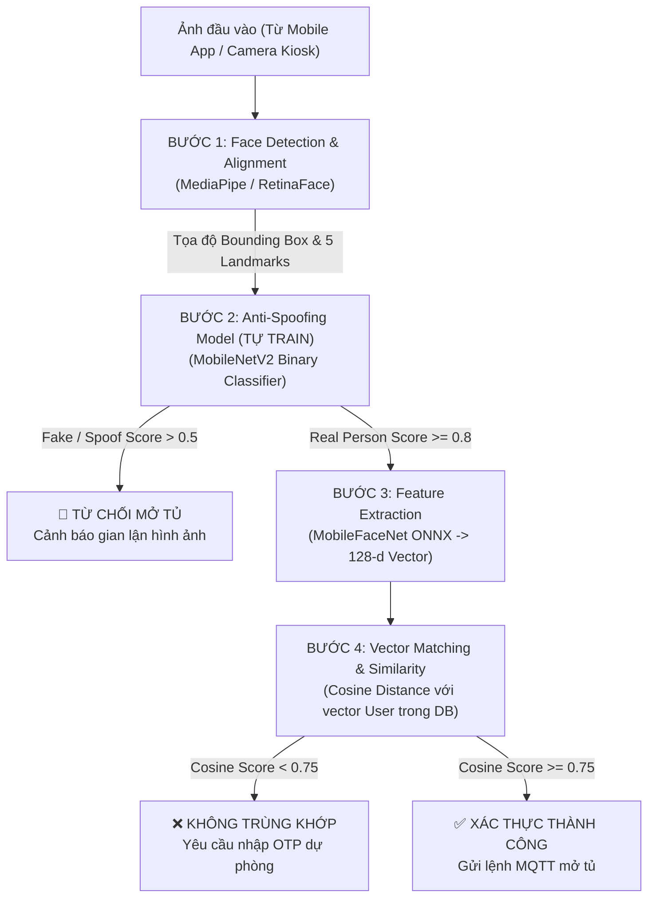
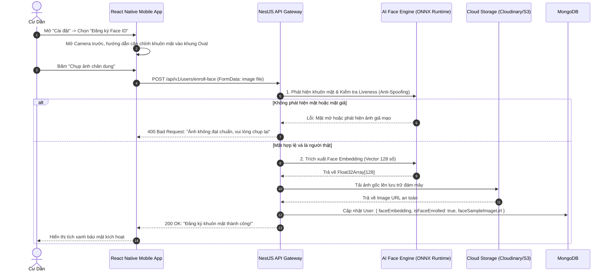
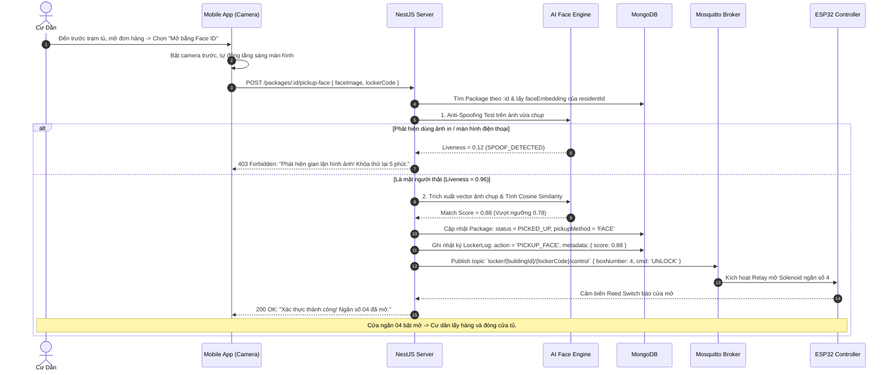

# Đặc Tả Kỹ Thuật Hệ Thống Nhận Diện Khuôn Mặt AI (AI Face Verification & Anti-Spoofing Specification)

> **Dự án:** Smart Locker System (Hệ thống Tủ đồ Thông minh)  
> **Module:** AI Biometric Verification (Xác thực Sinh trắc học Khuôn mặt)  
> **Tài liệu tham chiếu:** `delivery_retrieval_system.md`, `smart_locker_master_plan.md`  
> **Phiên bản:** 1.0.0 — Kế hoạch triển khai chi tiết

---

## 1. TỔNG QUAN & MỤC TIÊU HỆ THỐNG

### 1.1. Mục Tiêu Nghiệp Vụ
1. **Lấy hàng rảnh tay (Touchless Pickup):** Cư dân chỉ cần đưa khuôn mặt trước camera điện thoại hoặc camera trạm tủ, không cần ghi nhớ hoặc nhập mã OTP 6 số.
2. **Bảo vệ bưu phẩm giá trị cao (High-Value Parcels KYC):** Đối với các bưu kiện đắt tiền (điện thoại, trang sức, giấy tờ tùy thân), bắt buộc xác thực sinh trắc học để ký nhận điện tử và lưu vết bằng chứng giao dịch (Audit Log), loại bỏ 100% rủi ro chối bỏ nhận hàng.
3. **Phòng chống gian lận (Anti-Spoofing):** Phát hiện và từ chối các hành vi dùng ảnh in màu, video quay lại từ màn hình điện thoại/tablet (Replay Attack) hoặc mặt nạ silicon để qua mặt hệ thống.
4. **Điểm nhấn công nghệ (Academic AI Value):** Tích hợp cả **Model Tự Train (Anti-Spoofing CNN)** và **Model Trích Xuất Vector SOTA (MobileFaceNet ONNX)** chạy trực tiếp trên backend với độ trễ dưới 150ms.

---

## 2. KIẾN TRÚC MÔ HÌNH AI (AI PIPELINE ARCHITECTURE)

Pipeline nhận diện khuôn mặt được thiết kế gồm **4 tầng xử lý liên hoàn (Sequential Pipeline)**:



---

## 3. CHI TIẾT KỸ THUẬT TỪNG TẦNG AI

### 3.1. Tầng 1: Phát Hiện & Căn Chỉnh Khuôn Mặt (Face Detection & Alignment)
* **Nhiệm vụ:** Tìm vị trí khuôn mặt trong khung hình, cắt (crop) vùng mặt và xoay thẳng góc dựa trên 5 điểm mốc (2 mắt, đỉnh mũi, 2 khóe môi).
* **Công nghệ:** **RetinaFace (Lightweight MobileNet-0.25)** hoặc **MediaPipe Face Detector**.
* **Đầu vào:** Ảnh kích thước $640 \times 480$ (RGB).
* **Đầu ra:** Ảnh khuôn mặt đã căn chỉnh kích thước chuẩn $112 \times 112 \times 3$, chuẩn hóa giá trị pixel về dải $[-1, 1]$.

---

### 3.2. Tầng 2: Kiểm Tra Mặt Thật / Mặt Giả (Anti-Spoofing — MODEL TỰ TRAIN)
* **Bản chất bài toán:** Binary Classification (Nhị phân: `0 = Spoof/Fake`, `1 = Real/Live`).
* **Kiến trúc mạng:** **MobileNetV2 / Mini-FASNet** (tham số nhỏ, tốc độ inference cực nhanh ~15ms trên CPU).
* **Dataset huấn luyện:**
  * **CelebA-Spoof** (Dataset công khai lớn nhất với 43 phân loại phụ kiện và kiểu tấn công).
  * **CASIA-SURF / Replay-Attack** (Chứa ảnh in giấy, màn hình iPad, màn hình OLED).
  * Dữ liệu tự thu thập nội bộ (Augmented data): Chụp mặt qua màn hình iPhone, máy tính bàn.
* **Loss Function:** Binary Cross-Entropy với Label Smoothing để chống overfitting:
  $$\mathcal{L} = - \left( y \log(\hat{y}) + (1-y) \log(1-\hat{y}) \right)$$
* **Đầu ra:** Điểm tin cậy `livenessScore` $\in [0, 1]$. Ngưỡng an toàn: $\ge 0.80$ là mặt người thật.

---

### 3.3. Tầng 3: Trích Xuất Vector Đặc Trưng (Face Embedding)
* **Mô hình:** **MobileFaceNet** (Kiến trúc CNN tối ưu hóa cho di động và hệ thống nhúng).
* **Kỹ thuật trích xuất:** Mô hình được pre-train trên tập MS1MV2 bằng hàm mất mát **ArcFace Loss (Additive Angular Margin)**, giúp cực đại hóa khoảng cách góc giữa các người khác nhau và cực tiểu hóa khoảng cách giữa các góc chụp của cùng 1 người:
  $$\mathcal{L}_{ArcFace} = -\log \frac{e^{s(\cos(\theta_{y_i} + m))}}{e^{s(\cos(\theta_{y_i} + m))} + \sum_{j \ne y_i} e^{s \cos \theta_j}}$$
* **Đầu ra:** Vector không gian 128 chiều (128-dimensional float vector) đã chuẩn hóa L2 Norm ($\|\mathbf{v}\|_2 = 1$).

---

### 3.4. Tầng 4: So Khớp Danh Tính (Cosine Similarity Matching)
* **Cơ chế:** Lấy vector khuôn mặt vừa trích xuất ($\mathbf{u}$) so sánh với vector mẫu của cư dân lưu trong MongoDB ($\mathbf{v}$):
  $$\text{Similarity}(\mathbf{u}, \mathbf{v}) = \mathbf{u} \cdot \mathbf{v} = \sum_{i=1}^{128} u_i \cdot v_i$$
* **Thiết lập ngưỡng quyết định (Threshold Benchmark):**
  * **Score $\ge 0.78$:** Rất tự tin $\rightarrow$ Mở tủ tức thì.
  * **Score $0.65 - 0.77$:** Vùng nghi ngờ (do đổi kính hoặc ánh sáng kém) $\rightarrow$ Yêu cầu nhập thêm mã OTP dự phòng.
  * **Score $< 0.65$:** Từ chối nhận diện $\rightarrow$ Ghi log nghi vấn.

---

## 4. THIẾT KẾ DỮ LIỆU & SCHEMA DATABASE (MONGODB)

### 4.1. Cập nhật Thực thể `User` (`users` collection)
Lưu vector đặc trưng và trạng thái đăng ký khuôn mặt của Cư dân:

```typescript
// server/src/users/schemas/user.schema.ts
@Prop({ type: [Number], default: [], select: false }) // 128 số float, ẩn khỏi query thông thường
faceEmbedding: number[];

@Prop({ type: Boolean, default: false })
isFaceEnrolled: boolean;

@Prop({ type: Date, default: null })
faceEnrolledAt: Date;

@Prop({ type: String, default: null })
faceSampleImageUrl: string; // Ảnh mẫu đã qua kiểm duyệt lúc đăng ký (lưu Cloudinary/S3)
```

---

### 4.2. Cập nhật Thực thể `Package` & `LockerLog`
Lưu vết bằng chứng đối soát khi mở tủ bằng khuôn mặt:

```typescript
// Thêm vào Package schema
@Prop({ type: Boolean, default: false })
isHighValue: boolean; // Bắt buộc dùng Face ID nếu là đơn giá trị cao

@Prop({ type: String, enum: ['OTP', 'QR', 'REMOTE', 'FACE'], default: null })
pickupMethod: string;

@Prop({ type: String, default: null })
faceAuditImageUrl: string; // Ảnh chụp khoảnh khắc cư dân mở tủ thành công

@Prop({ type: Number, default: null })
faceMatchScore: number; // Điểm số tương đồng lúc nhận hàng (VD: 0.89)
```

---

## 5. QUY TRÌNH NGHIỆP VỤ & SEQUENCE DIAGRAM CHI TIẾT

### 5.1. Giai Đoạn 1: Đăng Ký Khuôn Mặt Cư Dân (Face Enrollment Flow)



---

### 5.2. Giai Đoạn 2: Quét Mặt Nhận Hàng Tại Trạm Tủ (Face Pickup Verification Flow)



---

## 6. LỰA CHỌN CÔNG NGHỆ & MÔ HÌNH TRIỂN KHAI (DEPLOYMENT STRATEGY)

Có 2 phương án kiến trúc để nhúng AI vào hệ thống Smart Locker:

### Bảng So Sánh Kiến Trúc Triển Khai:

| Tiêu chí | Phương Án 1: Nhúng Trực Tiếp Trong NestJS (Khuyên Dùng) | Phương Án 2: Microservice Python (FastAPI) |
| :--- | :--- | :--- |
| **Công nghệ** | `onnxruntime-node` + `sharp` (Xử lý ảnh C++) | Python 3.10 + FastAPI + PyTorch / OpenCV |
| **Độ phức tạp hệ thống**| **Rất thấp:** Chung 1 repository, cùng deploy trên 1 server Node.js | Cao: Phải quản lý 2 service, 2 Docker container |
| **Giao tiếp liên dịch vụ**| In-memory function call ($\sim 0.1\text{ms}$) | REST API qua HTTP network ($\sim 30 - 50\text{ms}$) |
| **Tài nguyên RAM** | Nhẹ ($\sim 150\text{MB}$ RAM cho ONNX Runtime) | Nặng hơn ($\sim 400 - 600\text{MB}$ RAM cho Python Torch) |
| **Tốc độ Inference** | **50 - 80ms** trên CPU tiêu chuẩn | 60 - 90ms trên CPU |
| **Phù hợp đồ án tốt nghiệp**| ✅ **TỐI ƯU NHẤT:** Gọn gàng, dễ demo, không sợ lỗi mạng nội bộ | Thích hợp nếu nhóm có 1 thành viên chỉ làm Python |

👉 **Lựa chọn tối ưu:** Sử dụng **`onnxruntime-node` trực tiếp trong NestJS**. Model PyTorch tự train sẽ được export sang định dạng chuẩn `.onnx` và nạp vào bộ nhớ RAM của NestJS khi server khởi động (Startup).

---

## 7. CHI TIẾT HUẤN LUYỆN MODEL ANTI-SPOOFING TỰ TRAIN (PYTHON PIPELINE)

Quy trình chuẩn bị dữ liệu và huấn luyện mô hình chống gian lận để báo cáo đồ án:

### 7.1. Cấu trúc Thư mục Dataset Huấn Luyện
```text
dataset_antispoof/
├── train/
│   ├── real/         # 2,000 ảnh chân dung người thật (đa dạng ánh sáng, góc nghiêng)
│   └── spoof/        # 2,500 ảnh in màu, ảnh màn hình smartphone, tablet, laptop
└── val/
    ├── real/         # 500 ảnh
    └── spoof/        # 500 ảnh
```

### 7.2. Kỹ thuật Tăng Cường Dữ Liệu (Data Augmentation)
* Xoay nhẹ góc ($\pm 15^\circ$), lật ngang (Horizontal Flip).
* Biến thiên độ sáng, độ tương phản (Color Jitter, Random Contrast) để mô phỏng điều kiện ánh sáng yếu tại sảnh chung cư.
* Thêm nhiễu Moiré (mô phỏng vân sọc khi chụp lại qua màn hình máy tính/điện thoại).

### 7.3. Kịch Bản Xuất Model Sang ONNX (Export Script)
```python
import torch
import torchvision.models as models

# 1. Load model sau khi train
model = models.mobilenet_v2(num_classes=2)
model.load_state_dict(torch.load("best_antispoof_model.pth"))
model.eval()

# 2. Tạo dummy input kích thước chuẩn (1, 3, 112, 112)
dummy_input = torch.randn(1, 3, 112, 112)

# 3. Xuất file ONNX
torch.onnx.export(
    model, 
    dummy_input, 
    "antispoof_mobilenetv2.onnx",
    input_names=["input_face"],
    output_names=["liveness_score"],
    opset_version=14,
    dynamic_axes={"input_face": {0: "batch_size"}}
)
print("Xuất model ONNX thành công! File sẵn sàng nạp vào NestJS.")
```

---

## 8. BẢO MẬT & QUYỀN RIÊNG TƯ DỮ LIỆU (PRIVACY & GDPR COMPLIANCE)

1. **Không lưu trữ ảnh nhạy cảm thô dạng Raw Base64 trong Database:**  
   Chỉ lưu trữ vector đặc trưng toán học `faceEmbedding: [0.124, -0.984, ...]` (128 số thực). Vector này là hàm một chiều (One-way mathematical representation), kẻ tấn công nếu đánh cắp được database cũng **không bao giờ có thể tái tạo ngược lại thành khuôn mặt người**.
2. **Khóa tạm thời chống Brute-force:**  
   Nếu quét mặt thất bại liên tiếp 3 lần trong vòng 2 phút $\rightarrow$ Hệ thống tự động khóa phương thức Face ID của bưu kiện đó trong 10 phút, yêu cầu quay về nhập mã OTP 6 số qua tin nhắn/app.
3. **Quyền xóa dữ liệu sinh trắc học:**  
   Cư dân có nút bấm *"Xóa dữ liệu khuôn mặt"* trong phần Cài đặt tài khoản bất kỳ lúc nào để tuân thủ quy định bảo vệ bí mật cá nhân.

---

## 9. LỘ TRÌNH TRIỂN KHAI THEO TỪNG GIAI ĐOẠN (IMPLEMENTATION ROADMAP)

```text
TUẦN 1: HUẤN LUYỆN & XUẤT MODEL AI (.ONNX)
├── 1.1 Thu thập dataset Anti-Spoofing (CelebA-Spoof mini + ảnh chụp thực nghiệm)
├── 1.2 Viết script PyTorch train MobileNetV2 Binary Classifier đạt Accuracy > 95%
├── 1.3 Tải model pre-trained MobileFaceNet trích xuất 128-d vector
├── 1.4 Xuất cả 2 model ra định dạng .onnx và kiểm thử inference bằng Python
└── 1.5 Đo lường Confusion Matrix, Precision, Recall và ROC-AUC để làm biểu đồ báo cáo

TUẦN 2: XÂY DỰNG BACKEND AI MODULE TRONG NESTJS
├── 2.1 Cài đặt dependencies: npm install onnxruntime-node sharp
├── 2.2 Tạo AiModule và FaceService trong NestJS:
│   ├── Khởi tạo ONNX Session tại OnModuleInit() (load model sẵn vào RAM)
│   ├── Hàm tiền xử lý ảnh: Base64 -> Buffer -> Resize 112x112 -> Tensor Float32
│   ├── Hàm runAntiSpoofing(tensor) -> trả về livenessScore
│   ├── Hàm extractEmbedding(tensor) -> trả về number[128]
│   └── Hàm computeCosineSimilarity(v1, v2) -> trả về score [-1, 1]
├── 2.3 Thêm trường faceEmbedding vào UserSchema
├── 2.4 Viết API POST /api/v1/users/enroll-face (Đăng ký mặt mẫu)
└── 2.5 Viết API POST /api/v1/packages/:id/pickup-face (Xác thực mở tủ nhận hàng)

TUẦN 3: TÍCH HỢP GIAO DIỆN REACT NATIVE MOBILE APP
├── 3.1 Cấu hình expo-camera và cấp quyền truy cập Camera trước
├── 3.2 Xây dựng màn hình "Đăng ký Face ID" (Hiển thị khung oval, đèn báo căn chuẩn mặt)
├── 3.3 Thêm nút "Mở tủ bằng Face ID" trong trang chi tiết bưu phẩm cư dân
├── 3.4 Hiệu ứng quét Face ID Scanner (Lottie Animation hoặc Scanner Line chuyển động)
└── 3.5 Bắt lỗi và hiển thị thông báo chi tiết (Lỗi mờ mặt, Lỗi giả mạo, Khớp thành công)

TUẦN 4: KIỂM THỬ THỰC TẾ & TỐI ƯU HÓA HỆ THỐNG
├── 4.1 Thử nghiệm tấn công giả mạo (dùng ảnh điện thoại khác chụp lại) -> Đo độ nhạy
├── 4.2 Thử nghiệm trong các điều kiện thiếu sáng, đeo kính cận nhẹ, đổi kiểu tóc
├── 4.3 Tối ưu hóa thời gian mở tủ: từ lúc bấm nút quét mặt đến lúc rơ-le nhảy < 1.5 giây
└── 4.4 Đóng gói tài liệu, chụp ảnh màn hình và vẽ biểu đồ kiến trúc vào Báo cáo ĐATN
```
