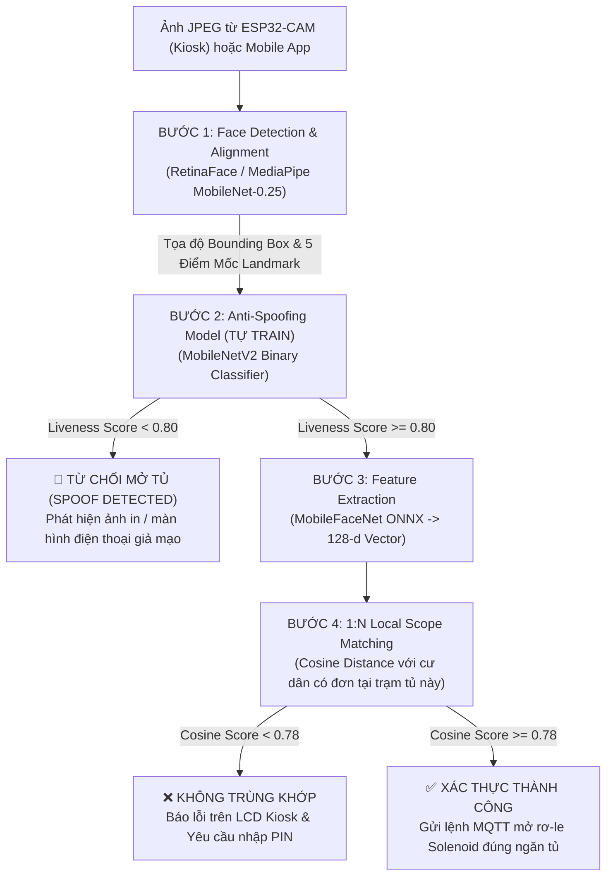
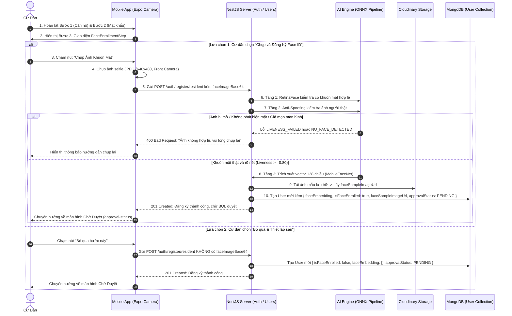
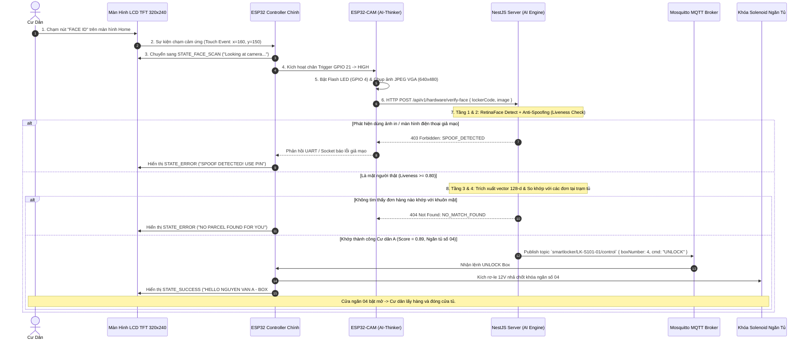

# Đặc Tả Kỹ Thuật Hệ Thống Nhận Diện Khuôn Mặt AI (AI Face Verification & Anti-Spoofing Specification)

> **Dự án:** Smart Locker System (Hệ thống Tủ đồ Thông minh)  
> **Module:** AI Biometric Verification (Xác thực Sinh trắc học Khuôn mặt Kiosk & Mobile)  
> **Phần cứng:** ESP32 Controller chính + ESP32-CAM (OV2640) + Màn hình cảm ứng LCD TFT 320x240  
> **Tài liệu tham chiếu:** `delivery_retrieval_system.md`, `smart_locker_master_plan.md`, `smart-locker-iot/`  
> **Phiên bản:** 2.1.0 — Tích hợp trạm tủ Kiosk & Quy trình Đăng ký Sinh trắc học Mobile (Mobile Enrollment & eKYC)

---

## 1. TỔNG QUAN & MỤC TIÊU HỆ THỐNG

### 1.1. Mục Tiêu Nghiệp Vụ
1. **Lấy hàng rảnh tay không cần điện thoại (Phone-less Kiosk Touchless Pickup):** Cư dân đi tập thể dục, dắt thú cưng, để quên điện thoại ở nhà hoặc điện thoại hết pin vẫn có thể lấy hàng bằng cách chạm chọn "FACE ID" trên màn hình LCD trạm tủ và nhìn vào camera ESP32-CAM.
2. **Linh hoạt đa phương thức (Dual-Channel Verification):** Hỗ trợ nhận diện khuôn mặt qua cả 2 kênh:
   - **Kênh Kiosk vật lý:** Camera nhúng ESP32-CAM tại trạm tủ kết hợp màn hình LCD cảm ứng.
   - **Kênh Di động (Mobile App):** Camera trước của smartphone thông qua ứng dụng React Native.
3. **Bảo vệ bưu phẩm giá trị cao (High-Value Parcels KYC):** Đối với các bưu kiện đắt tiền (điện thoại, trang sức, hợp đồng pháp lý), hệ thống bắt buộc xác thực sinh trắc học để ký nhận điện tử và lưu vết bằng chứng đối soát (`Audit Log`), loại bỏ 100% rủi ro chối bỏ nhận hàng.
4. **Phòng chống gian lận đa dạng (Anti-Spoofing):** Phát hiện và từ chối các hành vi dùng ảnh in màu, video quay lại từ màn hình điện thoại/tablet (Replay Attack) hoặc mặt nạ silicon để qua mặt hệ thống.
5. **Thu thập mẫu khuôn mặt chuẩn & Hỗ trợ eKYC (Mobile Biometric Enrollment & eKYC):** Cư dân đăng ký khuôn mặt mẫu đối chứng (Ground Truth) thông qua camera selfie của điện thoại với cơ chế linh hoạt (cho phép bỏ qua lúc tạo tài khoản và thiết lập sau trong cài đặt bảo mật), đồng thời hỗ trợ Ban Quản Lý (BQL) xem xét ảnh chân dung thực tế khi duyệt cư dân vào tòa nhà.
6. **Điểm nhấn học thuật đồ án (Academic AIoT Value):** Kết hợp trọn vẹn 3 trụ cột: **IoT nhúng (ESP32 + ESP32-CAM + LCD)**, **Điện toán đám mây (NestJS + MQTT)** và **Trí tuệ nhân tạo (Model tự train Anti-Spoofing CNN + MobileFaceNet ONNX)** với độ trễ phản hồi toàn trình dưới 1.5 giây.

---

## 2. KIẾN TRÚC MÔ HÌNH AI (AI PIPELINE ARCHITECTURE)

Pipeline nhận diện khuôn mặt được thiết kế gồm **4 tầng xử lý liên hoàn (Sequential Pipeline)** chạy trên Server NestJS thông qua `onnxruntime-node`:



---

## 3. CHI TIẾT KỸ THUẬT TỪNG TẦNG AI

### 3.1. Tầng 1: Phát Hiện & Căn Chỉnh Khuôn Mặt (Face Detection & Alignment)
* **Nhiệm vụ:** Tìm vị trí khuôn mặt trong ảnh, chọn khuôn mặt có diện tích Bounding Box lớn nhất (người đứng gần tủ nhất), cắt (crop) và xoay thẳng góc dựa trên 5 điểm mốc (2 mắt, đỉnh mũi, 2 khóe môi).
* **Công nghệ:** **RetinaFace (Lightweight MobileNet-0.25)** hoặc **MediaPipe Face Mesh**.
* **Đầu vào:** Ảnh RGB kích thước $640 \times 480$ từ camera ESP32-CAM hoặc điện thoại.
* **Đầu ra:** Ảnh khuôn mặt đã căn chỉnh kích thước chuẩn $112 \times 112 \times 3$, chuẩn hóa giá trị pixel về dải $[-1, 1]$.

---

### 3.2. Tầng 2: Kiểm Tra Mặt Thật / Mặt Giả (Anti-Spoofing — MODEL TỰ TRAIN)
* **Bản chất bài toán:** Phân loại nhị phân (Binary Classification: `0 = Spoof/Fake`, `1 = Real/Live`).
* **Kiến trúc mạng:** **EfficientNet-B0 / MobileNetV2** (Tích hợp khối SE-Attention trích xuất vân sọc màn hình moiré, tham số nhỏ, tốc độ inference cực nhanh ~18ms trên CPU).
* **Dataset huấn luyện:**
  * **CelebA-Spoof** (Dataset công khai với 43 phân loại phụ kiện và kiểu tấn công).
  * **CASIA-SURF / Replay-Attack** (Chứa ảnh in giấy, màn hình iPad, màn hình OLED).
  * Dữ liệu tự thu thập thực nghiệm: Chụp qua ống kính OV2640 của ESP32-CAM và màn hình điện thoại dưới ánh sáng sảnh chung cư.
* **Hàm mất mát (Loss Function):** Binary Cross-Entropy kèm Label Smoothing để chống overfitting:
  $$\mathcal{L} = - \left( y \log(\hat{y}) + (1-y) \log(1-\hat{y}) \right)$$
* **Đầu ra:** Điểm tin cậy `livenessScore` $\in [0, 1]$. Ngưỡng an toàn: $\ge 0.80$ là người thật.

---

### 3.3. Tầng 3: Trích Xuất Vector Đặc Trưng (Face Embedding)
* **Mô hình:** **MobileFaceNet** (Kiến trúc CNN tối ưu hóa cho di động và hệ thống nhúng).
* **Kỹ thuật trích xuất:** Huấn luyện bằng hàm mất mát **ArcFace Loss (Additive Angular Margin)**, tối ưu khoảng cách góc giữa các vector đặc trưng:
  $$\mathcal{L}_{ArcFace} = -\log \frac{e^{s(\cos(\theta_{y_i} + m))}}{e^{s(\cos(\theta_{y_i} + m))} + \sum_{j \ne y_i} e^{s \cos \theta_j}}$$
* **Đầu ra:** Vector không gian 128 chiều (128-dimensional float vector) đã chuẩn hóa L2 Norm ($\|\mathbf{v}\|_2 = 1$).

---

### 3.4. Tầng 4: Thuật Toán So Khớp Phạm Vi Cục Bộ (1:N Local Scope Matching)
Để loại bỏ nguy cơ nhận diện nhầm (False Acceptance) khi hệ thống có hàng ngàn cư dân, hệ thống áp dụng cơ chế **Phạm vi Cục bộ (Local Scope)**:
1. Khi nhận được ảnh từ trạm tủ `lockerCode` (ví dụ `LK-S101-01`), server chỉ truy vấn danh sách các bưu phẩm đang nằm tại trạm tủ này:
   ```typescript
   const activePackages = await packageModel.find({
     lockerCode,
     status: PackageStatus.WAITING_FOR_PICKUP,
   }).populate('receiverId', '+faceEmbedding');
   ```
2. Thay vì so khớp với toàn bộ database cư dân thành phố, hệ thống chỉ tính Cosine Similarity giữa vector ảnh chụp $\mathbf{u}$ với $N$ cư dân đang có hàng trong tủ ($N \approx 5 - 20$ người):
   $$\text{Similarity}(\mathbf{u}, \mathbf{v}_k) = \mathbf{u} \cdot \mathbf{v}_k = \sum_{i=1}^{128} u_i \cdot v_{k,i}$$
3. **Ưu điểm vượt trội:**
   - **Tốc độ:** So sánh 10-20 vector mất $< 0.1\text{ms}$.
   - **Độ chính xác:** Giảm 99% xác suất nhận diện nhầm người khác so với tìm kiếm toàn cục ($1:ALL$).
   - **Xác định ngay số ngăn tủ:** Tìm được người có $\text{Score} \ge 0.78$ cao nhất ➔ Xác định ngay số ngăn tủ `boxNumber` để mở chốt.

---

## 4. THIẾT KẾ PHẦN CỨNG KIOSK: LCD CẢM ỨNG & ESP32-CAM

Hệ thống trạm tủ thông minh tích hợp **2 vi điều khiển ESP32 phối hợp**:
1. **ESP32 Controller Chính (Master):** Quản lý điều khiển Relay Solenoid, cảm biến Reed Switch, cảm biến hồng ngoại IR, kết nối MQTT và trực tiếp điều khiển màn hình cảm ứng LCD TFT 320x240 (`smart-locker-iot`).
2. **ESP32-CAM (Slave Camera):** Module AI-Thinker OV2640 chuyên dụng chụp ảnh, kết nối WiFi độc lập và gửi HTTP POST lên Server NestJS.

```
       ┌─────────────────────────────────────────────────────────────┐
       │                 MẶT TRƯỚC TRẠM TỦ (KIOSK PANEL)             │
       │                                                             │
       │       ┌──────────────────────┐      ┌────────────────┐      │
       │       │                      │      │  ESP32-CAM     │      │
       │       │   MÀN HÌNH LCD TFT   │      │  [OV2640 Lens] │      │
       │       │    320 x 240 CẢM ỨNG │      │  (Độ cao 1.35m)│      │
       │       │  [PIN] [FACE] [QR]   │      │  [LED Flash]   │      │
       │       │                      │      └───────┬────────┘      │
       │       └──────────┬───────────┘              │               │
       └──────────────────┼──────────────────────────┼───────────────┘
                          │ SPI / XPT2046            │ HTTP POST (WiFi)
                          ▼                          ▼
               ┌──────────────────────┐     ┌─────────────────┐
               │   ESP32 CHÍNH        │     │  SERVER NESTJS  │
               │  - Quản lý LCD       │     │   (AI ENGINE)   │
               │  - Điều khiển Relay  │◄────┤  MQTT UNLOCK    │
               │  - Đọc Cảm Biến Cửa  │     └─────────────────┘
               └──────────┬───────────┘
                          │ GPIO 21 (Trigger xung HIGH 100ms)
                          └──────────► Chân GPIO 13 (ESP32-CAM)
```

---

### 4.1. Thiết Kế Giao Diện Màn Hình LCD Kiosk 320x240 (`smart-locker-iot`)

Cải tiến màn hình Home [`drawIdleScreen()`](file:///c:/Users/Admin/Desktop/studyspace/DATN/smart-locker/smart-locker-iot/src/display/DisplayManager.cpp#L402) từ 2 lựa chọn thành **3 lựa chọn song song (3 Columns Layout)**:

```
+-------------------------------------------------------------+
| (*) READY             SMART LOCKER LK-S101-01               |
|-------------------------------------------------------------|
|                    CHOOSE PICKUP METHOD                     |
|                                                             |
|  +-------------+    +-------------+    +-------------+      |
|  |   [ 1 2 3 ] |    |    ( o_o )  |    |    [ # # ]  |      |
|  |   [ 4 5 6 ] |    |    FACE ID  |    |    QR CODE  |      |
|  |             |    |             |    |             |      |
|  |  ENTER PIN  |    |  SCAN FACE  |    |  MOBILE APP |      |
|  | [TAP OPEN]  |    | [LOOK CAM]  |    | [SHOW QR]   |      |
|  +-------------+    +-------------+    +-------------+      |
|   (x:10, w:94)       (x:113, w:94)      (x:216, w:94)       |
+-------------------------------------------------------------+
```

#### A. Trạng thái mới `STATE_FACE_SCAN` trong `DisplayManager.h`:
```cpp
enum DisplayState {
  STATE_WIFI_CONNECTING,
  STATE_WIFI_FAILED,
  STATE_IDLE,       // Menu 3 lựa chọn: PIN - FACE ID - QR
  STATE_QR,         // Mã QR động toàn màn hình
  STATE_KEYPAD,     // Bàn phím số nhập mã PIN
  STATE_FACE_SCAN,  // [MỚI] Màn hình hướng dẫn nhìn vào camera
  STATE_SUCCESS,    // Thông báo mở tủ thành công
  STATE_ERROR       // Thông báo lỗi
};
```

#### B. Giao diện `STATE_FACE_SCAN` (`drawFaceScanScreen`):
- Nút `< CANCEL` góc trên bên trái để người dùng quay lại menu chính bất kỳ lúc nào.
- Icon khuôn mặt đồ họa ở trung tâm kèm khung bo tròn mô phỏng vùng quét.
- Dòng chữ: `"PLEASE LOOK AT CAMERA"` và `"Stand 40-60cm in front of locker"`.
- Thanh tiến trình đếm ngược Timeout 8 giây (nếu không nhận diện được sẽ tự quay về `STATE_IDLE`).

---

### 4.2. Sơ Đồ Đấu Nối & Giao Tiếp Phần Cứng

| Tín hiệu kết nối | Từ ESP32 Chính | Tới ESP32-CAM | Mục đích |
| :--- | :--- | :--- | :--- |
| **Trigger Signal** | `GPIO 21` (Output) | `GPIO 13` (Input Pull-down) | Gửi xung HIGH 100ms ra lệnh cho ESP32-CAM chụp ảnh khi cư dân bấm nút Face ID trên LCD. |
| **Nguồn cấp 5V** | Nguồn 5V/2A ngoài (LM2596) | Chân `5V` | Cấp dòng ổn định, chống sụt áp khi bật đồng thời WiFi và đèn Flash LED. |
| **GND** | Chân `GND` chung | Chân `GND` | Nối chung mass toàn hệ thống. |
| **Đèn Flash LED** | Nội bộ ESP32-CAM | `GPIO 4` | Kích hoạt đèn LED trắng siêu sáng 150ms để chiếu sáng khuôn mặt ban đêm. |

---

## 5. THIẾT KẾ QUY TRÌNH ĐĂNG KÝ KHUÔN MẶT TRÊN MOBILE APP (MOBILE FACE ENROLLMENT & EKYC)

Để hệ thống Kiosk và Server có thể nhận diện cư dân, ứng dụng di động phải có quy trình thu thập mẫu khuôn mặt chuẩn (Ground Truth Enrollment).

```
     ┌─────────────────────────────────────────────────────────────┐
     │           QUY TRÌNH ĐĂNG KÝ CƯ DÂN 3 BƯỚC (WIZARD)          │
     │                                                             │
     │   [1] Căn Hộ & Tòa Nhà  ──►  [2] Mật Khẩu  ──►  [3] FACE ID  │
     │                                                     │       │
     │                   ┌─────────────────────────────────┴───┐   │
     │                   ▼                                     ▼   │
     │        [QUÉT KHUÔN MẶT NGAY]                 [ĐỂ SAU / BỎ QUA]│
     │        - Bật camera trước                    - Không bắt buộc│
     │        - Khung oval căn chỉnh                - Không nghẽn   │
     │        - Gửi faceImageBase64                   luồng đăng ký │
     └─────────────────────────────────────────────────────────────┘
```

### 5.1. Wizard Đăng Ký Cư Dân 3 Bước (`register-resident.tsx`)
Nâng cấp giao diện đăng ký cư dân hiện tại từ 2 bước thành **3 bước rõ ràng**:
1. **Bước 1 (`ResidentInfoStep`):** Họ tên, Số điện thoại, Tòa nhà chung cư và Số căn hộ.
2. **Bước 2 (`PasswordSecurityStep`):** Email, Mật khẩu và Xác nhận mật khẩu theo tiêu chuẩn bảo mật.
3. **Bước 3 (`FaceEnrollmentStep` - Mới):**
   - Tiêu đề: *"Thiết lập Face ID Nhận Hàng"*.
   - Khung hình xem trước từ camera trước (Front-facing Camera Preview) kèm khung Oval dẫn hướng khuôn mặt.
   - Hướng dẫn trực quan: *"Giữ thẳng mặt trong khung oval, không đeo khẩu trang và đứng nơi đủ sáng"*.
   - **Cơ chế Hybrid an toàn UX (Zero Drop-off):**
     - Nút chính (Electric Blue): **"CHỤP VÀ ĐĂNG KÝ FACE ID"**.
     - Nút phụ (Outline/Text): **"Bỏ qua bước này, tôi sẽ thiết lập sau"** $\rightarrow$ Cho phép cư dân hoàn tất đăng ký ngay mà không bị gián đoạn nếu đang ở nơi thiếu sáng.

---

### 5.2. Quản Lý Face ID Trong Trang Cài Đặt Bảo Mật (`security.tsx`)
Đối với cư dân bỏ qua lúc đăng ký hoặc muốn cập nhật lại khuôn mặt mới (khi thay đổi ngoại hình, đổi kiểu tóc/kính):
- Thêm thẻ quản lý **"Face ID Mở Tủ Thông Minh"** bên cạnh mục Xác thực 2 bước (2FA):
  - **Trạng thái:** Huy hiệu *"Đã kích hoạt"* (Xanh lá) hoặc *"Chưa kích hoạt"* (Vàng cam).
  - **Thông tin:** Ngày cập nhật gần nhất (`faceEnrolledAt`).
  - **Hành động:** Nút bấm *"Cập nhật khuôn mặt mới"* $\rightarrow$ Mở Modal quét khuôn mặt selfie và gọi API `POST /api/v1/users/me/face-enroll`.

---

### 5.3. Hỗ Trợ eKYC & Phê Duyệt Cư Dân Cho Ban Quản Lý (Admin Dashboard)
- Khi cư dân quét mặt lúc đăng ký, ảnh chụp gốc được tải lên Cloudinary lưu tại `User.faceSampleImageUrl`.
- Trên giao diện Quản trị viên Tòa nhà (Building Admin Portal - `Smart-Locker-Admin`):
  - Khi xem xét hồ sơ cư dân ở trạng thái `PENDING`: BQL có thể xem ảnh chân dung thực tế đối chiếu với tên và số căn hộ đã khai báo.
  - Sau khi BQL nhấn *"Phê duyệt"*, cư dân chính thức nhận được quyền sử dụng các ngăn tủ thông minh tại tòa nhà.

---

### 5.4. Sơ Đồ Trình Tự Đăng Ký Khuôn Mặt Trên Mobile App (Sequence Diagram)



---

## 6. THIẾT KẾ CƠ SỞ DỮ LIỆU & SCHEMA DATABASE (MONGODB)

### 6.1. Cập nhật Thực thể `User` (`users` collection)
Lưu vector đặc trưng và trạng thái đăng ký khuôn mặt của cư dân:
```typescript
// server/src/users/schemas/user.schema.ts
@Prop({ type: [Number], default: [], select: false }) // 128 số float, ẩn khỏi query thông thường
faceEmbedding: number[];

@Prop({ type: Boolean, default: false, index: true })
isFaceEnrolled: boolean;

@Prop({ type: Date, default: null })
faceEnrolledAt: Date;

@Prop({ type: String, default: null })
faceSampleImageUrl: string; // Ảnh mẫu đã qua kiểm duyệt lúc đăng ký (Cloudinary)
```

### 6.2. Cập nhật Thực thể `Package` & `LockerLog`
Lưu vết bằng chứng đối soát khi mở tủ bằng khuôn mặt:
```typescript
// Thêm vào Package schema
@Prop({ type: Boolean, default: false })
isHighValue: boolean; // Bắt buộc dùng Face ID nếu là đơn giá trị cao

@Prop({ type: String, enum: ['OTP', 'QR', 'BLE', 'FACE_KIOSK', 'FACE_MOBILE'], default: null })
pickupMethod: string;

@Prop({ type: String, default: null })
faceAuditImageUrl: string; // Ảnh chụp lúc cư dân mở tủ thành công
```

---

## 7. QUY TRÌNH NGHIỆP VỤ & SEQUENCE DIAGRAM KIOSK FACE ID



---

## 8. ĐẶC TẢ API GIAO TIẾP HỆ THỐNG (API CONTRACT)

### 8.1. Đăng Ký Cư Dân Kèm Khuôn Mặt (`POST /api/v1/auth/register/resident`)
Endpoint tạo tài khoản cư dân mới có tùy chọn kèm ảnh khuôn mặt:

#### Request Body:
```json
{
  "name": "Nguyễn Văn A",
  "email": "nguyenvana@gmail.com",
  "password": "Password123@",
  "phone": "0987654321",
  "buildingId": "651a2b3c4d5e6f7a8b9c0d1e",
  "apartment": "P.1204 - Tháp A",
  "faceImageBase64": "data:image/jpeg;base64,/9j/4AAQSkZJRgABAQE..." 
}
```
*(Trường `faceImageBase64` là không bắt buộc; nếu không truyền, tài khoản được tạo với `isFaceEnrolled = false`).*

#### Response Thành Công (`201 Created`):
```json
{
  "statusCode": 201,
  "message": "Đăng ký tài khoản cư dân thành công! Hồ sơ đang chờ Ban Quản Lý phê duyệt.",
  "data": {
    "id": "6701a9b8c2d3e4f5a6b7c8d9",
    "name": "Nguyễn Văn A",
    "email": "nguyenvana@gmail.com",
    "approvalStatus": "PENDING",
    "isFaceEnrolled": true
  }
}
```

---

### 8.2. Cập Nhật / Đăng Ký Lại Khuôn Mặt Trong App (`POST /api/v1/users/me/face-enroll`)
Dành cho cư dân đã đăng nhập muốn kích hoạt hoặc cập nhật lại khuôn mặt trong trang Bảo Mật (`security.tsx`).

#### Request Headers:
```http
Authorization: Bearer <JWT_ACCESS_TOKEN>
Content-Type: application/json
```

#### Request Body:
```json
{
  "faceImageBase64": "data:image/jpeg;base64,/9j/4AAQSkZJRgABAQE..."
}
```

#### Response Thành Công (`200 OK`):
```json
{
  "statusCode": 200,
  "message": "Cập nhật dữ liệu nhận diện khuôn mặt thành công!",
  "data": {
    "isFaceEnrolled": true,
    "faceEnrolledAt": "2026-09-23T15:20:00.000Z"
  }
}
```

---

### 8.3. Xác Thực Khuôn Mặt Từ Hardware Kiosk (`POST /api/v1/hardware/verify-face`)
Dành riêng cho module ESP32-CAM tại trạm tủ gửi ảnh mở khóa ngăn hàng.

#### Request Headers:
```http
Content-Type: application/json
x-api-key: LK_STATION_SECRET_KEY_ABC123
```

#### Request Body:
```json
{
  "lockerCode": "LK-S101-01",
  "imageBase64": "/9j/4AAQSkZJRgABAQEASABIAAD...",
  "timestamp": 1727078400000
}
```

#### Response Thành Công (`200 OK`):
```json
{
  "statusCode": 200,
  "message": "Xác thực khuôn mặt thành công! Đang mở tủ.",
  "data": {
    "boxNumber": 4,
    "residentName": "Nguyễn Văn A",
    "trackingNumber": "SPX839201948",
    "matchScore": 0.892,
    "unlockedAt": "2026-09-23T15:10:00.000Z"
  }
}
```

---

## 9. LỘ TRÌNH TRIỂN KHAI THEO 4 TUẦN (IMPLEMENTATION ROADMAP)

```text
TUẦN 1: HUẤN LUYỆN MODEL AI & XUẤT ĐỊNH DẠNG .ONNX
├── 1.1 Chuẩn bị dataset Anti-Spoofing (CelebA-Spoof + ảnh thực nghiệm chụp qua OV2640 & smartphone)
├── 1.2 Viết script PyTorch train MobileNetV2 Binary Classifier đạt Accuracy > 95%
├── 1.3 Export MobileNetV2 Anti-Spoofing và MobileFaceNet sang chuẩn .onnx
└── 1.4 Kiểm thử tốc độ inference bằng Python và đo lường Confusion Matrix

TUẦN 2: XÂY DỰNG AI PIPELINE & API BACKEND (NESTJS) & MOBILE ENROLLMENT
├── 2.1 Cài đặt onnxruntime-node và sharp vào server NestJS
├── 2.2 Viết FaceService: nạp model vào RAM khi server khởi động (OnModuleInit)
├── 2.3 Viết hàm tiền xử lý ảnh Buffer -> Tensor Float32 112x112 chuẩn hóa [-1, 1]
├── 2.4 Cập nhật user.schema.ts & mở rộng API đăng ký POST /api/v1/auth/register/resident
├── 2.5 Viết API POST /api/v1/users/me/face-enroll (Kích hoạt Face ID trong Profile)
├── 2.6 Viết API POST /api/v1/hardware/verify-face (Tiếp nhận ảnh từ ESP32-CAM)
└── 2.7 Xây dựng FaceEnrollmentStep.tsx trong wizard đăng ký cư dân mobile (Hybrid Skip)

TUẦN 3: LẬP TRÌNH PHẦN CỨNG IOT (ESP32 CHÍNH + ESP32-CAM)
├── 3.1 Cập nhật DisplayManager.cpp trên ESP32 chính: vẽ menu 3 thẻ (PIN, FACE ID, QR)
├── 3.2 Lập trình trạng thái STATE_FACE_SCAN và xử lý chạm cảm ứng
├── 3.3 Đấu nối chân Trigger GPIO 21 (ESP32 chính) sang GPIO 13 (ESP32-CAM)
├── 3.4 Lập trình firmware ESP32-CAM: ngắt trigger -> bật Flash LED -> chụp JPEG -> HTTP POST
└── 3.5 Bắt lệnh MQTT UNLOCK từ server gửi về để kích rơ-le mở ngăn tủ

TUẦN 4: THỬ NGHIỆM THỰC TẾ & TỐI ƯU HỆ THỐNG
├── 4.1 Thử nghiệm các góc mặt: thẳng, nghiêng 15 độ, đeo kính, thay đổi ánh sáng sảnh
├── 4.2 Thử nghiệm tấn công Replay-Attack (dùng iPad/ảnh in) để chứng minh Anti-Spoofing
├── 4.3 Tối ưu hóa thời gian toàn trình: từ lúc chạm Face ID đến khi rơ-le nhảy < 1.5 giây
└── 4.4 Hoàn thiện ảnh chụp thực tế và đưa sơ đồ kiến trúc vào Báo cáo Đồ án Tốt nghiệp
```
