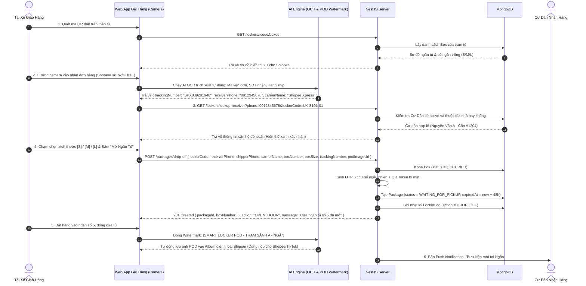
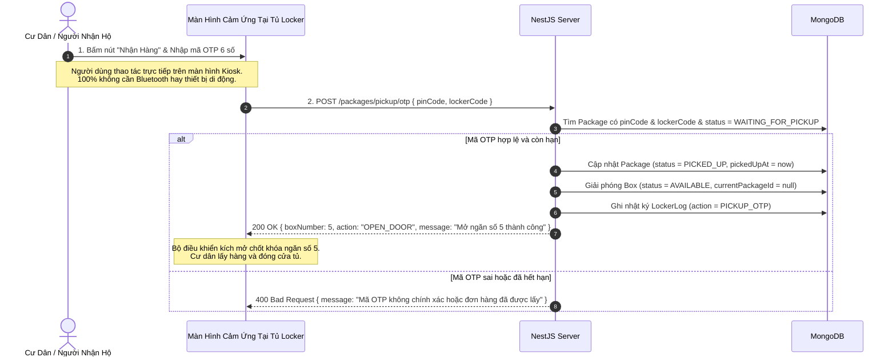
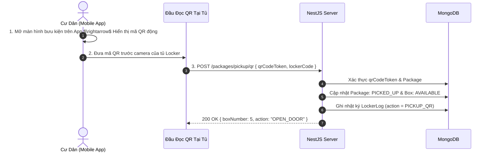
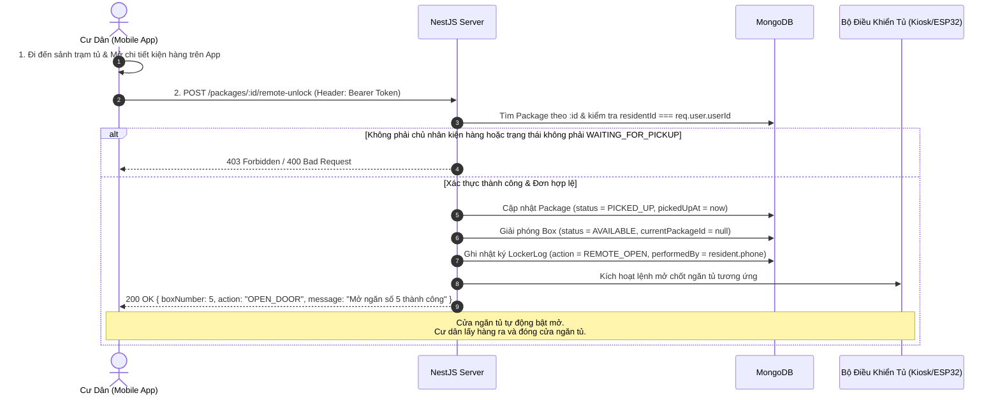
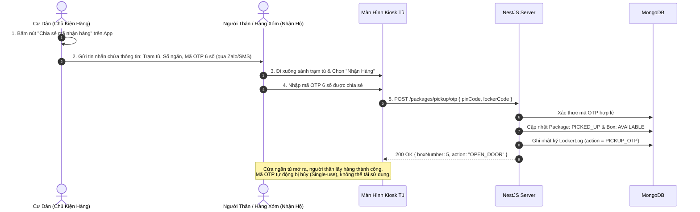
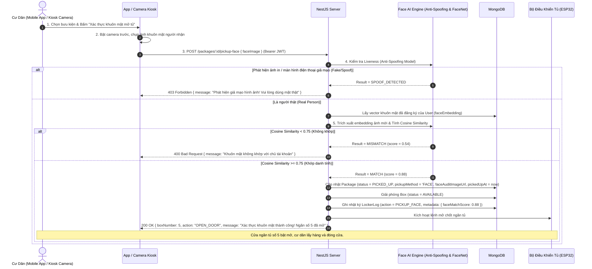

# Đặc Tả Kiến Trúc Hệ Thống Giao Nhận Hàng (Delivery & Retrieval System Specification)

> **Tài liệu thiết kế kiến trúc toàn diện cho 2 module cốt lõi:**
> 1. **Module Lockers & Boxes (Quản Lý Trạm Tủ & Ngăn Tủ)**
> 2. **Module Packages (Quản Lý Bưu Kiện & Quy Trình Giao - Nhận Hàng)**
> 
> *Đã cập nhật đồng bộ 100% với mô hình Shipper Không Cần Tài Khoản (No-Auth Guest Shipper) theo đặc tả `shipper_flow.md`.*

---

## 1. Tổng Quan Hệ Thống

Hệ thống giao nhận hàng Smart Locker cung cấp nền tảng tự động hóa việc giao nhận bưu kiện tại các khu đô thị và chung cư:
- **Shipper (Tài Xế Giao Hàng - Khách Vãng Lai / No Auth)**: Không cần tài khoản $\rightarrow$ Quét mã QR trạm tủ $\rightarrow$ **AI OCR quét nhãn đơn (tự trích xuất Mã vận đơn, SĐT cư dân, Hãng ship)** $\rightarrow$ Hệ thống auto-lookup căn hộ $\rightarrow$ Chọn cỡ ngăn $\rightarrow$ Bỏ hàng và đóng cửa tủ $\rightarrow$ **Tự động xuất ảnh POD (Proof of Delivery) có Watermark vào máy Shipper để nộp Shopee/TikTok** $\rightarrow$ Hỗ trợ gửi liên tiếp nhiều đơn trong 1 phiên (Batch Drop-off).
- **Resident (Cư Dân Nhận Hàng - JWT Auth)**: Nhận thông báo tức thì (Push Notification) kèm ảnh kiện hàng $\rightarrow$ Hỗ trợ **5 phương thức nhận hàng linh hoạt 24/7**:
  1. *Nhập mã OTP 6 số tại màn hình Kiosk của trạm tủ*.
  2. *Quét mã QR Token động trước Camera của trạm tủ*.
  3. *Bấm nút "Mở Tủ Từ Xa" trên ứng dụng di động React Native (Remote Proximity Unlock)*.
  4. *Ủy quyền cho người thân/bạn bè nhận hộ qua mã OTP chia sẻ*.
  5. *Xác thực khuôn mặt AI (Face Verification + Anti-Spoofing)* cho các đơn hàng bảo mật cao hoặc trải nghiệm nhận hàng rảnh tay.
- **Building Admin & System Admin**: Giám sát tình trạng trạm tủ, tỷ lệ lấp đầy ngăn tủ, quản lý bưu kiện quá hạn lưu kho và hỗ trợ mở tủ khẩn cấp từ xa khi xảy ra sự cố.

```mermaid
graph TD
    subgraph "HẠ TẦNG VẬT LÝ (HARDWARE LAYER)"
        LK[Locker: Trạm Tủ Thông Minh]
        BX[Box: 11-24 Ngăn Tủ Tự Động]
        IOT[IoT Controller: ESP32 / Relay Control]
        CAM[Camera Kiosk / Mobile Cam]
        LK --- BX
        BX --- IOT
        LK --- CAM
    end

    subgraph "TẦNG DỊCH VỤ (BACKEND NESTJS & AI SERVICES)"
        ML[Lockers Service: Quản lý trạm & ngăn tủ]
        MP[Packages Service: Xử lý Giao & Nhận]
        MN[Notifications Service: Gửi Push Token]
        MA[Auth & Users: Phân quyền Cư Dân & BQL]
        AI_OCR[AI OCR Engine: Nhận diện nhãn đơn & Tạo ảnh POD]
        AI_FACE[AI Face Engine: Liveness Check & FaceNet So Khớp]
    end

    subgraph "ỨNG DỤNG NGƯỜI DÙNG (CLIENT LAYER)"
        SP[Guest Shipper: AI OCR Quét Nhãn - Không cần Account]
        RD[Mobile App Resident: Nhận OTP, Quét QR, Mở từ xa, Face ID]
        SCR[Màn hình cảm ứng tại Tủ: Nhập OTP / Quét Face]
        REL[Người thân nhận hộ: Nhập OTP được chia sẻ]
    end

    SP -->|POST /packages/drop-off & OCR| MP
    SP -.-> AI_OCR
    RD -->|GET /packages/my-packages (JWT)| MP
    RD -->|POST /packages/:id/remote-unlock (JWT)| MP
    RD -->|POST /packages/:id/pickup-face (JWT)| MP
    RD -.-> AI_FACE
    SCR -->|POST /packages/pickup/otp (Public)| MP
    REL -->|POST /packages/pickup/otp (Public)| MP
    MP --> ML
    MP --> MN
    ML --> IOT
```

---

## 2. Thiết Kế Mô Hình Dữ Liệu (Database Schemas)

### 2.1. Thực thể `Locker` (`lockers` collection)

| Thuộc Tính | Kiểu Dữ Liệu | Ràng Buộc | Mô Tả & Ý Nghĩa Nghiệp Vụ |
| :--- | :--- | :--- | :--- |
| `_id` | `Types.ObjectId` | Primary Key | Mã định danh duy nhất của trạm tủ |
| `name` | `String` | `required, trim` | Tên hiển thị (ví dụ: *"Trạm Tủ Sảnh Chính Tòa S1.01"*) |
| `code` | `String` | `required, unique, uppercase` | Mã trạm tủ duy nhất (ví dụ: *"LK-S101-01"*) |
| `buildingId` | `Types.ObjectId` | `ref: 'Building', required, index` | Tòa nhà nơi đặt trạm tủ |
| `totalBoxes` | `Number` | `required, min: 1` | Tổng số lượng ngăn tủ con (ví dụ: `16` hoặc `11`) |
| `macAddress` | `String` | `required, unique, trim` | Địa chỉ MAC phần cứng của bộ điều khiển IoT |
| `apiKey` | `String` | `required, select: false` | Khóa bí mật dùng để chứng thực request từ bộ điều khiển IoT Kiosk/ESP32 (chống giả mạo MAC) |
| `status` | `String (Enum)` | `enum: LockerStatus, default: ONLINE` | Trạng thái trạm tủ: `ONLINE`, `OFFLINE`, `MAINTENANCE` |
| `locationDescription` | `String` | `optional, trim` | Vị trí đặt tủ (ví dụ: *"Cạnh quầy lễ tân sảnh A tầng 1"*) |
| `coordinates` | `Object` | `{ latitude: Number, longitude: Number }, optional` | Tọa độ địa lý GPS độc lập phục vụ định vị và tính khoảng cách |
| `createdAt` / `updatedAt` | `Date` | `timestamps: true` | Dấu thời gian tạo và cập nhật |

```typescript
export enum LockerStatus {
  ONLINE = 'ONLINE',
  OFFLINE = 'OFFLINE',
  MAINTENANCE = 'MAINTENANCE',
}
```

---

### 2.2. Thực thể `Box` (`boxes` collection)

| Thuộc Tính | Kiểu Dữ Liệu | Ràng Buộc | Mô Tả & Ý Nghĩa Nghiệp Vụ |
| :--- | :--- | :--- | :--- |
| `_id` | `Types.ObjectId` | Primary Key | Mã định danh ngăn tủ con |
| `lockerId` | `Types.ObjectId` | `ref: 'Locker', required, index` | Thuộc về trạm tủ nào |
| `boxNumber` | `Number` | `required, min: 1` | Số thứ tự in trên cánh cửa ngăn tủ (ví dụ: 1, 2, 3...) |
| `size` | `String (Enum)` | `enum: BoxSize, default: MEDIUM` | Kích thước ngăn: `SMALL`, `MEDIUM`, `LARGE` |
| `status` | `String (Enum)` | `enum: BoxStatus, default: AVAILABLE` | Tình trạng: `AVAILABLE` (Trống), `OCCUPIED` (Có hàng), `MAINTENANCE` (Lỗi) |
| `doorStatus` | `String (Enum)` | `enum: DoorStatus, default: CLOSED` | Trạng thái cửa (Reed Switch): `CLOSED` (Đóng), `OPEN` (Mở) |
| `hasItem` | `Boolean` | `default: false` | Trạng thái cảm biến quang học hồng ngoại (IR Sensor) phát hiện có vật thể trong lòng ngăn |
| `currentPackageId`| `Types.ObjectId` | `ref: 'Package', optional` | Bưu kiện đang được lưu trữ bên trong ngăn tủ |

```typescript
export enum BoxSize {
  SMALL = 'SMALL',       // Tài liệu, mỹ phẩm, phụ kiện (10x40x45 cm)
  MEDIUM = 'MEDIUM',     // Quần áo, giày dép, hộp vừa (20x40x45 cm)
  LARGE = 'LARGE',       // Đồ điện tử, kiện hàng lớn (35x40x45 cm)
}

export enum BoxStatus {
  AVAILABLE = 'AVAILABLE',     // Sẵn sàng nhận đơn hàng mới
  OCCUPIED = 'OCCUPIED',       // Đang chứa bưu kiện chưa được lấy
  MAINTENANCE = 'MAINTENANCE', // Hỏng chốt khóa hoặc bảo trì
}

export enum DoorStatus {
  CLOSED = 'CLOSED',
  OPEN = 'OPEN',
}
```

---

### 2.3. Thực thể `Package` (`packages` collection)

> **Cập nhật cốt lõi:** Shipper không cần tạo tài khoản, do đó `shipperId` là tùy chọn (`optional`), hệ thống định danh Shipper bằng `shipperPhone` và `carrierName` bắt buộc.

| Thuộc Tính | Kiểu Dữ Liệu | Ràng Buộc | Mô Tả & Ý Nghĩa Nghiệp Vụ |
| :--- | :--- | :--- | :--- |
| `_id` | `Types.ObjectId` | Primary Key | Mã định danh bưu kiện |
| `trackingNumber` | `String` | `required, index, trim` | Mã vận đơn của đơn vị vận chuyển (ví dụ: *"SPX123456789"*) |
| `lockerId` | `Types.ObjectId` | `ref: 'Locker', required, index` | Trạm tủ đang lưu giữ bưu kiện |
| `boxId` | `Types.ObjectId` | `ref: 'Box', required` | Ngăn tủ cụ thể chứa bưu kiện |
| `buildingId` | `Types.ObjectId` | `ref: 'Building', required, index` | Tòa nhà của cư dân nhận hàng |
| `residentId` | `Types.ObjectId` | `ref: 'User', required, index` | Cư dân thụ hưởng bưu kiện |
| `receiverPhone` | `String` | `required, trim` | Số điện thoại cư dân nhận hàng |
| `receiverName` | `String` | `required, trim` | Tên cư dân nhận hàng |
| `apartment` | `String` | `required, trim` | Số căn hộ người nhận (ví dụ: *"A1204"*) |
| `shipperPhone` | `String` | `required, index, trim` | Số điện thoại tài xế giao hàng để đối soát |
| `shipperName` | `String` | `optional, trim` | Tên tài xế giao hàng |
| `carrierName` | `String` | `required, trim` | Hãng giao vận (Shopee Xpress, GHTK, GHN, ViettelPost...) |
| `shipperId` | `Types.ObjectId` | `ref: 'User', optional, index` | Mã tài khoản nếu là shipper nội bộ liên kết |
| `pinCode` | `String` | `required, index` | Mã OTP 6 số (duy nhất trong các đơn `WAITING_FOR_PICKUP` tại cùng 1 trạm tủ) |
| `qrCodeToken` | `String` | `required, unique` | Token bí mật phục vụ tạo mã QR quét mở tủ |
| `failedAttempts` | `Number` | `default: 0` | Số lần nhập sai mã OTP liên tiếp tại trạm tủ (chống Brute-force dò mã) |
| `lockedUntil` | `Date` | `optional` | Khóa tạm thời quyền mở ngăn bằng OTP nếu nhập sai quá 5 lần (ví dụ: khóa 15 phút) |
| `status` | `String (Enum)` | `enum: PackageStatus, default: WAITING_FOR_PICKUP` | Trạng thái bưu kiện |
| `podImageUrl` | `String` | `optional, trim` | Ảnh chụp bưu phẩm / Bằng chứng giao hàng (POD) có Watermark trạm & ngăn tủ |
| `isHighValue` | `Boolean` | `default: false` | Đơn hàng giá trị cao / nhạy cảm yêu cầu xác thực khuôn mặt (Face Verification) |
| `pickupMethod`| `String (Enum)` | `enum: ['OTP', 'QR', 'REMOTE', 'FACE'], optional` | Phương thức thực tế cư dân đã sử dụng để mở tủ nhận hàng |
| `faceAuditImageUrl`| `String` | `optional, trim` | Ảnh chụp khuôn mặt lúc cư dân mở tủ (phục vụ đối soát chống chối bỏ) |
| `droppedOffAt` | `Date` | `required` | Thời điểm shipper bỏ hàng vào tủ thành công |
| `pickedUpAt` | `Date` | `optional` | Thời điểm cư dân mở tủ lấy hàng |
| `expiredAt` | `Date` | `required` | Hạn chót lấy hàng (mặc định: `droppedOffAt + 48 giờ`) |
| `note` | `String` | `optional, trim` | Ghi chú đơn hàng (ví dụ: *"Hàng dễ vỡ"*) |

```typescript
export enum PackageStatus {
  WAITING_FOR_PICKUP = 'WAITING_FOR_PICKUP', // Đang chờ cư dân đến lấy
  PICKED_UP = 'PICKED_UP',                   // Cư dân đã lấy hàng thành công
  OVERDUE = 'OVERDUE',                       // Quá hạn lưu kho (sau 48h)
  RETURNED = 'RETURNED',                     // Đã hoàn trả lại cho Shipper/BQL
}
```

---

### 2.4. Thực thể `LockerLog` (`locker_logs` collection - Nhật Ký Đóng/Mở Tủ)

| Thuộc Tính | Kiểu Dữ Liệu | Ràng Buộc | Mô Tả & Ý Nghĩa Nghiệp Vụ |
| :--- | :--- | :--- | :--- |
| `_id` | `Types.ObjectId` | Primary Key | Mã nhật ký |
| `lockerId` | `Types.ObjectId` | `ref: 'Locker', required, index` | Trạm tủ thực hiện hành động |
| `boxNumber` | `Number` | `required` | Số ngăn tủ bị tác động |
| `packageId` | `Types.ObjectId` | `ref: 'Package', optional` | Bưu kiện liên quan |
| `action` | `String (Enum)` | `enum: LockerAction` | Hành động mở/đóng tủ |
| `performedBy` | `String` | `required` | Số điện thoại hoặc User ID người thực hiện |
| `status` | `String` | `SUCCESS` hoặc `FAILED` | Kết quả thực thi |
| `metadata` | `Object` | `optional` | Dữ liệu ngữ cảnh kỹ thuật: trạng thái cảm biến IR/Reed switch, điểm tin cậy AI Face match, mã lỗi phần cứng |
| `createdAt` | `Date` | `timestamps: true` | Thời điểm thực hiện |

```typescript
export enum LockerAction {
  DROP_OFF = 'DROP_OFF',                     // Tài xế mở tủ gửi hàng
  PICKUP_OTP = 'PICKUP_OTP',                 // Cư dân nhập mã OTP nhận hàng
  PICKUP_QR = 'PICKUP_QR',                   // Cư dân quét mã QR nhận hàng
  PICKUP_FACE = 'PICKUP_FACE',               // Cư dân quét khuôn mặt AI nhận hàng
  REMOTE_OPEN = 'REMOTE_OPEN',               // Cư dân / BQL mở tủ từ xa qua ứng dụng
  FORCE_OPEN = 'FORCE_OPEN',                 // Mở cưỡng bức khi xử lý sự cố kỹ thuật
  OVERDUE_RETRIEVAL = 'OVERDUE_RETRIEVAL',   // Thu hồi bưu phẩm quá hạn lưu kho
}
```

---

### 2.5. Chiến Lược Đánh Chỉ Mục MongoDB (Database Indexing Strategy)

Để đảm bảo toàn vẹn dữ liệu phần cứng và tối ưu hóa hiệu năng truy vấn cho toàn hệ thống:

```typescript
// 1. Boxes Collection: Đảm bảo trong 1 trạm tủ không bao giờ trùng lặp số ngăn
BoxSchema.index({ lockerId: 1, boxNumber: 1 }, { unique: true });
BoxSchema.index({ lockerId: 1, status: 1, size: 1 }); // Shipper lọc nhanh ngăn trống theo cỡ

// 2. Packages Collection: Tối ưu tra cứu nhận hàng và Cronjob
PackageSchema.index({ lockerId: 1, pinCode: 1, status: 1 }); // Mở tủ bằng OTP tại màn hình Kiosk
PackageSchema.index({ qrCodeToken: 1 }, { unique: true });    // Quét QR mở tủ tức thì
PackageSchema.index({ residentId: 1, status: 1 });           // Cư dân xem danh sách bưu kiện của mình
PackageSchema.index({ status: 1, expiredAt: 1 });            // Cronjob tự động quét đơn hàng quá hạn 48h
```

---

## 3. Quy Trình Nghiệp Vụ & Sequence Diagrams

### 3.1. Quy Trình Shipper Gửi Hàng Tích Hợp AI OCR & Smart POD (Drop-off Flow - No Auth)



---

### 3.2. Bảng Tổng Hợp 5 Phương Thức Nhận Hàng Của Cư Dân (Resident Retrieval Channels)

Hệ thống cung cấp 5 phương thức nhận hàng linh hoạt để tối ưu trải nghiệm trong mọi hoàn cảnh thực tế:

| Phương thức | Thiết bị tương tác | Cơ chế xác thực | Yêu cầu BLE (1–3m) / Vị trí vật lý | Kịch bản sử dụng tối ưu | Ưu điểm nổi bật |
| :--- | :--- | :--- | :--- | :--- | :--- |
| **1A. Nhập OTP tại Kiosk** | Màn hình cảm ứng / Phím số tại tủ | Mã OTP 6 chữ số ngẫu nhiên (`pinCode`) | **KHÔNG CẦN BLE** *(Hiển nhiên đã có mặt tại tủ)* | Khi không mang điện thoại, hết pin; người thân lấy hộ | Không phụ thuộc vào điện thoại thông minh hay sóng Bluetooth |
| **1B. Nhập OTP trên Mobile App** | Ứng dụng di động Citibox (`/locker/enter-pin`) | Mã OTP 6 số + Đối soát bưu kiện | **Ưu tiên BLE $\le$ 3m** *(Mở tức thì)*<br/>*Nếu ở xa: Yêu cầu xác nhận cảnh báo* | Khi không muốn chạm màn hình Kiosk công cộng hoặc camera quét QR bị mờ | Tận dụng bàn phím riêng trên điện thoại, phòng tránh mở nhầm từ xa |
| **2. Quét QR tại tủ** | Camera Kiosk của trạm tủ + Mobile App | Token động 32 ký tự hex (`qrCodeToken`) | **Có mặt tại tủ** *(Camera Kiosk quét màn hình app)* | Nhận hàng nhanh 1 chạm khi đứng trước trạm tủ | Không chạm màn hình công cộng, chống nhìn lén mã PIN |
| **3. Mở tủ từ xa trên App**| Ứng dụng di động React Native | JWT Token định danh Cư dân (`Bearer Token`) | **BẮT BUỘC BLE $\le$ 3m** *(Hoặc đã quét QR trạm tủ)* | Vừa bước ra khỏi thang máy sảnh chung cư, đứng gần trạm tủ | Tiện lợi tối đa, tự động mở sẵn ngăn tủ khi đến gần (1 chạm 1s) |
| **4. Ủy quyền nhận hộ** | Tin nhắn SMS, Zalo, Messenger | Mã OTP 6 số được chia sẻ trực tiếp | **KHÔNG CẦN BLE** *(Người nhận hộ nhập tại Kiosk)* | Khi cư dân vắng nhà, đi công tác, nhờ người thân/hàng xóm lấy hộ | An toàn, mã tự hủy ngay sau khi ngăn tủ được mở |
| **5. Quét khuôn mặt AI (Face ID)** | Camera trước Mobile App hoặc Camera Kiosk | **FaceNet Cosine Similarity ($\ge 0.75$) + Anti-Spoofing** | **Có mặt tại trạm** | Đơn hàng giá trị cao / nhạy cảm hoặc muốn trải nghiệm rảnh tay | Bảo mật sinh trắc học tối đa, chống chối bỏ, lưu audit ảnh |

---

### 3.3. Phương Thức 1: Nhận Hàng Bằng Mã OTP (Pick-up OTP Flow)

#### 3.3.1. Luồng Nhập OTP Trực Tiếp Tại Màn Hình Kiosk Tủ (Physical Kiosk - Không Cần Bluetooth)
Cư dân hoặc người được ủy quyền nhận hộ không cần điện thoại, không cần Bluetooth. Chỉ cần đứng trước màn hình trạm tủ và nhập 6 số OTP.



#### 3.3.2. Luồng Nhập OTP Trên Ứng Dụng Di Động (Mobile App OTP Entry - Phối Hợp BLE)
Khi cư dân mở tính năng **"Enter PIN"** trên ứng dụng di động:
1. **Bản chất của mã OTP**: Là bằng chứng xác thực *quyền sở hữu/nhận kiện hàng* (Authentication).
2. **Bản chất của BLE 1–3m**: Là bằng chứng xác thực *vị trí vật lý của người nhận trước trạm tủ* (Proximity Proof).
   - **Nếu phát hiện sóng BLE trong 1–3m** (hoặc đã quét QR trạm tủ): Tủ mở ngay lập tức (1-chạm) vì đã thỏa mãn cả 2 điều kiện: Có mã + Đang đứng cạnh tủ.
   - **Nếu KHÔNG phát hiện BLE** (người dùng ở xa, tắt Bluetooth hoặc trong nhà):
     - Hệ thống ngăn chặn việc tự động mở để tránh sự cố **Ghost Unlock** (cửa tủ bật mở toang ở sảnh chung cư khi chủ nhân chưa xuống nhận).
     - Ứng dụng cung cấp 2 giải pháp linh hoạt:
       - *Lựa chọn A*: Yêu cầu cư dân xác nhận qua hộp thoại cảnh báo: *"Cửa tủ sẽ bật mở ngay lập tức tại trạm. Bạn có chắc chắn muốn mở từ xa?"* $\rightarrow$ Khi bấm xác nhận, lệnh mới được gửi tới trạm.
       - *Lựa chọn B*: Nhắc nhở cư dân có thể nhập 6 số OTP này trực tiếp trên màn hình Kiosk của tủ khi đi xuống sảnh.

---

### 3.4. Phương Thức 2: Nhận Hàng Bằng Quét Mã QR Token Trước Đầu Đọc Tủ (Pick-up QR Flow)



---

### 3.5. Phương Thức 3: Mở Tủ Từ Xa Trên Ứng Dụng Di Động (Remote Proximity Unlock Flow)



---

### 3.6. Phương Thức 4: Ủy Quyền Cho Người Thân Nhận Hộ (Delegated Pick-up Flow)



---

### 3.7. Phương Thức 5: Nhận Hàng Bằng Xác Thực Khuôn Mặt AI (Pick-up Face Verification Flow)

> **Mục đích:** Dành cho các đơn hàng giá trị cao (High-Value Parcels) hoặc cư dân muốn trải nghiệm lấy hàng rảnh tay, bảo mật chống chối bỏ.



---

## 4. Ma Trận Phân Quyền API (RBAC Matrix)

| Chức Năng | Method & Endpoint | Phân Quyền (RBAC) | Mô Tả Nghiệp Vụ |
| :--- | :--- | :---: | :--- |
| **Thông tin trạm tủ** | `GET /lockers/:code` | **Public** | Lấy thông tin trạm tủ khi quét QR trên thân tủ |
| **Sơ đồ các ngăn tủ** | `GET /lockers/:code/boxes` | **Public** | Lấy danh sách toàn bộ các ngăn tủ (trống/bận, cỡ S/M/L) |
| **Tra cứu Cư Dân** | `GET /lockers/lookup-receiver` | **Public** | Tra cứu tên & căn hộ theo SĐT trước khi mở tủ gửi |
| **AI OCR nhãn đơn hàng**| `POST /packages/ocr-label` | **Public (Guest)** | AI quét ảnh nhãn đơn hàng trích xuất Mã vận đơn, SĐT, Hãng |
| **Shipper gửi hàng** | `POST /packages/drop-off` | **Public (Guest)** | Gửi hàng vào tủ, mở chốt điện từ, sinh OTP cho cư dân |
| **Bưu kiện của tôi** | `GET /packages/my-packages` | `RESIDENT` *(JWT)* | Cư dân xem các đơn đang chờ nhận và lịch sử nhận |
| **Chi tiết bưu kiện** | `GET /packages/:id` | `RESIDENT` *(JWT)* | Xem chi tiết kiện hàng, vị trí ngăn, mã OTP, hạn lấy |
| **Lấy QR Token nhận**| `GET /packages/:id/qr-token` | `RESIDENT` *(JWT)* | Lấy mã QR động dùng để quét trước camera tủ |
| **Nhập OTP mở tủ** | `POST /packages/pickup/otp` | **Public / Kiosk Tủ**| Nhập OTP 6 số tại màn hình tủ để mở khóa lấy đồ |
| **Quét QR mở tủ** | `POST /packages/pickup/qr` | **Public / Kiosk Tủ**| Quét QR Token trước camera tủ để mở khóa lấy đồ |
| **Mở tủ từ xa qua App** | `POST /packages/:id/remote-unlock`| `RESIDENT` *(JWT)* | Cư dân bấm mở khóa tủ từ xa khi đứng cạnh trạm tủ |
| **Quét mặt nhận hàng AI**| `POST /packages/:id/pickup-face` | `RESIDENT` *(JWT)* / Kiosk| Nhận hàng bằng khuôn mặt (Anti-spoofing + FaceNet) |
| **Đăng ký khuôn mặt** | `POST /users/enroll-face` | `RESIDENT` *(JWT)* | Cư dân chụp ảnh đăng ký vector khuôn mặt mẫu (Embedding) |
| **Danh sách trạm tủ** | `GET /lockers` | `SYSTEM_ADMIN`, `BUILDING_ADMIN` | Quản trị viên xem mạng lưới trạm tủ toàn hệ thống |
| **Tạo trạm tủ mới** | `POST /lockers` | `SYSTEM_ADMIN` | Thêm trạm tủ mới (auto sinh các ngăn tủ con) |
| **Mở tủ khẩn cấp từ xa**| `POST /lockers/:id/remote-open`| `BUILDING_ADMIN` | BQL mở khẩn cấp khi kẹt cửa hoặc xử lý sự cố |
| **Bưu kiện tòa nhà** | `GET /packages/building-packages`| `BUILDING_ADMIN` | BQL giám sát các bưu kiện đang lưu tại sảnh |

---

## 5. Đặc Tả Chi Tiết API (API Specifications)

### 5.1. `POST /packages/drop-off` (Tài Xế Gửi Hàng Vào Tủ - Không Cần Token)
- **Quyền truy cập**: Public
- **Request Body**:
```json
{
  "lockerCode": "LK-S101-01",
  "receiverPhone": "0912345678",
  "shipperPhone": "0987654321",
  "shipperName": "Trần Giao Hàng",
  "carrierName": "Shopee Xpress",
  "boxNumber": 4,
  "boxSize": "MEDIUM",
  "trackingNumber": "SPX839201948",
  "note": "Hàng quần áo đóng hộp"
}
```
- **Response (201 Created)**:
```json
{
  "message": "Gửi bưu kiện vào tủ thành công",
  "package": {
    "_id": "6b1234567890abcdef123456",
    "trackingNumber": "SPX839201948",
    "receiverName": "Nguyễn Văn Cư Dân",
    "receiverPhone": "0912345678",
    "apartment": "A1204",
    "boxNumber": 4,
    "boxSize": "MEDIUM",
    "status": "WAITING_FOR_PICKUP",
    "droppedOffAt": "2026-09-01T08:00:00.000Z",
    "expiredAt": "2026-09-03T08:00:00.000Z"
  },
  "action": {
    "command": "OPEN_DOOR",
    "boxNumber": 4
  }
}
```

---

### 5.2. `GET /lockers/lookup-receiver` (Tra Cứu Cư Dân Hợp Lệ Trước Khi Mở Tủ)
- **Quyền truy cập**: Public
- **Query Params**: `phone=0912345678&lockerCode=LK-S101-01`
- **Response (200 OK)**:
```json
{
  "found": true,
  "receiverName": "Nguyễn Văn A",
  "apartment": "A1204",
  "buildingName": "Tòa S1.01",
  "buildingId": "6a95091f1e23b42475f441d3"
}
```
- **Response Khi Không Thuộc Tòa Nhà (404 Not Found)**:
```json
{
  "statusCode": 404,
  "message": "Số điện thoại này chưa được đăng ký làm cư dân của tòa nhà"
}
```

---

### 5.3. `GET /lockers/:code/boxes` (Lấy Sơ Đồ Ngăn Tủ Hiển Thị Cho Shipper)
- **Quyền truy cập**: Public
- **Response (200 OK)**:
```json
{
  "lockerCode": "LK-S101-01",
  "name": "Trạm Tủ Sảnh Chính Tòa S1.01",
  "totalBoxes": 11,
  "availableCount": 7,
  "boxes": [
    { "boxNumber": 1, "size": "SMALL", "status": "AVAILABLE", "doorStatus": "CLOSED" },
    { "boxNumber": 2, "size": "SMALL", "status": "OCCUPIED", "doorStatus": "CLOSED" },
    { "boxNumber": 4, "size": "MEDIUM", "status": "AVAILABLE", "doorStatus": "CLOSED" }
  ]
}
```

---

### 5.4. `POST /packages/pickup/otp` (Nhập OTP Tại Màn Hình Tủ Để Nhận Hàng)
- **Quyền truy cập**: Public / Kiosk Tủ
- **Request Body**:
```json
{
  "lockerCode": "LK-S101-01",
  "pinCode": "384920"
}
```
- **Response (200 OK)**:
```json
{
  "message": "Xác thực mã OTP thành công. Cửa ngăn tủ số 4 đã mở!",
  "package": {
    "_id": "6b1234567890abcdef123456",
    "trackingNumber": "SPX839201948",
    "status": "PICKED_UP",
    "pickedUpAt": "2026-09-01T10:30:00.000Z"
  },
  "boxNumber": 4,
  "action": "OPEN_DOOR"
}
```

---

### 5.5. `GET /packages/my-packages` (Cư Dân Xem Bưu Kiện Của Mình)
- **Header**: `Authorization: Bearer <RESIDENT_TOKEN>`
- **Response (200 OK)**:
```json
[
  {
    "_id": "6b1234567890abcdef123456",
    "trackingNumber": "SPX839201948",
    "lockerName": "Trạm Tủ Sảnh Chính Tòa S1.01",
    "lockerCode": "LK-S101-01",
    "boxNumber": 4,
    "boxSize": "MEDIUM",
    "pinCode": "384920",
    "status": "WAITING_FOR_PICKUP",
    "carrierName": "Shopee Xpress",
    "droppedOffAt": "2026-09-01T08:00:00.000Z",
    "expiredAt": "2026-09-03T08:00:00.000Z"
  }
]
```

---

### 5.6. `POST /packages/:id/remote-unlock` (Cư Dân Mở Tủ Từ Xa Qua Ứng Dụng Di Động)
- **Quyền truy cập**: `RESIDENT` *(JWT)*
- **Header**: `Authorization: Bearer <RESIDENT_TOKEN>`
- **Params**: `id` - Mã ObjectId của bưu kiện cần mở tủ nhận hàng
- **Request Body** *(Tùy chọn phục vụ kiểm tra cự ly an toàn Proximity)*:
```json
{
  "currentLocation": {
    "latitude": 10.7769,
    "longitude": 106.7009
  }
}
```
- **Hành vi xử lý**:
  1. Trích xuất `req.user.userId` từ JWT Token xác thực.
  2. Tìm bưu kiện theo `id` và đối soát quyền sở hữu: Bắt buộc `package.residentId.toString() === req.user.userId` (Chặn `403 Forbidden` nếu cố ý mở đơn của người khác).
  3. Kiểm tra trạng thái bưu kiện: Bắt buộc đang ở trạng thái `WAITING_FOR_PICKUP`.
  4. Cập nhật bưu kiện: `status = PICKED_UP`, `pickedUpAt = now`.
  5. Cập nhật ngăn tủ: `box.status = AVAILABLE`, `box.currentPackageId = undefined`, `box.doorStatus = OPEN`.
  6. Ghi nhật ký: `LockerLog` với `action = REMOTE_OPEN`, `performedBy = resident.phone`.
  7. Trả về phản hồi kèm lệnh `action: "OPEN_DOOR"` kích hoạt rơ-le mở chốt điện từ của ngăn tủ tương ứng.
- **Response Thành Công (200 OK)**:
```json
{
  "message": "Xác thực thành công. Cửa ngăn tủ số 4 đã mở!",
  "package": {
    "_id": "6b1234567890abcdef123456",
    "trackingNumber": "SPX839201948",
    "status": "PICKED_UP",
    "pickedUpAt": "2026-09-08T15:00:00.000Z"
  },
  "boxNumber": 4,
  "action": "OPEN_DOOR"
}
```
- **Response Lỗi Quyền Hạn (403 Forbidden)**:
```json
{
  "statusCode": 403,
  "message": "Bạn không có quyền mở bưu kiện của người khác"
}
```

---

### 5.7. `POST /packages/pickup/qr` (Quét QR Token Trước Camera Tủ Để Nhận Hàng)
- **Quyền truy cập**: Public / Camera Kiosk Tủ
- **Request Body**:
```json
{
  "lockerCode": "LK-S101-01",
  "qrCodeToken": "a3f8902b1c4e5d67890123456789abcdef"
}
```
- **Hành vi xử lý**:
  1. Tìm bưu kiện theo `qrCodeToken` và `status = WAITING_FOR_PICKUP`.
  2. Xác minh bưu kiện có đúng đang nằm tại trạm tủ `lockerCode` tương ứng hay không.
  3. Đổi trạng thái bưu kiện: `status = PICKED_UP`, `pickedUpAt = now`.
  4. Giải phóng ngăn tủ: `box.status = AVAILABLE`, `box.currentPackageId = undefined`, `box.doorStatus = OPEN`.
  5. Ghi nhật ký: `LockerLog` với `action = PICKUP_QR`, `performedBy = package.receiverPhone`.
  6. Trả về thông tin ngăn tủ và lệnh kích hoạt mở chốt khóa `OPEN_DOOR`.
- **Response (200 OK)**:
```json
{
  "message": "Xác thực mã QR thành công. Cửa ngăn tủ số 4 đã mở!",
  "package": {
    "_id": "6b1234567890abcdef123456",
    "trackingNumber": "SPX839201948",
    "status": "PICKED_UP",
    "pickedUpAt": "2026-09-08T15:00:00.000Z"
  },
  "boxNumber": 4,
  "action": "OPEN_DOOR"
}
```
- **Response Lỗi (400 Bad Request)**:
```json
{
  "statusCode": 400,
  "message": "Mã QR không hợp lệ, sai trạm tủ hoặc kiện hàng đã được nhận"
}
```

---

### 5.8. `GET /packages/:id/qr-token` (Cư Dân Lấy QR Token Động Trên Mobile App)
- **Quyền truy cập**: `RESIDENT` *(JWT)*
- **Header**: `Authorization: Bearer <RESIDENT_TOKEN>`
- **Params**: `id` - Mã ObjectId của bưu kiện
- **Hành vi xử lý**:
  1. Đối soát quyền sở hữu: `package.residentId.toString() === req.user.userId`.
  2. Kiểm tra trạng thái đơn: Bắt buộc `WAITING_FOR_PICKUP`.
  3. Trả về `qrCodeToken` (chuỗi 32 hex) để thư viện React Native render mã QR trên màn hình điện thoại.
- **Response (200 OK)**:
```json
{
  "packageId": "6b1234567890abcdef123456",
  "qrCodeToken": "a3f8902b1c4e5d67890123456789abcdef",
  "expiresIn": "Còn hiệu lực cho đến khi bưu kiện được nhận hoặc quá hạn lưu kho"
}
```

---

### 5.9. `POST /packages/ocr-label` (AI OCR Quét Nhãn Đơn Hàng Tự Động Điền)
- **Quyền truy cập**: Public / Shipper Web & App
- **Request Body**:
```json
{
  "labelImage": "data:image/jpeg;base64,..."
}
```
- **Hành vi xử lý**:
  1. Đưa ảnh qua AI OCR Engine.
  2. Dùng Pattern Matching trích xuất: Mã vận đơn (tracking number), SĐT người nhận (10 số), và Hãng giao vận.
- **Response (200 OK)**:
```json
{
  "success": true,
  "data": {
    "trackingNumber": "SPX839201948",
    "receiverPhone": "0912345678",
    "carrierName": "Shopee Xpress",
    "confidence": 0.96
  }
}
```

---

### 5.10. `POST /packages/:id/pickup-face` (Cư Dân Quét Khuôn Mặt AI Nhận Hàng)
- **Quyền truy cập**: `RESIDENT` *(JWT)* hoặc Camera Kiosk Tủ
- **Header**: `Authorization: Bearer <RESIDENT_TOKEN>`
- **Params**: `id` - Mã ObjectId của bưu kiện
- **Request Body**:
```json
{
  "faceImage": "data:image/jpeg;base64,...",
  "lockerCode": "LK-S101-01"
}
```
- **Hành vi xử lý**:
  1. Kiểm tra Liveness (Anti-Spoofing): Chặn nếu là ảnh in giấy hoặc ảnh chụp màn hình điện thoại (`403 Forbidden`).
  2. Lấy vector khuôn mặt `faceEmbedding` của Cư dân từ Database.
  3. Trích xuất embedding ảnh mới và tính Cosine Similarity:
     - Nếu Score $\ge 0.75$: Khớp danh tính $\rightarrow$ Cập nhật Package (`status = PICKED_UP`, `pickupMethod = 'FACE'`), giải phóng Box, ghi nhật ký `LockerLog` (`action = PICKUP_FACE`), gửi lệnh mở chốt khóa `OPEN_DOOR`.
     - Nếu Score $< 0.75$: Báo lỗi `400 Bad Request` ("Khuôn mặt không khớp với chủ tài khoản").
- **Response Thành Công (200 OK)**:
```json
{
  "message": "Xác thực khuôn mặt thành công. Cửa ngăn tủ số 4 đã mở!",
  "matchScore": 0.88,
  "package": {
    "_id": "6b1234567890abcdef123456",
    "trackingNumber": "SPX839201948",
    "status": "PICKED_UP",
    "pickupMethod": "FACE",
    "pickedUpAt": "2026-09-08T15:00:00.000Z"
  },
  "boxNumber": 4,
  "action": "OPEN_DOOR"
}
```

---

### 5.11. `POST /users/enroll-face` (Cư Dân Đăng Ký Vector Khuôn Mặt Mẫu)
- **Quyền truy cập**: `RESIDENT` *(JWT)*
- **Header**: `Authorization: Bearer <RESIDENT_TOKEN>`
- **Request Body**:
```json
{
  "faceImage": "data:image/jpeg;base64,..."
}
```
- **Hành vi xử lý**:
  1. Phát hiện khuôn mặt hợp lệ và trích xuất vector đặc trưng 128 chiều bằng MobileFaceNet.
  2. Lưu vector vào trường `faceEmbedding` của User và đánh dấu `isFaceEnrolled = true`.
- **Response (200 OK)**:
```json
{
  "message": "Đăng ký khuôn mặt thành công",
  "isFaceEnrolled": true
}
```

---

## 6. Lộ Trình Triển Khai Backend (NestJS Roadmap)

```text
GIAI ĐOẠN 1: MODULE LOCKERS & BOXES (HẠ TẦNG TRẠM TỦ)
├── 1.1 Khởi tạo Enums: LockerStatus, BoxStatus, BoxSize, DoorStatus
├── 1.2 Khởi tạo Schemas Mongoose: LockerSchema, BoxSchema
├── 1.3 Xây dựng LockersService:
│   ├── Khởi tạo trạm tủ kèm auto-generate các ngăn con
│   ├── GET /lockers/:code (Thông tin trạm tủ)
│   ├── GET /lockers/:code/boxes (Sơ đồ ngăn tủ thời gian thực)
│   └── GET /lockers/lookup-receiver (Tra cứu xác minh SĐT Cư Dân)
├── 1.4 Khởi tạo LockersController & Swagger Docs
└── 1.5 Cập nhật seed.ts: Nạp sẵn trạm LK-S101-01 (Vinhomes) & LK-TECCO-01 (Tecco Linh Đông)

GIAI ĐOẠN 2: MODULE PACKAGES & GIAO NHẬN TÍCH HỢP AI (CORE BUSINESS LOGIC)
├── 2.1 Khởi tạo Enums: PackageStatus, LockerAction (thêm PICKUP_FACE)
├── 2.2 Khởi tạo Schemas Mongoose: PackageSchema (thêm podImageUrl, isHighValue, pickupMethod), LockerLogSchema
├── 2.3 Xây dựng PackagesService:
│   ├── POST /packages/ocr-label (AI OCR nhận diện nhanh nhãn đơn hàng)
│   ├── POST /packages/drop-off (No-Auth Guest Shipper gửi hàng, khóa Box, sinh OTP & tạo ảnh POD có Watermark)
│   ├── GET /packages/my-packages (Cư Dân xem danh sách đơn đang chờ nhận)
│   ├── GET /packages/:id (Chi tiết kiện hàng)
│   ├── GET /packages/:id/qr-token (Lấy QR Token động phục vụ render QR nhận hàng)
│   ├── POST /packages/pickup/otp (Phương thức 1 & 4: Nhập OTP mở tủ trực tiếp/nhận hộ)
│   ├── POST /packages/pickup/qr (Phương thức 2: Quét mã QR trước camera tủ Kiosk)
│   ├── POST /packages/:id/remote-unlock (Phương thức 3: Cư dân bấm mở tủ từ xa qua App)
│   └── POST /packages/:id/pickup-face (Phương thức 5: Xác thực khuôn mặt AI + Anti-Spoofing)
├── 2.4 Xây dựng module Notifications (Tích hợp Expo Push Service gửi thông báo kèm ảnh gói hàng tới app Cư Dân)
└── 2.5 Cronjob tự động chuyển trạng thái đơn hàng quá hạn (OVERDUE sau 48h)

GIAI ĐOẠN 3: TÍCH HỢP TOÀN DIỆN MOBILE APP & KIOSK
├── 3.1 Nối API Mobile Shipper: drop-off/scan (AI OCR) -> locker/select -> locker/interaction -> drop-off/summary (Auto-save POD)
├── 3.2 Nối API Mobile Resident (Hỗ trợ trọn vẹn 5 phương thức):
│   ├── Trang chủ (readyShipment) -> Bưu phẩm chi tiết
│   ├── Modal hiển thị mã OTP & Nút chia sẻ nhận hộ (Phương thức 1 & 4)
│   ├── Modal hiển thị mã QR động để quét trước camera tủ (Phương thức 2)
│   ├── Nút "Mở Tủ Từ Xa" (Remote Unlock) kích hoạt Solenoid khi đứng gần tủ (Phương thức 3)
│   └── Modal "Xác Thực Khuôn Mặt (Face ID)" mở camera trước quét mặt nhận hàng (Phương thức 5)
└── 3.3 Kiểm thử E2E trọn vẹn luồng từ khi Shipper bỏ đồ đến khi Cư Dân nhận hàng qua cả 5 kênh
```

