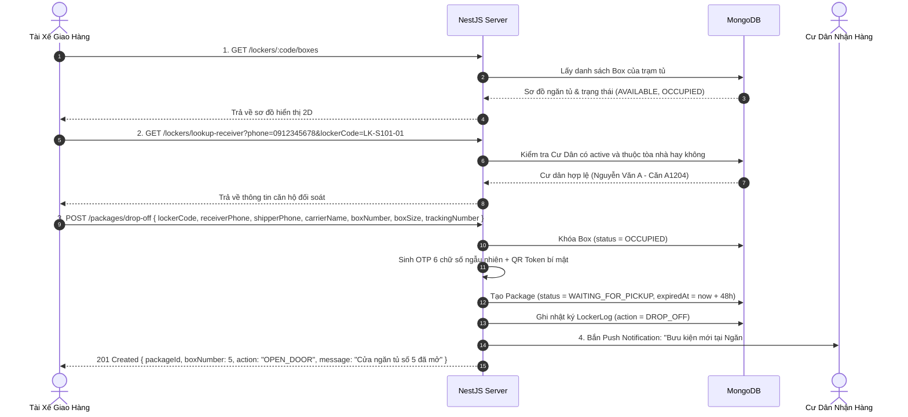
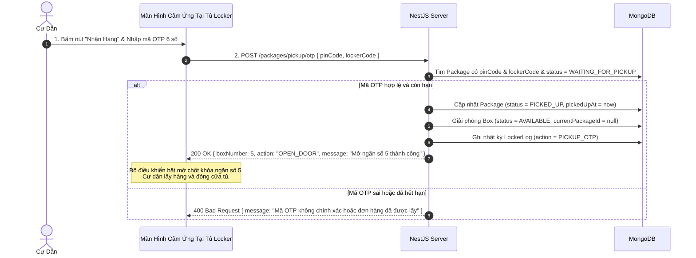
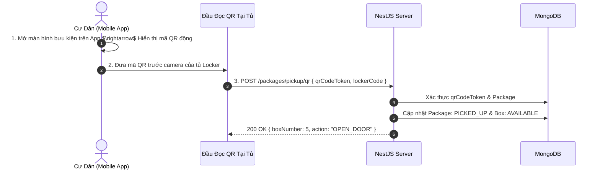

# Đặc Tả Kiến Trúc Hệ Thống Giao Nhận Hàng (Delivery & Retrieval System Specification)

> **Tài liệu thiết kế kiến trúc toàn diện cho 2 module cốt lõi:**
> 1. **Module Lockers & Boxes (Quản Lý Trạm Tủ & Ngăn Tủ)**
> 2. **Module Packages (Quản Lý Bưu Kiện & Quy Trình Giao - Nhận Hàng)**
> 
> *Đã cập nhật đồng bộ 100% với mô hình Shipper Không Cần Tài Khoản (No-Auth Guest Shipper) theo đặc tả `shipper_flow.md`.*

---

## 1. Tổng Quan Hệ Thống

Hệ thống giao nhận hàng Smart Locker cung cấp nền tảng tự động hóa việc giao nhận bưu kiện tại các khu đô thị và chung cư:
- **Shipper (Tài Xế Giao Hàng - Khách Vãng Lai / No Auth)**: Không cần tài khoản $\rightarrow$ Quét mã QR trạm tủ $\rightarrow$ Tra cứu cư dân theo SĐT $\rightarrow$ Chọn cỡ ngăn $\rightarrow$ Bỏ hàng và đóng cửa tủ $\rightarrow$ Hỗ trợ gửi liên tiếp nhiều đơn trong 1 phiên (Batch Drop-off).
- **Resident (Cư Dân Nhận Hàng - JWT Auth)**: Nhận thông báo tức thì (Push Notification) $\rightarrow$ Xem mã OTP 6 số hoặc quét mã QR tại trạm tủ để nhận hàng 24/7.
- **Building Admin & System Admin**: Giám sát tình trạng trạm tủ, tỷ lệ lấp đầy ngăn tủ, quản lý bưu kiện quá hạn lưu kho và hỗ trợ mở tủ khẩn cấp từ xa khi xảy ra sự cố.

```mermaid
graph TD
    subgraph "HẠ TẦNG VẬT LÝ (HARDWARE LAYER)"
        LK[Locker: Trạm Tủ Thông Minh]
        BX[Box: 11-24 Ngăn Tủ Tự Động]
        IOT[IoT Controller: ESP32 / Relay Control]
        LK --- BX
        BX --- IOT
    end

    subgraph "TẦNG DỊCH VỤ (BACKEND NESTJS)"
        ML[Lockers Service: Quản lý trạm & ngăn tủ]
        MP[Packages Service: Xử lý Giao & Nhận]
        MN[Notifications Service: Gửi Push Token]
        MA[Auth & Users: Phân quyền Cư Dân & BQL]
    end

    subgraph "ỨNG DỤNG NGƯỜI DÙNG (CLIENT LAYER)"
        SP[Guest Shipper: Quét QR Tủ gửi hàng nhanh - Không cần Account]
        RD[Mobile App Resident: Nhận mã OTP & Quét QR]
        SCR[Màn hình cảm ứng tại Tủ: Nhập OTP mở cửa]
    end

    SP -->|POST /packages/drop-off (Public)| MP
    RD -->|GET /packages/my-packages (JWT)| MP
    SCR -->|POST /packages/pickup/otp (Public)| MP
    MP --> ML
    MP --> MN
    ML --> IOT
```

---

## 2. Thiết Kế Mô Hình Dữ Liệu (Database Schemas)

### 2.1. Thực thể `Locker` (`lockers` collection)

| Thuộc Tính | Kiểu Dữ Liệu | Ràng Buộc | Mô Tả & Ý Nghĩa Nghiệp Vụ |
| :--- | :--- | :--- | :--- |
| `_id` | `Types.ObjectId` | Primary Key | Mã định danh duy nhất của trạm tủ |
| `name` | `String` | `required, trim` | Tên hiển thị (ví dụ: *"Trạm Tủ Sảnh Chính Tòa S1.01"*) |
| `code` | `String` | `required, unique, uppercase` | Mã trạm tủ duy nhất (ví dụ: *"LK-S101-01"*) |
| `buildingId` | `Types.ObjectId` | `ref: 'Building', required, index` | Tòa nhà nơi đặt trạm tủ |
| `totalBoxes` | `Number` | `required, min: 1` | Tổng số lượng ngăn tủ con (ví dụ: `16` hoặc `11`) |
| `macAddress` | `String` | `required, unique, trim` | Địa chỉ MAC phần cứng của bộ điều khiển IoT |
| `apiKey` | `String` | `required, select: false` | Khóa bí mật dùng để chứng thực request từ bộ điều khiển IoT Kiosk/ESP32 (chống giả mạo MAC) |
| `status` | `String (Enum)` | `enum: LockerStatus, default: ONLINE` | Trạng thái trạm tủ: `ONLINE`, `OFFLINE`, `MAINTENANCE` |
| `locationDescription` | `String` | `optional, trim` | Vị trí đặt tủ (ví dụ: *"Cạnh quầy lễ tân sảnh A tầng 1"*) |
| `coordinates` | `Object` | `{ latitude: Number, longitude: Number }, optional` | Tọa độ địa lý GPS độc lập phục vụ định vị và tính khoảng cách |
| `createdAt` / `updatedAt` | `Date` | `timestamps: true` | Dấu thời gian tạo và cập nhật |

```typescript
export enum LockerStatus {
  ONLINE = 'ONLINE',
  OFFLINE = 'OFFLINE',
  MAINTENANCE = 'MAINTENANCE',
}
```

---

### 2.2. Thực thể `Box` (`boxes` collection)

| Thuộc Tính | Kiểu Dữ Liệu | Ràng Buộc | Mô Tả & Ý Nghĩa Nghiệp Vụ |
| :--- | :--- | :--- | :--- |
| `_id` | `Types.ObjectId` | Primary Key | Mã định danh ngăn tủ con |
| `lockerId` | `Types.ObjectId` | `ref: 'Locker', required, index` | Thuộc về trạm tủ nào |
| `boxNumber` | `Number` | `required, min: 1` | Số thứ tự in trên cánh cửa ngăn tủ (ví dụ: 1, 2, 3...) |
| `size` | `String (Enum)` | `enum: BoxSize, default: MEDIUM` | Kích thước ngăn: `SMALL`, `MEDIUM`, `LARGE` |
| `status` | `String (Enum)` | `enum: BoxStatus, default: AVAILABLE` | Tình trạng: `AVAILABLE` (Trống), `OCCUPIED` (Có hàng), `MAINTENANCE` (Lỗi) |
| `doorStatus` | `String (Enum)` | `enum: DoorStatus, default: CLOSED` | Trạng thái cửa (Reed Switch): `CLOSED` (Đóng), `OPEN` (Mở) |
| `hasItem` | `Boolean` | `default: false` | Trạng thái cảm biến quang học hồng ngoại (IR Sensor) phát hiện có vật thể trong lòng ngăn |
| `currentPackageId`| `Types.ObjectId` | `ref: 'Package', optional` | Bưu kiện đang được lưu trữ bên trong ngăn tủ |

```typescript
export enum BoxSize {
  SMALL = 'SMALL',       // Tài liệu, mỹ phẩm, phụ kiện (10x40x45 cm)
  MEDIUM = 'MEDIUM',     // Quần áo, giày dép, hộp vừa (20x40x45 cm)
  LARGE = 'LARGE',       // Đồ điện tử, kiện hàng lớn (35x40x45 cm)
}

export enum BoxStatus {
  AVAILABLE = 'AVAILABLE',     // Sẵn sàng nhận đơn hàng mới
  OCCUPIED = 'OCCUPIED',       // Đang chứa bưu kiện chưa được lấy
  MAINTENANCE = 'MAINTENANCE', // Hỏng chốt khóa hoặc bảo trì
}

export enum DoorStatus {
  CLOSED = 'CLOSED',
  OPEN = 'OPEN',
}
```

---

### 2.3. Thực thể `Package` (`packages` collection)

> **Cập nhật cốt lõi:** Shipper không cần tạo tài khoản, do đó `shipperId` là tùy chọn (`optional`), hệ thống định danh Shipper bằng `shipperPhone` và `carrierName` bắt buộc.

| Thuộc Tính | Kiểu Dữ Liệu | Ràng Buộc | Mô Tả & Ý Nghĩa Nghiệp Vụ |
| :--- | :--- | :--- | :--- |
| `_id` | `Types.ObjectId` | Primary Key | Mã định danh bưu kiện |
| `trackingNumber` | `String` | `required, index, trim` | Mã vận đơn của đơn vị vận chuyển (ví dụ: *"SPX123456789"*) |
| `lockerId` | `Types.ObjectId` | `ref: 'Locker', required, index` | Trạm tủ đang lưu giữ bưu kiện |
| `boxId` | `Types.ObjectId` | `ref: 'Box', required` | Ngăn tủ cụ thể chứa bưu kiện |
| `buildingId` | `Types.ObjectId` | `ref: 'Building', required, index` | Tòa nhà của cư dân nhận hàng |
| `residentId` | `Types.ObjectId` | `ref: 'User', required, index` | Cư dân thụ hưởng bưu kiện |
| `receiverPhone` | `String` | `required, trim` | Số điện thoại cư dân nhận hàng |
| `receiverName` | `String` | `required, trim` | Tên cư dân nhận hàng |
| `apartment` | `String` | `required, trim` | Số căn hộ người nhận (ví dụ: *"A1204"*) |
| `shipperPhone` | `String` | `required, index, trim` | Số điện thoại tài xế giao hàng để đối soát |
| `shipperName` | `String` | `optional, trim` | Tên tài xế giao hàng |
| `carrierName` | `String` | `required, trim` | Hãng giao vận (Shopee Xpress, GHTK, GHN, ViettelPost...) |
| `shipperId` | `Types.ObjectId` | `ref: 'User', optional, index` | Mã tài khoản nếu là shipper nội bộ liên kết |
| `pinCode` | `String` | `required, index` | Mã OTP 6 số (duy nhất trong các đơn `WAITING_FOR_PICKUP` tại cùng 1 trạm tủ) |
| `qrCodeToken` | `String` | `required, unique` | Token bí mật phục vụ tạo mã QR quét mở tủ |
| `failedAttempts` | `Number` | `default: 0` | Số lần nhập sai mã OTP liên tiếp tại trạm tủ (chống Brute-force dò mã) |
| `lockedUntil` | `Date` | `optional` | Khóa tạm thời quyền mở ngăn bằng OTP nếu nhập sai quá 5 lần (ví dụ: khóa 15 phút) |
| `status` | `String (Enum)` | `enum: PackageStatus, default: WAITING_FOR_PICKUP` | Trạng thái bưu kiện |
| `droppedOffAt` | `Date` | `required` | Thời điểm shipper bỏ hàng vào tủ thành công |
| `pickedUpAt` | `Date` | `optional` | Thời điểm cư dân mở tủ lấy hàng |
| `expiredAt` | `Date` | `required` | Hạn chót lấy hàng (mặc định: `droppedOffAt + 48 giờ`) |
| `note` | `String` | `optional, trim` | Ghi chú đơn hàng (ví dụ: *"Hàng dễ vỡ"*) |

```typescript
export enum PackageStatus {
  WAITING_FOR_PICKUP = 'WAITING_FOR_PICKUP', // Đang chờ cư dân đến lấy
  PICKED_UP = 'PICKED_UP',                   // Cư dân đã lấy hàng thành công
  OVERDUE = 'OVERDUE',                       // Quá hạn lưu kho (sau 48h)
  RETURNED = 'RETURNED',                     // Đã hoàn trả lại cho Shipper/BQL
}
```

---

### 2.4. Thực thể `LockerLog` (`locker_logs` collection - Nhật Ký Đóng/Mở Tủ)

| Thuộc Tính | Kiểu Dữ Liệu | Ràng Buộc | Mô Tả & Ý Nghĩa Nghiệp Vụ |
| :--- | :--- | :--- | :--- |
| `_id` | `Types.ObjectId` | Primary Key | Mã nhật ký |
| `lockerId` | `Types.ObjectId` | `ref: 'Locker', required, index` | Trạm tủ thực hiện hành động |
| `boxNumber` | `Number` | `required` | Số ngăn tủ bị tác động |
| `packageId` | `Types.ObjectId` | `ref: 'Package', optional` | Bưu kiện liên quan |
| `action` | `String (Enum)` | `enum: LockerAction` | Hành động mở/đóng tủ |
| `performedBy` | `String` | `required` | Số điện thoại hoặc User ID người thực hiện |
| `status` | `String` | `SUCCESS` hoặc `FAILED` | Kết quả thực thi |
| `metadata` | `Object` | `optional` | Dữ liệu ngữ cảnh kỹ thuật: trạng thái cảm biến IR/Reed switch, mã lỗi phần cứng |
| `createdAt` | `Date` | `timestamps: true` | Thời điểm thực hiện |

```typescript
export enum LockerAction {
  DROP_OFF = 'DROP_OFF',                     // Tài xế mở tủ gửi hàng
  PICKUP_OTP = 'PICKUP_OTP',                 // Cư dân nhập mã OTP nhận hàng
  PICKUP_QR = 'PICKUP_QR',                   // Cư dân quét mã QR nhận hàng
  REMOTE_OPEN = 'REMOTE_OPEN',               // Ban quản lý mở tủ từ xa
  FORCE_OPEN = 'FORCE_OPEN',                 // Mở cưỡng bức khi xử lý sự cố kỹ thuật
  OVERDUE_RETRIEVAL = 'OVERDUE_RETRIEVAL',   // Thu hồi bưu phẩm quá hạn lưu kho
}
```

---

### 2.5. Chiến Lược Đánh Chỉ Mục MongoDB (Database Indexing Strategy)

Để đảm bảo toàn vẹn dữ liệu phần cứng và tối ưu hóa hiệu năng truy vấn cho toàn hệ thống:

```typescript
// 1. Boxes Collection: Đảm bảo trong 1 trạm tủ không bao giờ trùng lặp số ngăn
BoxSchema.index({ lockerId: 1, boxNumber: 1 }, { unique: true });
BoxSchema.index({ lockerId: 1, status: 1, size: 1 }); // Shipper lọc nhanh ngăn trống theo cỡ

// 2. Packages Collection: Tối ưu tra cứu nhận hàng và Cronjob
PackageSchema.index({ lockerId: 1, pinCode: 1, status: 1 }); // Mở tủ bằng OTP tại màn hình Kiosk
PackageSchema.index({ qrCodeToken: 1 }, { unique: true });    // Quét QR mở tủ tức thì
PackageSchema.index({ residentId: 1, status: 1 });           // Cư dân xem danh sách bưu kiện của mình
PackageSchema.index({ status: 1, expiredAt: 1 });            // Cronjob tự động quét đơn hàng quá hạn 48h
```

---

## 3. Quy Trình Nghiệp Vụ & Sequence Diagrams

### 3.1. Quy Trình Shipper Gửi Hàng (Drop-off Flow - No Auth)



---

### 3.2. Quy Trình Cư Dân Nhận Hàng Bằng Mã OTP (Pick-up OTP Flow)



---

### 3.3. Quy Trình Cư Dân Quét Mã QR Mở Tủ (Pick-up QR Flow)



---

## 4. Ma Trận Phân Quyền API (RBAC Matrix)

| Chức Năng | Method & Endpoint | Phân Quyền (RBAC) | Mô Tả Nghiệp Vụ |
| :--- | :--- | :---: | :--- |
| **Thông tin trạm tủ** | `GET /lockers/:code` | **Public** | Lấy thông tin trạm tủ khi quét QR trên thân tủ |
| **Sơ đồ các ngăn tủ** | `GET /lockers/:code/boxes` | **Public** | Lấy danh sách toàn bộ các ngăn tủ (trống/bận, cỡ S/M/L) |
| **Tra cứu Cư Dân** | `GET /lockers/lookup-receiver` | **Public** | Tra cứu tên & căn hộ theo SĐT trước khi mở tủ gửi |
| **Shipper gửi hàng** | `POST /packages/drop-off` | **Public (Guest)** | Gửi hàng vào tủ, mở chốt điện từ, sinh OTP cho cư dân |
| **Bưu kiện của tôi** | `GET /packages/my-packages` | `RESIDENT` *(JWT)* | Cư dân xem các đơn đang chờ nhận và lịch sử nhận |
| **Chi tiết bưu kiện** | `GET /packages/:id` | `RESIDENT` *(JWT)* | Xem chi tiết kiện hàng, vị trí ngăn, mã OTP, hạn lấy |
| **Lấy QR Token nhận**| `GET /packages/:id/qr-token` | `RESIDENT` *(JWT)* | Lấy mã QR động dùng để quét trước camera tủ |
| **Nhập OTP mở tủ** | `POST /packages/pickup/otp` | **Public / Kiosk Tủ**| Nhập OTP 6 số tại màn hình tủ để mở khóa lấy đồ |
| **Quét QR mở tủ** | `POST /packages/pickup/qr` | **Public / Kiosk Tủ**| Quét QR Token trước camera tủ để mở khóa lấy đồ |
| **Danh sách trạm tủ** | `GET /lockers` | `SYSTEM_ADMIN`, `BUILDING_ADMIN` | Quản trị viên xem mạng lưới trạm tủ toàn hệ thống |
| **Tạo trạm tủ mới** | `POST /lockers` | `SYSTEM_ADMIN` | Thêm trạm tủ mới (auto sinh các ngăn tủ con) |
| **Mở tủ khẩn cấp từ xa**| `POST /lockers/:id/remote-open`| `BUILDING_ADMIN` | BQL mở khẩn cấp khi kẹt cửa hoặc xử lý sự cố |
| **Bưu kiện tòa nhà** | `GET /packages/building-packages`| `BUILDING_ADMIN` | BQL giám sát các bưu kiện đang lưu tại sảnh |

---

## 5. Đặc Tả Chi Tiết API (API Specifications)

### 5.1. `POST /packages/drop-off` (Tài Xế Gửi Hàng Vào Tủ - Không Cần Token)
- **Quyền truy cập**: Public
- **Request Body**:
```json
{
  "lockerCode": "LK-S101-01",
  "receiverPhone": "0912345678",
  "shipperPhone": "0987654321",
  "shipperName": "Trần Giao Hàng",
  "carrierName": "Shopee Xpress",
  "boxNumber": 4,
  "boxSize": "MEDIUM",
  "trackingNumber": "SPX839201948",
  "note": "Hàng quần áo đóng hộp"
}
```
- **Response (201 Created)**:
```json
{
  "message": "Gửi bưu kiện vào tủ thành công",
  "package": {
    "_id": "6b1234567890abcdef123456",
    "trackingNumber": "SPX839201948",
    "receiverName": "Nguyễn Văn Cư Dân",
    "receiverPhone": "0912345678",
    "apartment": "A1204",
    "boxNumber": 4,
    "boxSize": "MEDIUM",
    "status": "WAITING_FOR_PICKUP",
    "droppedOffAt": "2026-09-01T08:00:00.000Z",
    "expiredAt": "2026-09-03T08:00:00.000Z"
  },
  "action": {
    "command": "OPEN_DOOR",
    "boxNumber": 4
  }
}
```

---

### 5.2. `GET /lockers/lookup-receiver` (Tra Cứu Cư Dân Hợp Lệ Trước Khi Mở Tủ)
- **Quyền truy cập**: Public
- **Query Params**: `phone=0912345678&lockerCode=LK-S101-01`
- **Response (200 OK)**:
```json
{
  "found": true,
  "receiverName": "Nguyễn Văn A",
  "apartment": "A1204",
  "buildingName": "Tòa S1.01",
  "buildingId": "6a95091f1e23b42475f441d3"
}
```
- **Response Khi Không Thuộc Tòa Nhà (404 Not Found)**:
```json
{
  "statusCode": 404,
  "message": "Số điện thoại này chưa được đăng ký làm cư dân của tòa nhà"
}
```

---

### 5.3. `GET /lockers/:code/boxes` (Lấy Sơ Đồ Ngăn Tủ Hiển Thị Cho Shipper)
- **Quyền truy cập**: Public
- **Response (200 OK)**:
```json
{
  "lockerCode": "LK-S101-01",
  "name": "Trạm Tủ Sảnh Chính Tòa S1.01",
  "totalBoxes": 11,
  "availableCount": 7,
  "boxes": [
    { "boxNumber": 1, "size": "SMALL", "status": "AVAILABLE", "doorStatus": "CLOSED" },
    { "boxNumber": 2, "size": "SMALL", "status": "OCCUPIED", "doorStatus": "CLOSED" },
    { "boxNumber": 4, "size": "MEDIUM", "status": "AVAILABLE", "doorStatus": "CLOSED" }
  ]
}
```

---

### 5.4. `POST /packages/pickup/otp` (Nhập OTP Tại Màn Hình Tủ Để Nhận Hàng)
- **Quyền truy cập**: Public / Kiosk Tủ
- **Request Body**:
```json
{
  "lockerCode": "LK-S101-01",
  "pinCode": "384920"
}
```
- **Response (200 OK)**:
```json
{
  "message": "Xác thực mã OTP thành công. Cửa ngăn tủ số 4 đã mở!",
  "package": {
    "_id": "6b1234567890abcdef123456",
    "trackingNumber": "SPX839201948",
    "status": "PICKED_UP",
    "pickedUpAt": "2026-09-01T10:30:00.000Z"
  },
  "boxNumber": 4,
  "action": "OPEN_DOOR"
}
```

---

### 5.5. `GET /packages/my-packages` (Cư Dân Xem Bưu Kiện Của Mình)
- **Header**: `Authorization: Bearer <RESIDENT_TOKEN>`
- **Response (200 OK)**:
```json
[
  {
    "_id": "6b1234567890abcdef123456",
    "trackingNumber": "SPX839201948",
    "lockerName": "Trạm Tủ Sảnh Chính Tòa S1.01",
    "lockerCode": "LK-S101-01",
    "boxNumber": 4,
    "boxSize": "MEDIUM",
    "pinCode": "384920",
    "status": "WAITING_FOR_PICKUP",
    "carrierName": "Shopee Xpress",
    "droppedOffAt": "2026-09-01T08:00:00.000Z",
    "expiredAt": "2026-09-03T08:00:00.000Z"
  }
]
```

---

## 6. Lộ Trình Triển Khai Backend (NestJS Roadmap)

```text
GIAI ĐOẠN 1: MODULE LOCKERS & BOXES (HẠ TẦNG TRẠM TỦ)
├── 1.1 Khởi tạo Enums: LockerStatus, BoxStatus, BoxSize, DoorStatus
├── 1.2 Khởi tạo Schemas Mongoose: LockerSchema, BoxSchema
├── 1.3 Xây dựng LockersService:
│   ├── Khởi tạo trạm tủ kèm auto-generate các ngăn con
│   ├── GET /lockers/:code (Thông tin trạm tủ)
│   ├── GET /lockers/:code/boxes (Sơ đồ ngăn tủ thời gian thực)
│   └── GET /lockers/lookup-receiver (Tra cứu xác minh SĐT Cư Dân)
├── 1.4 Khởi tạo LockersController & Swagger Docs
└── 1.5 Cập nhật seed.ts: Nạp sẵn trạm LK-S101-01 (Vinhomes) & LK-TECCO-01 (Tecco Linh Đông)

GIAI ĐOẠN 2: MODULE PACKAGES & GIAO NHẬN (CORE BUSINESS LOGIC)
├── 2.1 Khởi tạo Enums: PackageStatus, LockerAction
├── 2.2 Khởi tạo Schemas Mongoose: PackageSchema (hỗ trợ shipperPhone/carrierName), LockerLogSchema
├── 2.3 Xây dựng PackagesService:
│   ├── POST /packages/drop-off (No-Auth Guest Shipper gửi hàng, khóa Box, sinh OTP 6 số)
│   ├── GET /packages/my-packages (Cư Dân xem danh sách đơn đang chờ)
│   ├── GET /packages/:id (Chi tiết kiện hàng)
│   ├── POST /packages/pickup/otp (Nhập OTP mở tủ, đổi Box thành AVAILABLE)
│   └── POST /packages/pickup/qr (Quét QR mở tủ)
├── 2.4 Xây dựng module Notifications (Tích hợp Expo Push Service gửi thông báo tới app Cư Dân)
└── 2.5 Cronjob tự động chuyển trạng thái đơn hàng quá hạn (OVERDUE sau 48h)

GIAI ĐOẠN 3: TÍCH HỢP TOÀN DIỆN MOBILE APP & KIOSK
├── 3.1 Nối API Mobile Shipper: drop-off/scan -> locker/select -> locker/interaction -> drop-off/summary
├── 3.2 Nối API Mobile Resident: Trang chủ (readyShipment) -> Bưu phẩm -> Mở tủ OTP
└── 3.3 Kiểm thử E2E trọn vẹn luồng từ khi Shipper bỏ đồ đến khi Cư Dân nhận hàng
```
