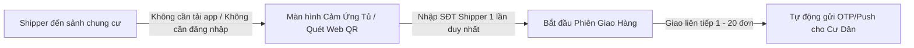
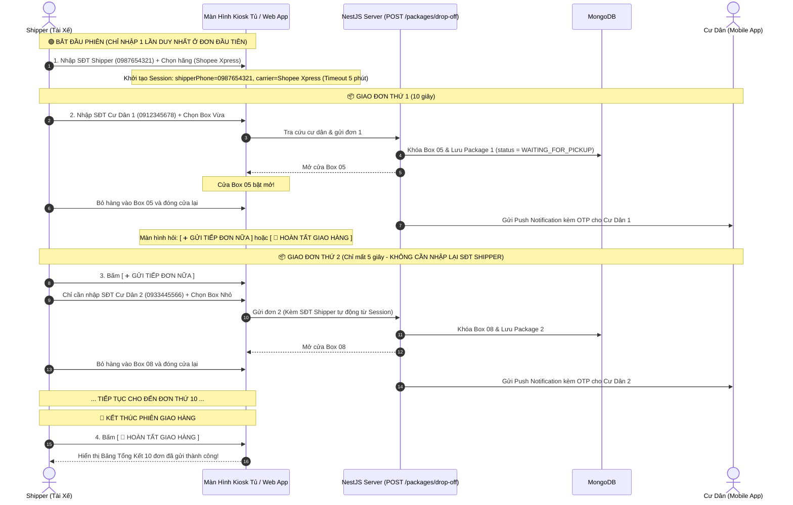
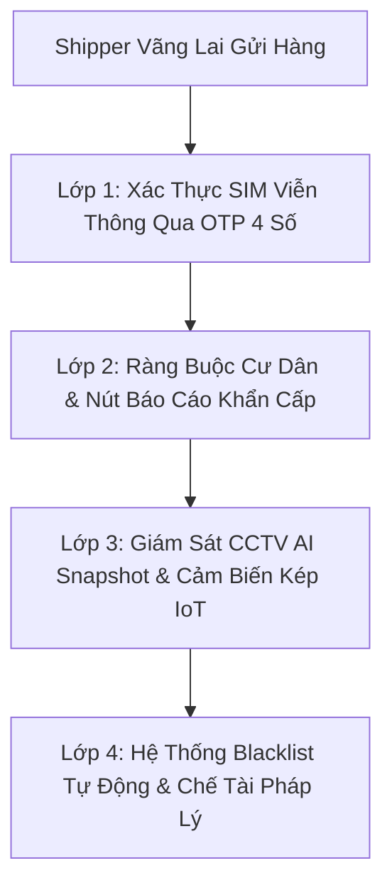
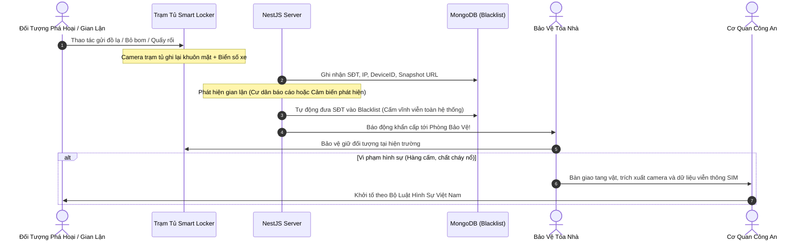

# Đặc Tả Quy Trình Giao Hàng Của Shipper (Shipper Drop-off Workflow)

> **Mô Hình Giao Hàng Không Cần Tài Khoản (Zero-Friction Guest Courier Model)**  
> *Áp dụng cho toàn bộ các đối tác giao vận: Shopee Xpress, GHTK, GHN, Viettel Post, J&T, Ninja Van, GrabExpress, Ahamove và tài xế tự do.*

---

## 1. Tổng Quan Triết Lý Thiết Kế (Design Philosophy)

Trong hệ thống Smart Locker chung cư:
- **Cư Dân (Resident)** là khách hàng cốt lõi $\rightarrow$ Cần tài khoản, định danh căn hộ, cài đặt ứng dụng di động để nhận mã OTP/QR mở tủ.
- **Shipper (Tài Xế Giao Hàng)** là đối tác vãng lai đưa hàng vào điểm giao nhận $\rightarrow$ **Cần tốc độ và sự tiện lợi tuyệt đối (< 15 - 30 giây mỗi đơn hàng)**.
- **Mô hình Không Cần Đăng Ký/Đăng Nhập (No Auth)** giúp:
  - Loại bỏ 100% rào cản cài đặt app và nhớ mật khẩu.
  - Tỉ lệ tài xế đồng ý sử dụng tủ thông minh đạt trên **95%**.
  - Tránh tình trạng tài xế đứng dưới sảnh gọi điện làm phiền cư dân vào giờ làm việc.



---

## 2. Quy Trình Giao Hàng Hàng Loạt (Batch Drop-off Session)

Khi Shipper mang **nhiều đơn hàng (5, 10, 20 đơn)** đến cùng một tòa nhà, hệ thống sử dụng cơ chế **"Phiên Giao Hàng Liên Tiếp (Session)"** để Shipper **CHỈ CẦN NHẬP SỐ ĐIỆN THOẠI CỦA MÌNH ĐÚNG 1 LẦN DUY NHẤT**.



---

## 3. Chi Tiết Các Màn Hình Trải Nghiệm Của Shipper

### 3.1. Màn Hình 1: Bắt Đầu Phiên (Đơn đầu tiên)
- **Nút to**: `[ 📦 GỬI HÀNG TẠI TỦ ]`
- **Nhập**:
  1. Số điện thoại Shipper: `0987 654 321` (Được lưu trong Session).
  2. Hãng vận chuyển: *Shopee Xpress, GHTK, GHN, Viettel Post, Khác...*
  3. Số điện thoại Cư Dân nhận hàng: `0912 345 678`.
- **Hệ thống hiển thị xác nhận tức thì**:
  > ✅ **Xác nhận người nhận:** Cư Dân *Nguyễn Văn A* — Căn hộ: *A1204*
- **Chọn kích thước Box**:
  - `[ 📦 Box Nhỏ (S) ]` — Tài liệu, mỹ phẩm, phụ kiện
  - `[ 📦 Box Vừa (M) ]` — Quần áo, hộp giày tiêu chuẩn
  - `[ 📦 Box Lớn (L) ]` — Gia dụng, đồ cồng kềnh

---

### 3.2. Màn Hình 2: Mở Cửa & Đặt Hàng
- Cửa ngăn tủ số tương ứng tự động bật mở (ví dụ: **Ngăn #05**).
- Màn hình hiển thị animation hướng dẫn: *"Vui lòng đặt kiện hàng vào Ngăn số 05 và đẩy đóng cửa lại"*.
- Sau khi cảm biến phát hiện cửa đã đóng an toàn $\rightarrow$ Chuyển ngay sang **Màn Hình 3**.

---

### 3.3. Màn Hình 3: Điều Hướng Giao Tiếp Hay Kết Thúc
Màn hình hiển thị 2 nút bấm lớn:
- 🟠 **`[ ➕ GỬI TIẾP ĐƠN NỮA ]`** (Màu cam nổi bật):
  - Nhảy ngay vào màn hình nhập **Số điện thoại Cư Dân tiếp theo**.
  - **Giữ nguyên SĐT Shipper & Hãng vận chuyển** từ phiên hiện tại.
  - Shipper gửi đơn thứ 2, 3, 4... chỉ mất **5 - 7 giây mỗi đơn**!
- ⚪ **`[ 🚪 HOÀN TẤT GIAO HÀNG ]`** (Màu xám):
  - Kết thúc phiên làm việc.

---

### 3.4. Màn Hình 4: Bảng Tổng Kết Phiên (Delivery Summary)
Hiển thị danh sách tóm tắt toàn bộ các đơn hàng đã gửi trong phiên để Shipper đối soát hoặc chụp ảnh lưu bằng chứng:
```text
======================================================
           TỔNG KẾT PHIÊN GIAO HÀNG (10 ĐƠN)
  Shipper: 0987 654 321  |  Đơn vị: Shopee Xpress
  Thời gian: 31/08/2026 16:30  |  Trạm tủ: Sảnh Tòa S1.01
======================================================
1. Căn A1204 (Anh A)     ->  Ngăn #05 (M)  [ ĐÃ GỬI ]
2. Căn B0502 (Chị B)     ->  Ngăn #08 (S)  [ ĐÃ GỬI ]
3. Căn A0801 (Anh C)     ->  Ngăn #12 (M)  [ ĐÃ GỬI ]
4. Căn B1103 (Chị D)     ->  Ngăn #15 (L)  [ ĐÃ GỬI ]
...
======================================================
      CẢM ƠN BẠN ĐÃ SỬ DỤNG SMART LOCKER!
```

---

### 3.5. Cơ Chế Tự Động Đăng Xuất An Toàn (Auto-Timeout 60s)
- Nếu Shipper gửi xong bưu kiện cuối cùng mà **vội đi ngay không bấm Hoàn tất**, sau **60 giây không có tương tác**, Kiosk sẽ **tự động kết thúc phiên**, xóa session và quay về màn hình chờ ban đầu.

---

### 3.6. Quy Trình Khách Vãng Lai Trên Ứng Dụng Di Động (Mobile App Guest Drop-off Flow)

Đối với các trạm tủ không trang bị màn hình Kiosk lớn hoặc khi tài xế sử dụng trực tiếp ứng dụng di động Smart Locker trên điện thoại của mình:

1. **Khởi Tạo Phiên Shipper Thông Minh (Smart Session BottomSheet)**:
   - Khi Shipper chọn chế độ *"Tài Xế Giao Hàng"* từ màn hình Đăng Nhập:
     - Ứng dụng kiểm tra bộ nhớ đệm `AsyncStorage`: Nếu đã từng giao hàng trước đó $\rightarrow$ Tự động điền lại Số điện thoại Shipper, Tên tài xế và Hãng vận chuyển (tiết kiệm 100% thời gian nhập liệu).
     - Nếu là lần đầu tiên $\rightarrow$ Mở BottomSheet yêu cầu nhập SĐT Shipper và chọn Hãng giao vận.
2. **Quét Mã Định Danh Trạm Tủ (`/drop-off/scan`)**:
   - Quét mã QR dán trên thân tủ (hoặc chọn nhanh mã tủ `LK-S101-01`, `LK-TECCO-01`).
3. **Màn Hình Gửi Hàng Tập Trung (`/locker/select`)**:
   - **Tự động đối soát Cư Dân**: Gõ SĐT Cư Dân $\rightarrow$ Tự động kiểm tra danh sách duyệt cư dân của tòa nhà, hiển thị Tên và Căn hộ.
   - **Ràng buộc kích thước**: Chọn cỡ bưu phẩm (S, M, L) $\rightarrow$ Hệ thống tự động kiểm tra tương thích, ngăn chặn việc chọn ngăn nhỏ hơn bưu phẩm.
   - **Chọn ngăn tủ 2D**: Bấm chọn ngăn trống trực tiếp trên sơ đồ bàn cờ thời gian thực.
   - **Bấm "Mở tủ & Gửi hàng"**: Hệ thống tự động truyền `shipperPhone`, `shipperName` từ Phiên làm việc vào API `POST /packages/drop-off` mà không bị gán cứng.
4. **Màn Hình Thành Công & Gửi Liên Hoàn (`/locker/success`)**:
   - Nút **`[ ➕ GỬI TIẾP ĐƠN NỮA ]`**: Giữ nguyên toàn bộ thông tin phiên làm việc của Shipper, quay lại màn hình chọn ngăn để giao tiếp các đơn hàng tiếp theo cho cư dân khác trong tòa nhà chỉ với **5 giây/đơn**.
   - Nút **`[ 🏁 HOÀN TẤT PHIÊN GIAO ]`**: Chuyển sang màn hình Tổng Kết (`/drop-off/summary`) để xem biên bản điện tử và đóng phiên làm việc.

---

## 4. Cơ Chế An Ninh & Chống Gian Lận (Accountability)

| Rủi Ro Tiềm Ẩn | Cơ Chế Kiểm Soát & Giải Quyết Thực Tế |
| :--- | :--- |
| **Shipper bấm mở tủ nhưng không bỏ hàng vào** | 1. **Cảm biến hồng ngoại/trọng lượng** gắn trong ngăn tủ kiểm tra sự hiện diện của kiện hàng.<br/>2. **Cư dân phản hồi**: Khi ra mở tủ thấy trống, cư dân bấm nút *"Báo cáo: Ngăn tủ rỗng"* trên app $\rightarrow$ Hệ thống truy xuất ngay `shipperPhone` của đơn đó. |
| **Shipper gửi nhầm đồ hoặc hàng hóa bị hỏng** | 1. **Camera an ninh góc rộng** đặt trên nóc trạm tủ ghi lại toàn bộ quá trình đóng/mở tủ.<br/>2. **Số điện thoại Shipper** được lưu vĩnh viễn trên bản ghi đơn hàng để BQL tòa nhà liên hệ xử lý bồi thường. |
| **Shipper gửi cho người ngoài không thuộc chung cư** | Hệ thống **chặn hoàn toàn** việc mở tủ nếu số điện thoại người nhận chưa được Ban Quản Lý phê duyệt là Cư Dân chính thức của tòa nhà. |
| **Gói hàng quá hạn lưu kho (> 48 giờ)** | Sau 48 giờ cư dân chưa lấy, hệ thống tự động gửi tin nhắn SMS/Zalo cho `shipperPhone`: *"Đơn hàng tại Ngăn #05 đã quá hạn 48h. Vui lòng đến thu hồi hoặc liên hệ BQL"*. |

---

## 5. Đặc Tả API Phục Vụ Shipper Giao Hàng

### 5.1. Tra Cứu Căn Hộ Cư Dân Trước Khi Gửi
- **Endpoint**: `GET /lockers/lookup-receiver`
- **Quyền truy cập**: Public (Kiosk Tủ)
- **Query Params**: `phone=0912345678`, `lockerCode=LK-S101-01`
- **Response (200 OK)**:
```json
{
  "found": true,
  "receiverName": "Nguyễn Văn A",
  "apartment": "A1204",
  "buildingName": "Tòa S1.01"
}
```

---

### 5.2. Thực Hiện Gửi Hàng & Mở Cửa Tủ (Hỗ Trợ Batch Drop-off)
- **Endpoint**: `POST /packages/drop-off`
- **Quyền truy cập**: Public (Kiosk Tủ / Web Quick Drop-off)
- **Request Body**:
```json
{
  "lockerCode": "LK-S101-01",
  "receiverPhone": "0912345678",
  "shipperPhone": "0987654321",
  "shipperName": "Trần Giao Hàng",
  "carrierName": "Shopee Xpress",
  "boxSize": "MEDIUM",
  "trackingNumber": "SPX987654321",
  "note": "Hàng quần áo đóng hộp"
}
```
- **Response (201 Created)**:
```json
{
  "message": "Mở ngăn tủ gửi hàng thành công",
  "boxNumber": 5,
  "boxSize": "MEDIUM",
  "packageId": "6a953f5ae2ed7c7d8d8a8ee9",
  "expiredAt": "2026-09-02T08:00:00.000Z",
  "action": {
    "command": "OPEN_DOOR",
    "boxNumber": 5
  }
}
```

---

## 6. Lợi Ích Của Mô Hình Đối Với Các Bên Liên Quan

1. **Đối Với Shipper**:
   - Giao 1 đơn mất **15 giây**, giao 10 đơn liên tiếp chỉ mất **khoảng 1 - 2 phút**.
   - Không bị trễ chỉ tiêu số lượng đơn trong ngày.
   - Không phải đứng chờ cư dân đi thang máy xuống sảnh (tiết kiệm 10-15 phút/đơn).
2. **Đối Với Cư Dân**:
   - Không bị gọi điện làm phiền khi đang bận họp, chăm con hay đi vắng.
   - Nhận hàng chủ động 24/7 bất kỳ lúc nào rảnh bằng mã OTP hoặc quét QR.
3. **Đối Với Ban Quản Lý Tòa Nhà**:
   - Sảnh chung cư văn minh, gọn gàng, không có cảnh bưu kiện vứt bừa bãi tại bàn lễ tân.
   - Tránh rủi ro thất lạc, mất cắp hàng hóa.

---

## 7. Khung An Ninh Đa Tầng: Chống SĐT Ảo, Phá Hoại & Hàng Cấm (Multi-Layer Security Framework)

> [!WARNING]
> **Mối đe dọa thực tế đối với mô hình Shipper vãng lai không cần tài khoản**:
> 1. **Kẻ xấu nhập Số Điện Thoại Ảo (Fake Phone)** để chiếm dụng ngăn tủ, phá phách làm tê liệt trạm tủ hoặc gửi đồ rác/hư hỏng.
> 2. **Lợi dụng tủ thông minh để giao nhận hàng cấm**: Chất cháy nổ, vũ khí, ma túy, hóa chất độc hại gây đe dọa trực tiếp an ninh và tính mạng cư dân chung cư.

Để triệt tiêu các nguy cơ trên mà **vẫn giữ nguyên tốc độ giao hàng nhanh** cho Shipper chân chính, hệ thống triển khai kiến trúc **Phòng Thủ Đa Tầng Chuyên Sâu (Defense-in-Depth)** gồm 4 lớp bảo vệ:



---

### 7.1. Lớp 1: Xác Thực SIM Viễn Thông Qua OTP Tức Thời (Instant Phone Verification)

Kẻ xấu chỉ có thể nhập số ảo khi hệ thống **không xác minh quyền sở hữu thiết bị/SIM**.

- **Quy trình triển khai**:
  1. Khi một Shipper nhập số điện thoại lần đầu tiên tại trạm tủ hoặc ứng dụng di động $\rightarrow$ Hệ thống tự động gửi **Mã OTP 4 số** qua SMS Brandname hoặc Zalo ZNS trong **1 - 2 giây**.
  2. Shipper nhập 4 số OTP để xác thực quyền sở hữu SIM.
  3. **Tối ưu trải nghiệm không gây phiền hà**:
     - Shipper **CHỈ CẦN XÁC THỰC OTP 1 LẦN DUY NHẤT** khi bắt đầu ca làm việc hoặc lần đầu tiên đến trạm tủ.
     - Hệ thống cấp mã `GuestTrustToken` lưu trên thiết bị / Cache Redis với hạn dùng **60 ngày**. Trong suốt 60 ngày tiếp theo, tài xế đến giao tại bất kỳ tủ nào cũng **không cần nhập lại OTP**.
- **Ý nghĩa an ninh**:
  - Chặn **100% SĐT rác, SĐT bịa đặt**.
  - Theo Nghị định 49/2017/NĐ-CP và Luật Viễn thông Việt Nam, mọi thuê bao di động đều được định danh CCCD chính chủ $\rightarrow$ Luôn truy cứu được danh tính người gửi khi có sự cố.

---

### 7.2. Lớp 2: Cơ Chế "Khóa Hai Đầu" — Cư Dân Kiểm Soát & Nút Báo Cáo Khẩn Cấp

Kẻ xấu không thể tự ý mở tủ nếu không có **Số điện thoại Cư Dân hợp lệ** được Ban Quản Lý phê duyệt:

1. **Ràng buộc Người Nhận Cư Dân**:
   - Hệ thống đối soát API `GET /lockers/lookup-receiver`: Bắt buộc số điện thoại người nhận phải là Cư Dân chính thức thuộc tòa nhà. Không hỗ trợ gửi cho người ngoài chung cư.
2. **Thông Báo Tức Thì Kèm Quyền Khóa Ngăn Tủ (Panic Button)**:
   - Ngay khi Shipper đóng cửa tủ, Cư Dân nhận được thông báo đẩy (Push Notification) trên ứng dụng:
     > *"📦 Kiện hàng mới từ Tài xế [0987.xxx.xxx] đã được gửi vào Ngăn #05."*
   - Kèm nút hành động khẩn cấp: **`[ 🚨 TÔI KHÔNG ĐẶT ĐƠN NÀY / BÁO CÁO ĐƠN LẠ ]`**.
   - Nếu Cư Dân bấm báo cáo đơn lạ:
     - Hệ thống **khóa cứng ngay lập tức** Ngăn số 05 (vô hiệu hóa mã OTP nhận hàng).
     - Đèn LED trên ngăn tủ chuyển sang màu đỏ nhấp nháy, phát còi cảnh báo ngắn.
     - Phát tín hiệu khẩn cấp đến màn hình giám sát của **Ban Quản Lý và Phòng Trực Bảo Vệ Tòa Nhà**.

---

### 7.3. Lớp 3: Bằng Chứng Kỹ Thuật Số & Cảm Biến Vật Lý (CCTV & Dual IoT Sensors)

1. **Camera AI Snapshot (Trích xuất hình ảnh lúc mở tủ)**:
   - Camera an ninh góc rộng trên nóc trạm tủ tự động chụp lại hình ảnh khuôn mặt của người thực hiện thao tác mở tủ và ghi nhận cùng thời điểm `droppedOffAt`.
   - Kết hợp hệ thống camera giao thông tại sảnh chung cư ghi nhận biển số xe của tài xế ra vào cổng sảnh.
2. **Cảm biến kép ngăn tủ (Dual Sensor)**:
   - **Cảm biến hồng ngoại**: Xác định tài xế có đặt vật thể vào ngăn hay không (chống bấm mở tủ ảo rồi bỏ đi).
   - **Cảm biến trọng lượng (Weight Sensor)**: Phát hiện các vật thể rỗng (< 20g) hoặc các kiện hàng quá tải trọng cho phép.
   - **Cảm biến khói/nhiệt độ IoT**: Cảnh báo sớm nếu có nguy cơ cháy nổ từ bên trong ngăn tủ.

---

### 7.4. Lớp 4: Hệ Thống Danh Sách Đen (Automated Blacklist) & Chế Tài Pháp Lý



1. **Danh Sách Đen Toàn Cầu (Global Blacklist)**:
   - Thuê bao vi phạm (mở tủ không gửi hàng nhiều lần, bị cư dân báo cáo đơn lạ, spam OTP) sẽ bị đưa vào danh sách đen.
   - SĐT này sẽ bị **chặn vĩnh viễn** không thể thực hiện gửi hoặc nhận hàng tại bất kỳ trạm tủ nào thuộc hệ thống Smart Locker trên toàn quốc.
2. **Biển Cảnh Báo Răn Đe Pháp Lý**:
   - Trên giao diện Kiosk/Mobile luôn có thông báo pháp lý bắt buộc:
     > *"⚠️ Mọi hành vi gửi chất cấm, chất cháy nổ, phá hoại trạm tủ hoặc quấy rối cư dân đều được hệ thống Camera an ninh và cơ sở dữ liệu viễn thông ghi lại toàn bộ. Ban Quản Lý sẽ chuyển hồ sơ cùng dữ liệu định danh cho Cơ quan Công an xử lý nghiêm theo Pháp luật Việt Nam."*
   - Hàng rào pháp lý và tâm lý này ngăn chặn hầu hết các hành vi quấy rối bộc phát.

