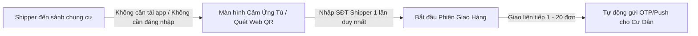
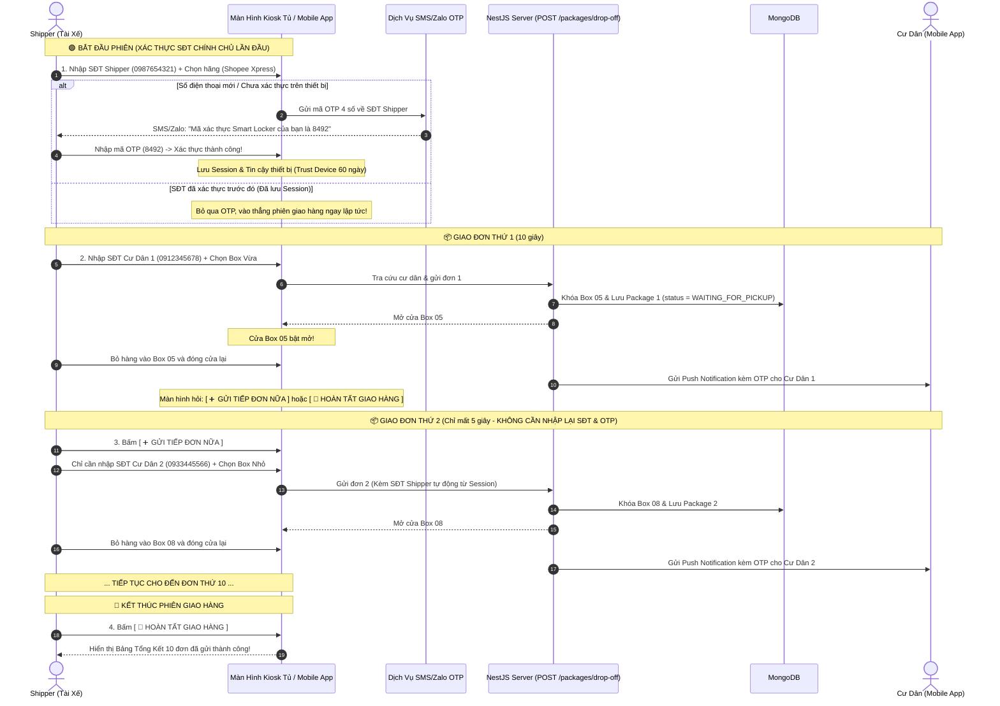

# Đặc Tả Quy Trình Giao Hàng Của Shipper (Shipper Drop-off Workflow)

> **Mô Hình Giao Hàng Không Cần Tài Khoản (Zero-Friction Guest Courier Model)**  
> *Áp dụng cho toàn bộ các đối tác giao vận: Shopee Xpress, GHTK, GHN, Viettel Post, J&T, Ninja Van, GrabExpress, Ahamove và tài xế tự do.*

---

## 1. Tổng Quan Triết Lý Thiết Kế (Design Philosophy)

Trong hệ thống Smart Locker chung cư:
- **Cư Dân (Resident)** là khách hàng cốt lõi $\rightarrow$ Cần tài khoản, định danh căn hộ, cài đặt ứng dụng di động để nhận mã OTP/QR mở tủ.
- **Shipper (Tài Xế Giao Hàng)** là đối tác vãng lai đưa hàng vào điểm giao nhận $\rightarrow$ **Cần tốc độ và sự tiện lợi tuyệt đối (< 15 - 30 giây mỗi đơn hàng)**.
- **Mô hình Không Cần Đăng Ký/Đăng Nhập (No Auth)** giúp:
  - Loại bỏ 100% rào cản cài đặt app và nhớ mật khẩu.
  - Tỉ lệ tài xế đồng ý sử dụng tủ thông minh đạt trên **95%**.
  - Tránh tình trạng tài xế đứng dưới sảnh gọi điện làm phiền cư dân vào giờ làm việc.



---

## 2. Quy Trình Giao Hàng Hàng Loạt (Batch Drop-off Session)

Khi Shipper mang **nhiều đơn hàng (5, 10, 20 đơn)** đến cùng một tòa nhà, hệ thống sử dụng cơ chế **"Phiên Giao Hàng Liên Tiếp (Session)"** để Shipper **CHỈ CẦN NHẬP SỐ ĐIỆN THOẠI CỦA MÌNH ĐÚNG 1 LẦN DUY NHẤT**.



---

## 3. Chi Tiết Các Màn Hình Trải Nghiệm Của Shipper

### 3.1. Màn Hình 1: Bắt Đầu Phiên (Đơn đầu tiên)
- **Nút to**: `[ 📦 GỬI HÀNG TẠI TỦ ]`
- **Các bước nhập liệu & xác minh**:
  1. **Số điện thoại Shipper**: `0987 654 321`.
  2. **Xác thực quyền sở hữu SIM (Lớp 1 - Chống SĐT Ảo & Phá Hoại)**:
     - Nếu SĐT lần đầu tiên sử dụng hoặc phiên đã hết hạn: Hệ thống gửi mã OTP 4 số qua SMS/Zalo ZNS.
     - Shipper nhập 4 số OTP để kích hoạt phiên (chỉ mất 3 - 5 giây).
     - Hệ thống lưu cờ **Tin Cậy Thiết Bị (Trust Device 60 ngày)** trên máy/Kiosk $\rightarrow$ Các đơn tiếp theo và các lần giao hàng sau **không cần nhập lại OTP**.
  3. **Hãng vận chuyển**: Chọn nhanh *Shopee Xpress, GHTK, GHN, Viettel Post, Khác...*
  4. **Số điện thoại Cư Dân nhận hàng**: `0912 345 678`.
- **Hệ thống hiển thị xác nhận tức thì**:
  > ✅ **Xác nhận người nhận:** Cư Dân *Nguyễn Văn A* — Căn hộ: *A1204*
- **Chọn kích thước Box**:
  - `[ 📦 Box Nhỏ (S) ]` — Tài liệu, mỹ phẩm, phụ kiện
  - `[ 📦 Box Vừa (M) ]` — Quần áo, hộp giày tiêu chuẩn
  - `[ 📦 Box Lớn (L) ]` — Gia dụng, đồ cồng kềnh

---

### 3.2. Màn Hình 2: Mở Cửa & Đặt Hàng
- Cửa ngăn tủ số tương ứng tự động bật mở (ví dụ: **Ngăn #05**).
- Màn hình hiển thị animation hướng dẫn: *"Vui lòng đặt kiện hàng vào Ngăn số 05 và đẩy đóng cửa lại"*.
- Sau khi cảm biến phát hiện cửa đã đóng an toàn $\rightarrow$ Chuyển ngay sang **Màn Hình 3**.

---

### 3.3. Màn Hình 3: Điều Hướng Giao Tiếp Hay Kết Thúc
Màn hình hiển thị 2 nút bấm lớn:
- 🟠 **`[ ➕ GỬI TIẾP ĐƠN NỮA ]`** (Màu cam nổi bật):
  - Nhảy ngay vào màn hình nhập **Số điện thoại Cư Dân tiếp theo**.
  - **Giữ nguyên SĐT Shipper (đã xác thực OTP) & Hãng vận chuyển** từ phiên hiện tại.
  - Shipper gửi đơn thứ 2, 3, 4... chỉ mất **5 - 7 giây mỗi đơn**!
- ⚪ **`[ 🚪 HOÀN TẤT GIAO HÀNG ]`** (Màu xám):
  - Kết thúc phiên làm việc.

---

### 3.4. Màn Hình 4: Bảng Tổng Kết Phiên (Delivery Summary)
Hiển thị danh sách tóm tắt toàn bộ các đơn hàng đã gửi trong phiên để Shipper đối soát hoặc chụp ảnh lưu bằng chứng:
```text
======================================================
           TỔNG KẾT PHIÊN GIAO HÀNG (10 ĐƠN)
  Shipper: 0987 654 321 (Đã xác minh OTP) | Đơn vị: Shopee Xpress
  Thời gian: 31/08/2026 16:30  |  Trạm tủ: Sảnh Tòa S1.01
======================================================
1. Căn A1204 (Anh A)     ->  Ngăn #05 (M)  [ ĐÃ GỬI ]
2. Căn B0502 (Chị B)     ->  Ngăn #08 (S)  [ ĐÃ GỬI ]
3. Căn A0801 (Anh C)     ->  Ngăn #12 (M)  [ ĐÃ GỬI ]
4. Căn B1103 (Chị D)     ->  Ngăn #15 (L)  [ ĐÃ GỬI ]
...
======================================================
      CẢM ƠN BẠN ĐÃ SỬ DỤNG SMART LOCKER!
```

---

### 3.5. Cơ Chế Tự Động Đăng Xuất An Toàn (Auto-Timeout 60s)
- Nếu Shipper gửi xong bưu kiện cuối cùng mà **vội đi ngay không bấm Hoàn tất**, sau **60 giây không có tương tác**, Kiosk sẽ **tự động kết thúc phiên**, xóa session và quay về màn hình chờ ban đầu.

---

## 4. Cơ Chế An Ninh & Chống Gian Lận (Accountability)

| Rủi Ro Tiềm Ẩn | Cơ Chế Kiểm Soát & Giải Quyết Thực Tế |
| :--- | :--- |
| **Shipper nhập SĐT ảo (Fake Phone) để phá phách, chiếm tủ hoặc gửi hàng cấm vô danh** | **Xác thực quyền sở hữu SIM qua SMS/Zalo OTP (Lớp 1)**:<br/>1. Bắt buộc nhập mã OTP 4 số gửi về SIM điện thoại của Shipper ở lần đầu tiên. Chặn 100% SĐT rác/ảo vì kẻ xấu bắt buộc phải sở hữu SIM thật đang hoạt động.<br/>2. Khi xảy ra sự cố gửi hàng cấm, BQL trích xuất SĐT thật (đã đăng ký thông tin thuê bao chính chủ với nhà mạng) cung cấp cho Cơ quan Công an điều tra.<br/>3. Thiết bị được cấp token tin cậy (Trust Device) trong 60 ngày để lần sau không cần nhập lại OTP, giữ nguyên tốc độ giao hàng nhanh dưới 15 giây. |
| **Shipper bấm mở tủ nhưng không bỏ hàng vào** | 1. **Cảm biến hồng ngoại/trọng lượng** gắn trong ngăn tủ kiểm tra sự hiện diện của kiện hàng.<br/>2. **Cư dân phản hồi**: Khi ra mở tủ thấy trống, cư dân bấm nút *"Báo cáo: Ngăn tủ rỗng"* trên app $\rightarrow$ Hệ thống truy xuất ngay `shipperPhone` của đơn đó. |
| **Shipper gửi nhầm đồ hoặc hàng hóa bị hỏng** | 1. **Camera an ninh góc rộng** đặt trên nóc trạm tủ ghi lại toàn bộ quá trình đóng/mở tủ.<br/>2. **Số điện thoại Shipper** được lưu vĩnh viễn trên bản ghi đơn hàng để BQL tòa nhà liên hệ xử lý bồi thường. |
| **Shipper gửi cho người ngoài không thuộc chung cư** | Hệ thống **chặn hoàn toàn** việc mở tủ nếu số điện thoại người nhận chưa được Ban Quản Lý phê duyệt là Cư Dân chính thức của tòa nhà. |
| **Gói hàng quá hạn lưu kho (> 48 giờ)** | Sau 48 giờ cư dân chưa lấy, hệ thống tự động gửi tin nhắn SMS/Zalo cho `shipperPhone`: *"Đơn hàng tại Ngăn #05 đã quá hạn 48h. Vui lòng đến thu hồi hoặc liên hệ BQL"*. |

---

## 5. Đặc Tả API Phục Vụ Shipper Giao Hàng

### 5.1. Gửi Mã OTP Xác Thực Số Điện Thoại Shipper (Lần đầu / Hết hạn session)
- **Endpoint**: `POST /packages/shipper/send-otp`
- **Quyền truy cập**: Public (Kiosk Tủ / Mobile App)
- **Request Body**:
```json
{
  "phone": "0987654321"
}
```
- **Response (200 OK)**:
```json
{
  "success": true,
  "message": "Đã gửi mã xác thực 4 số qua SMS/Zalo tới 0987654321",
  "expiresInSeconds": 180
}
```

---

### 5.2. Xác Minh Mã OTP & Khởi Tạo Phiên Tin Cậy (Nội bộ / Test nhanh)
- **Endpoint**: `POST /packages/shipper/verify-otp`
- **Quyền truy cập**: Public (Kiosk Tủ / Mobile App)
- **Request Body**:
```json
{
  "phone": "0987654321",
  "otp": "849201"
}
```
- **Response (200 OK)**:
```json
{
  "success": true,
  "message": "Xác thực số điện thoại tài xế thành công",
  "sessionToken": "shp_sess_a8f93b2190c...",
  "phone": "0987654321",
  "expiresAt": "2026-11-03T00:00:00.000Z"
}
```

---

### 5.3. Xác Minh Google Firebase ID Token (Xác thực SMS Thật)
- **Endpoint**: `POST /packages/shipper/verify-firebase-token`
- **Quyền truy cập**: Public (Kiosk Tủ / Mobile App)
- **Request Body**:
```json
{
  "idToken": "eyJhbGciOiJSUzI1NiIsImtpZCI6Ij..."
}
```
- **Response (200 OK)**:
```json
{
  "success": true,
  "message": "Xác thực số điện thoại tài xế thành công qua Firebase",
  "sessionToken": "shp_sess_a8f93b2190c...",
  "phone": "0987654321",
  "expiresAt": "2026-11-03T00:00:00.000Z"
}
```

---

### 5.4. Tra Cứu Căn Hộ Cư Dân Trước Khi Gửi
- **Endpoint**: `GET /lockers/lookup-receiver`
- **Quyền truy cập**: Public (Kiosk Tủ)
- **Query Params**: `phone=0912345678`, `lockerCode=LK-S101-01`
- **Response (200 OK)**:
```json
{
  "found": true,
  "receiverName": "Nguyễn Văn A",
  "apartment": "A1204",
  "buildingName": "Tòa S1.01"
}
```

---

### 5.4. Thực Hiện Gửi Hàng & Mở Cửa Tủ (Hỗ Trợ Batch Drop-off)
- **Endpoint**: `POST /packages/drop-off`
- **Quyền truy cập**: Public (Kiosk Tủ / Web Quick Drop-off)
- **Request Body**:
```json
{
  "lockerCode": "LK-S101-01",
  "receiverPhone": "0912345678",
  "shipperPhone": "0987654321",
  "shipperName": "Trần Giao Hàng",
  "carrierName": "Shopee Xpress",
  "boxSize": "MEDIUM",
  "trackingNumber": "SPX987654321",
  "note": "Hàng quần áo đóng hộp"
}
```
- **Response (201 Created)**:
```json
{
  "message": "Mở ngăn tủ gửi hàng thành công",
  "boxNumber": 5,
  "boxSize": "MEDIUM",
  "packageId": "6a953f5ae2ed7c7d8d8a8ee9",
  "expiredAt": "2026-09-02T08:00:00.000Z",
  "action": {
    "command": "OPEN_DOOR",
    "boxNumber": 5
  }
}
```

---

## 6. Lợi Ích Của Mô Hình Đối Với Các Bên Liên Quan

1. **Đối Với Shipper**:
   - Giao 1 đơn mất **15 giây**, giao 10 đơn liên tiếp chỉ mất **khoảng 1 - 2 phút**.
   - Không bị trễ chỉ tiêu số lượng đơn trong ngày.
   - Không phải đứng chờ cư dân đi thang máy xuống sảnh (tiết kiệm 10-15 phút/đơn).
2. **Đối Với Cư Dân**:
   - Không bị gọi điện làm phiền khi đang bận họp, chăm con hay đi vắng.
   - Nhận hàng chủ động 24/7 bất kỳ lúc nào rảnh bằng mã OTP hoặc quét QR.
3. **Đối Với Ban Quản Lý Tòa Nhà**:
   - Sảnh chung cư văn minh, gọn gàng, không có cảnh bưu kiện vứt bừa bãi tại bàn lễ tân.
   - Tránh rủi ro thất lạc, mất cắp hàng hóa.
