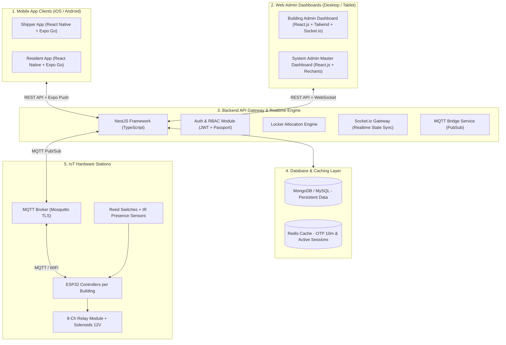
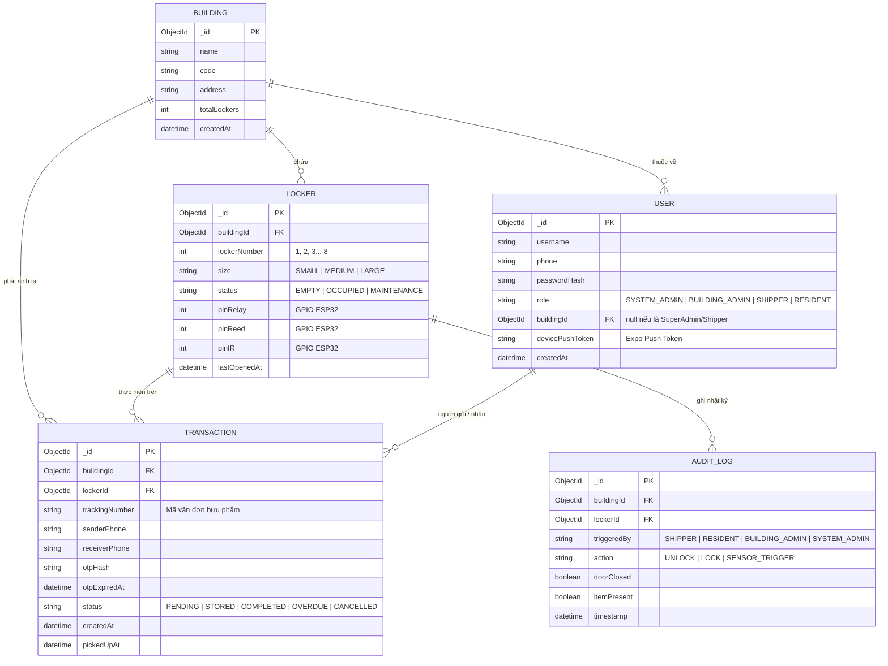
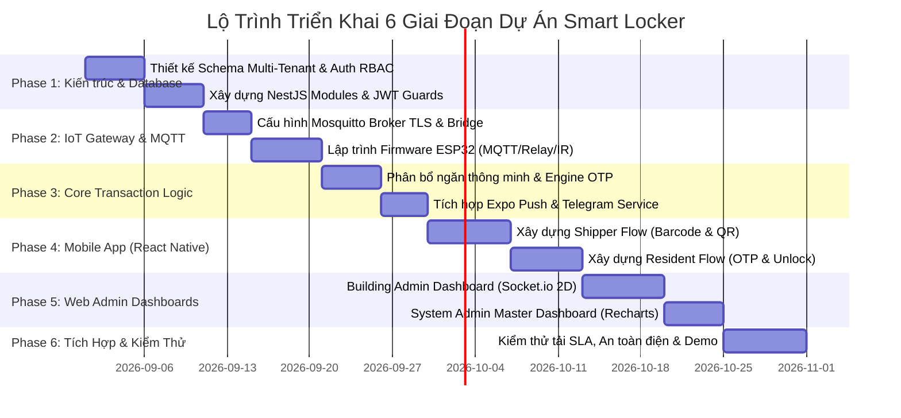

# Kế Hoạch Triển Khai Chi Tiết Hệ Thống Tủ Đồ Thông Minh (Smart Locker Master Implementation Plan)

---

## 1. TỔNG QUAN HỆ THỐNG & CÔNG NGHỆ ĐỀ XUẤT (TECH STACK)



### 1.1 Bảng Công Nghệ Đề Xuất Chi Tiết

| Thành phần | Công nghệ đề xuất | Lý do & Vai trò |
| :--- | :--- | :--- |
| **Backend Server** | **NestJS (TypeScript)** | Kiến trúc Module hóa chuẩn doanh nghiệp, tích hợp sẵn DI (Dependency Injection), WebSocket Gateway, Microservices MQTT. |
| **Database** | **MongoDB (Mongoose)** hoặc **MySQL** | Lưu trữ dữ liệu Multi-Tenant: Tòa nhà, Ngăn tủ, Người dùng, Lịch sử Giao dịch và Audit Log. |
| **In-Memory Cache**| **Redis** | Lưu trữ mã OTP 6 số với TTL 10 phút, quản lý Blacklist Token và Rate-limiting tốc độ micro-giây. |
| **IoT Broker** | **Mosquitto MQTT Broker** | Giao thức truyền tin siêu nhẹ, bảo mật TLS, hỗ trợ hàng nghìn kết nối đồng thời từ các trạm tủ ESP32. |
| **Mobile App** | **React Native + Expo (SDK 51+)** | 1 Codebase duy nhất cho cả iOS & Android, chạy test trực tiếp qua **Expo Go**, tích hợp `expo-camera`, `expo-barcode-scanner`, `expo-notifications`. |
| **Web Admin UI** | **React.js (Vite) + Tailwind CSS** | Giao diện quản trị hiện đại, linh hoạt, dùng **Shadcn UI**, **Recharts** vẽ biểu đồ, **Socket.io-client** đồng bộ sơ đồ tủ 2D Realtime. |
| **IoT Hardware** | **ESP32 + FreeRTOS (C++)** | Vi điều khiển 2 nhân 240MHz, tích hợp WiFi/Bluetooth, quản lý GPIO đọc cảm biến kép và kích relay. |

---

## 2. CHI TIẾT GIAO DIỆN & TÍNH NĂNG THEO TỪNG VAI TRÒ (UI/UX SPECIFICATION)

### 2.1 Giao diện Shipper (React Native Mobile App / Expo Go)

* **Mục tiêu:** Tối ưu hóa tốc độ giao hàng, thao tác 1 tay, quét mã tự động, dưới 30 giây cho 1 lần gửi hàng.

```text
┌──────────────────────────────────────────────┐
│  📦 SMART LOCKER SHIPPER          🔔  👤    │
├──────────────────────────────────────────────┤
│  Xin chào, Nguyễn Văn Giao (Shipper ID: #88) │
│  Hôm nay đã giao: 12 đơn | Đang chờ: 2 đơn   │
├──────────────────────────────────────────────┤
│  [  📷  QUÉT MÃ VẬN ĐƠN / QR TỦ ĐỂ GỬI HÀNG ] │
├──────────────────────────────────────────────┤
│  Danh sách trạm tủ gần bạn:                  │
│  📍 Tủ Chung cư Green Park (Tòa A) - 4 ngăn  │
│  📍 Tủ Tòa nhà Landmark 81 (Sảnh B) - 2 ngăn │
├──────────────────────────────────────────────┤
│  Lịch sử giao gần đây:                       │
│  • Đơn #VN88219 - Cư dân: 0987***321 - Ngăn 3│
│  • Đơn #VN88210 - Cư dân: 0912***654 - Ngăn 1│
└──────────────────────────────────────────────┘
```

#### Các Màn hình & Thông tin hiển thị:
1. **Màn hình Đăng nhập Shipper:**
   * Nhập SĐT / Mật khẩu hoặc OTP đăng nhập nhanh.
   * Hiển thị thông tin đơn vị vận chuyển (GHTK, GHN, ShopeeExpress, ViettelPost...).
2. **Màn hình Quét Camera (Native Viewfinder):**
   * Tự động nhận diện **Mã vạch (Barcode)** bưu phẩm $\rightarrow$ Trích xuất số điện thoại cư dân và mã vận đơn.
   * Quét **Mã QR trạm tủ** $\rightarrow$ Nhận diện vị trí tòa nhà (`buildingId`).
3. **Màn hình Chọn Kích Thước & Xác Nhận Gửi:**
   * Gợi ý kích thước ngăn (Nhỏ: S, Vừa: M, Lớn: L).
   * Hiển thị số ngăn tủ được cấp (VD: **"Ngăn số 04 đã mở"**), kèm hiệu ứng hình ảnh và đèn LED tủ bật sáng.
   * Hướng dẫn: *"Vui lòng đặt gói hàng vào và đóng chặt cửa tủ lại"*.
4. **Màn hình Xác Nhận Thành Công:**
   * Thông báo: *"Đã đóng cửa tủ thành công. Mã OTP đã được gửi đến người nhận."*

---

### 2.2 Giao diện Cư Dân (Resident Mobile App & Web QR)

* **Mục tiêu:** Nhận thông báo tức thì, thao tác lấy hàng trong 10 giây, hỗ trợ nhận hộ.

```text
┌──────────────────────────────────────────────┐
│  🏠 SMART LOCKER - CƯ DÂN        🔔 (2)  ⚙️ │
├──────────────────────────────────────────────┤
│  🎁 BƯU PHẨM ĐANG CHỜ BẠN LẤY (1 ĐƠN)        │
│  ┌────────────────────────────────────────┐  │
│  │ 🏢 Chung cư Green Park - Tủ Sảnh A     │  │
│  │ 📦 Gói hàng từ Shipper: Nguyễn Văn Giao │  │
│  │ 🚪 Vị trí: NGĂN SỐ 04                  │  │
│  │ 🔑 Mã OTP mở tủ: [ 8 4 9 2 0 1 ]       │  │
│  │ ⏳ Hết hạn sau: 08:45 phút             │  │
│  │    [ 🔓 BẤM ĐỂ MỞ TỦ TỪ XA KHI ĐỨNG GẦN ]│  │
│  │    [ 📤 CHIA SẺ MÃ CHO NGƯỜI NHÀ ]      │  │
│  └────────────────────────────────────────┘  │
├──────────────────────────────────────────────┤
│  📜 Lịch sử nhận hàng trước đó:              │
│  • Đã lấy: 24/08/2026 - Ngăn 02 (Hoàn tất)   │
└──────────────────────────────────────────────┘
```

#### Các Màn hình & Thông tin hiển thị:
1. **Màn hình Home / Danh sách Bưu phẩm:**
   * Thẻ Card bưu phẩm đang đợi: Tên người gửi, thời gian gửi, vị trí ngăn tủ, mã OTP 6 số to rõ, đồng hồ đếm ngược TTL (10 phút).
2. **Màn hình Mở Tủ Nhận Hàng:**
   * *Cách 1 (Web QR không cần app):* Quét QR trên tủ $\rightarrow$ Nhập mã OTP 6 số $\rightarrow$ Tủ tự bật mở.
   * *Cách 2 (Trên App React Native):* Nhấn nút "Mở Tủ Từ Xa" khi đã đứng tại vị trí trạm tủ.
3. **Màn hình Chia Sẻ / Ủy Quyền Nhận Hộ:**
   * Tạo link / QR nhận hộ gửi qua Zalo/Tin nhắn cho người thân.
4. **Màn hình Lịch Sử & Đánh Giá:**
   * Xem lại toàn bộ ảnh chụp gói hàng và thời gian đã nhận.

---

### 2.3 Giao diện Building Admin (Web Dashboard — Quản lý 1 Chung Cư)

* **Mục tiêu:** Giám sát trực quan 2D thời gian thực tủ của tòa nhà, xử lý sự cố hàng tồn >24h, đặt bảo trì ngăn tủ.

```text
┌─────────────────────────────────────────────────────────────────────────────────┐
│ 🏢 GREEN PARK APARTMENT - BUILDING ADMIN DASHBOARD            👤 Admin Tòa A   │
├───────────────────┬─────────────────────────────────────────────────────────────┤
│ 📊 Tổng quan tủ:  │ [ 8 Tổng Ngăn ] [ 4 Ngăn Trống 🟢] [ 3 Có Hàng 🔴] [ 1 Bảo Trì 🟡]│
├───────────────────┴─────────────────────────────────────────────────────────────┤
│ 🗺️ SƠ ĐỒ TRỰC QUAN 2D REALTIME CỤM TỦ LOCKER (SOCKET.IO)                        │
│ ┌──────────────┬──────────────┬──────────────┬──────────────┐                   │
│ │ NGĂN 01 [S]  │ NGĂN 02 [M]  │ NGĂN 03 [L]  │ NGĂN 04 [S]  │                   │
│ │ 🟢 TRỐNG     │ 🔴 CÓ HÀNG   │ 🔴 CÓ HÀNG   │ 🟡 BẢO TRÌ   │                   │
│ │ [Mở Khẩn Cấp]│ (Lưu 02h15p) │ (Lưu 26h00p⚠️)│ (Đang sửa)   │                   │
│ ├──────────────┼──────────────┼──────────────┼──────────────┤                   │
│ │ NGĂN 05 [M]  │ NGĂN 06 [S]  │ NGĂN 07 [M]  │ NGĂN 08 [L]  │                   │
│ │ 🟢 TRỐNG     │ 🟢 TRỐNG     │ 🔴 CÓ HÀNG   │ 🟢 TRỐNG     │                   │
│ └──────────────┴──────────────┴──────────────┴──────────────┘                   │
├─────────────────────────────────────────────────────────────────────────────────┤
│ ⚠️ DANH SÁCH BƯU PHẨM QUÁ HẠN (>24H):                                           │
│ • Ngăn 03: Người nhận: 0987***111 - Gửi lúc: 24/08 14:00 [Gửi Nhắc Nhở] [Mở Tủ]│
├─────────────────────────────────────────────────────────────────────────────────┤
│ 📜 AUDIT LOG GIAO DỊCH REALTIME (TÒA NHÀ A):                                    │
│ [20:15:10] Shipper 0912***456 đóng cửa Ngăn 02 -> Trạng thái OCCUPIED           │
│ [20:12:00] Cư dân 0933***789 nhập OTP mở Ngăn 07 -> Solenoid Mở                 │
└─────────────────────────────────────────────────────────────────────────────────┘
```

#### Các Chức năng Quản lý:
1. **Bản đồ 2D Sơ đồ Tủ Realtime:**
   * Cập nhật màu tức thì qua Socket.io: Xanh (Trống), Đỏ (Có hàng), Vàng (Bảo trì).
   * Click vào từng ngăn: Xem thông tin chi tiết (Ai gửi, ai nhận, thời gian lưu, tình trạng cảm biến Reed/IR).
2. **Điều khiển Khẩn Cấp & Bảo Trì:**
   * Đặt/Hủy chế độ bảo trì từng ngăn tủ.
   * Nút bấm Mở khóa khẩn cấp (Emergency Unlock) có ghi log lý do.
3. **Quản lý Hàng Quá Hạn (>24h):**
   * Tự động cảnh báo các bưu phẩm để quên lâu ngày.
   * Nút gửi tin nhắn nhắc nhở cư dân hoặc thu hồi bưu phẩm.
4. **Nhật ký Giao dịch (Audit Log):**
   * Bảng lọc theo ngày, số điện thoại, mã ngăn, loại hành động.

---

### 2.4 Giao diện System Admin (Super Admin Web Dashboard)

* **Mục tiêu:** Quản trị Master Data toàn bộ mạng lưới các tòa nhà, phân quyền tài khoản, theo dõi hạ tầng IoT và chi phí.

```text
┌─────────────────────────────────────────────────────────────────────────────────┐
│ 🌐 SMART LOCKER SYSTEM MASTER CONTROL (SUPER ADMIN)           👤 Super Admin   │
├─────────────────────────────────────────────────────────────────────────────────┤
│ 📈 KPI TOÀN HỆ THỐNG:                                                           │
│ [ 24 Tòa Nhà ] [ 192 Tổng Ngăn Tủ ] [ 1,420 Giao Dịch/Ngày ] [ 99.8% Uptime ]  │
├─────────────────────────────────────────────────────────────────────────────────┤
│ 🏢 QUẢN LÝ DANH MỤC TÒA NHÀ & CỤM TỦ (BUILDING & LOCKER CLUSTERS):              │
│ • Chung cư Green Park (Q.2)  - 16 Ngăn - ESP32 #01 (ONLINE 🟢) [Quản Lý] [Sửa]  │
│ • Landmark 81 (Bình Thạnh)   - 32 Ngăn - ESP32 #02 (ONLINE 🟢) [Quản Lý] [Sửa]  │
│ • ĐH Bách Khoa (Tòa H6)      - 08 Ngăn - ESP32 #03 (OFFLINE 🔴) [Cảnh Báo]      │
├─────────────────────────────────────────────────────────────────────────────────┤
│ 👥 QUẢN LÝ NGƯỜI DÙNG & TÀI KHOẢN BUILDING ADMIN:                               │
│ • Cấp tài khoản Building Admin cho từng chung cư / gán buildingId.              │
│ • Quản lý danh sách Shippers và Residents toàn hệ thống.                        │
├─────────────────────────────────────────────────────────────────────────────────┤
│ 📊 THỐNG KÊ CHI PHÍ & LƯU LƯỢNG (RECHARTS):                                     │
│ • Biểu đồ khung giờ cao điểm gửi hàng (11h-13h & 17h-19h).                      │
│ • Biểu đồ tiêu thụ tin nhắn Push / Telegram / SMS Twilio.                       │
└─────────────────────────────────────────────────────────────────────────────────┘
```

#### Các Chức năng Quản trị:
1. **Quản lý Tòa nhà (`Building CRUD`):** Thêm mới chung cư, khai báo số lượng tủ, gán địa chỉ GPS.
2. **Quản lý Phần cứng & Firmware OTA:** Giám sát trạng thái nhịp tim (Heartbeat) của từng vi điều khiển ESP32; hỗ trợ đẩy firmware OTA từ xa.
3. **Phân quyền Đa tầng (RBAC):** Cấp quyền và phân bổ tài khoản Building Admin vào đúng `buildingId`.
4. **Báo cáo Tài chính & Lưu lượng:** Thống kê doanh thu, chi phí vận hành dịch vụ thông báo.

---

## 3. CƠ SỞ DỮ LIỆU & SCHEMA DATA MODEL (MULTI-TENANT)



---

## 4. KẾ HOẠCH TRIỂN KHAI THEO 6 GIAI ĐOẠN (6-PHASE MASTER ROADMAP)



### Chi tiết từng giai đoạn:

#### GIAI ĐOẠN 1: Thiết Kế Database Multi-Tenant & Module Xác Thực (Tuần 1 - 2)
* **Nhiệm vụ 1.1:** Xây dựng các Schemas trên NestJS Mongoose: `BuildingSchema`, `UserSchema`, `LockerSchema`, `TransactionSchema`, `AuditLogSchema`.
* **Nhiệm vụ 1.2:** Xây dựng `AuthModule` với JWT Strategy, Password hashing (bcrypt).
* **Nhiệm vụ 1.3:** Xây dựng `RolesGuard` phân quyền 4 nhóm vai trò (`SYSTEM_ADMIN`, `BUILDING_ADMIN`, `SHIPPER`, `RESIDENT`) và `BuildingScopeInterceptor` phân lập dữ liệu tòa nhà.

#### GIAI ĐOẠN 2: Cầu Nối IoT & Firmware Vi Điều Khiển ESP32 (Tuần 2 - 3)
* **Nhiệm vụ 2.1:** Thiết lập Mosquitto MQTT Broker bảo mật TLS / Username-Password.
* **Nhiệm vụ 2.2:** Xây dựng `MqttModule` trên NestJS nhận Pub/Sub các topic:
  * `locker/{buildingId}/{esp32Id}/control/lock` (Lệnh mở)
  * `locker/{buildingId}/{esp32Id}/status/door` (Trạng thái Reed Switch)
  * `locker/{buildingId}/{esp32Id}/status/presence` (Trạng thái Cảm biến IR)
* **Nhiệm vụ 2.3:** Nạp firmware ESP32 C++: Lập trình đọc GPIO chống nhiễu (Debounce), điều khiển Relay kích Solenoid 12V qua hàng đợi Queue giãn cách 500ms.

#### GIAI ĐOẠN 3: Nghiệp Vụ Phân Bổ Ngăn Tủ & Engine Xử Lý OTP (Tuần 3 - 4)
* **Nhiệm vụ 3.1:** Viết thuật toán Phân bổ ngăn tủ tự động (`Smart Allocation Engine`): Tìm ngăn trống có kích thước nhỏ nhất vừa gói hàng tại đúng `buildingId`.
* **Nhiệm vụ 3.2:** Viết module sinh OTP 6 số ngẫu nhiên lưu Redis/MongoDB với TTL 10 phút, Rate-limit 5 lần thử sai.
* **Nhiệm vụ 3.3:** Tích hợp `Expo Notification Service` gửi Push Notification đến di động cư dân và fallback qua `Telegram Bot API`.

#### GIAI ĐOẠN 4: Phát Triển Mobile App (React Native + Expo SDK) (Tuần 4 - 6)
* **Nhiệm vụ 4.1:** Khởi tạo dự án React Native Expo TypeScript (`expo-router` hoặc `react-navigation`).
* **Nhiệm vụ 4.2:** Tích hợp `expo-camera` và `expo-barcode-scanner` cho luồng Shipper (quét mã vận đơn và quét QR trạm tủ).
* **Nhiệm vụ 4.3:** Xây dựng giao diện Cư dân: Nhập OTP 6 số, nhận Push Notification, bấm nút mở tủ từ xa.

#### GIAI ĐOẠN 5: Phát Triển Web Admin Dashboards (React.js + Socket.io) (Tuần 6 - 8)
* **Nhiệm vụ 5.1:** Xây dựng giao diện **Building Admin**: Sơ đồ lưới 2D trực quan từng ngăn tủ, kết nối `Socket.io Gateway` để cập nhật màu sắc Xanh/Đỏ/Vàng tức thì khi có sự kiện đóng/mở tủ.
* **Nhiệm vụ 5.2:** Xây dựng tính năng Đặt bảo trì ngăn tủ, Mở tủ khẩn cấp và Quản lý bưu phẩm quá hạn >24h.
* **Nhiệm vụ 5.3:** Xây dựng giao diện **System Admin Master Dashboard**: Quản lý danh mục Tòa nhà, cấp tài khoản Building Admin, biểu đồ thống kê `Recharts`.

#### GIAI ĐOẠN 6: Tích Hợp Toàn Diện, Kiểm Thử SLA & Chuẩn Bị Bảo Vệ ĐATN (Tuần 8 - 9)
* **Nhiệm vụ 6.1:** Kiểm thử toàn bộ kịch bản E2E: Shipper quét gửi $\rightarrow$ Cư dân nhận Push $\rightarrow$ Nhập OTP lấy hàng $\rightarrow$ Dashboard Admin cập nhật realtime.
* **Nhiệm vụ 6.2:** Đo đạc độ trễ phản hồi hệ thống (SLA < 1.5s) để đưa vào Slide báo cáo.
* **Nhiệm vụ 6.3:** Đóng gói Docker Compose toàn bộ hệ thống (NestJS Server, Mosquitto, MongoDB, Redis, Web Admin).

---

## 5. BẢNG PHÂN CÔNG & DANH MỤC KIỂM TRA CHẤT LƯỢNG (QA & TEST CASES)

| Hạng mục kiểm thử | Kịch bản Test | Kết quả mong đợi |
| :--- | :--- | :--- |
| **Bảo mật Multi-Tenant** | Building Admin A cố tình gọi API xem tủ của Building B | Bị chặn với mã lỗi `403 Forbidden`. |
| **An toàn Chống Dò OTP** | Cố tình nhập sai mã OTP 5 lần liên tiếp | Bị khóa tạm thời trong 15 phút, gửi cảnh báo về Dashboard Admin. |
| **Độ trễ Mở Khóa** | Shipper / Cư dân bấm nút xác thực mở ngăn tủ | Khóa Solenoid rút chốt trong vòng dưới **1.5 giây**. |
| **Xác thực Cảm biến Kép** | Đóng cửa tủ nhưng bên trong rỗng (không bỏ hàng) | Cảm biến IR nhận diện không có hàng $\rightarrow$ Không cập nhật trạng thái có hàng. |
| **Đồng bộ Realtime** | 1 ngăn tủ bất kỳ bị đóng/mở tại phần cứng | Sơ đồ 2D trên Dashboard đổi màu ngay lập tức (**< 1.0 giây**). |
