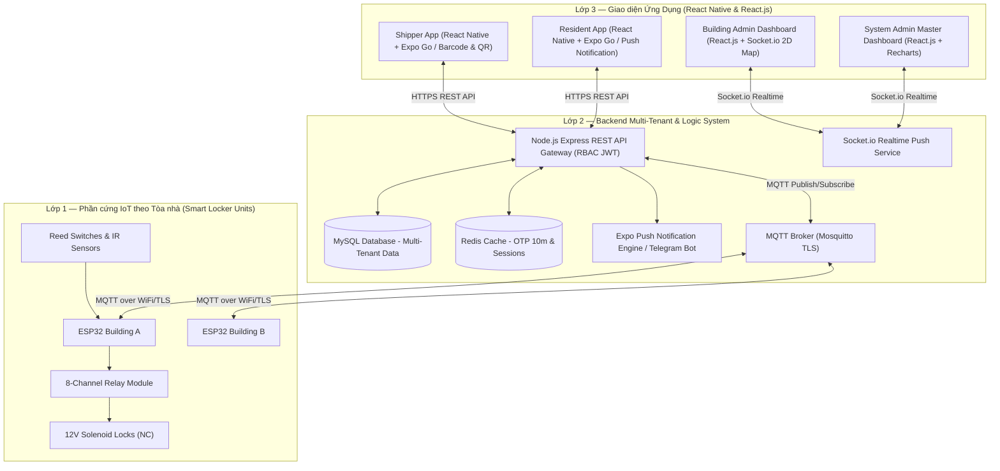
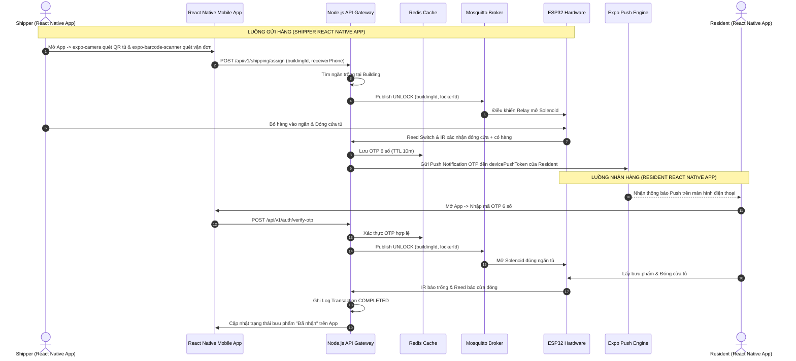
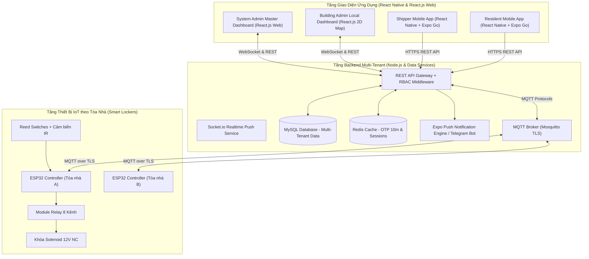
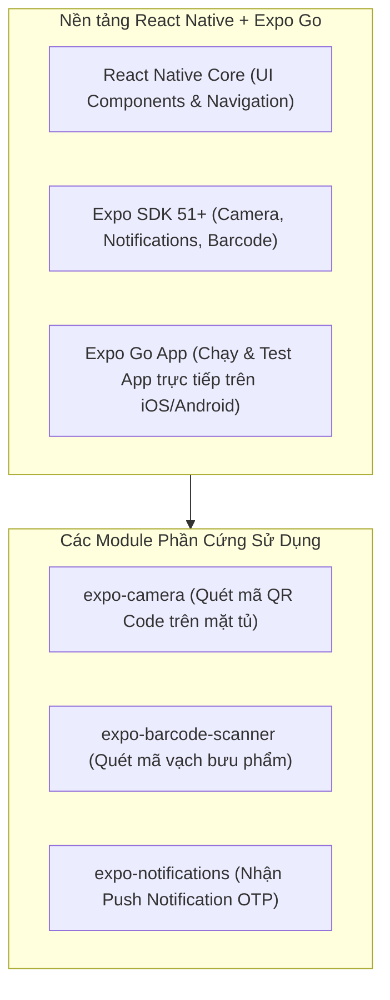

# Phân Tích Báo Cáo Hệ Thống Tủ Đồ Thông Minh (Smart Locker System)

---

## PART 1 — DOCUMENT ANALYSIS

### 1. Document Overview

* **Document Title:** Đồ án tốt nghiệp — Hệ thống Tủ đồ thông minh (Smart Locker System)
* **Document Type:** Báo cáo đồ án / Tài liệu mô tả hệ thống IoT, React Native Mobile App & Multi-Tenant Web Admin
* **Scope:** Giải pháp quản lý, điều khiển và giám sát tủ khóa điện từ từ xa cho mô hình nhiều tòa nhà (chung cư, văn phòng, trường học).
* **Target Audience:** Hội đồng bảo vệ đồ án, Giảng viên hướng dẫn, Đội ngũ phát triển phần mềm và IoT.
* **Primary Objectives:** Mô tả toàn bộ kiến trúc 3 lớp phân tán, mô hình phân quyền 2 tầng Admin (System Admin & Building Admin), ứng dụng di động **React Native (Expo Go)** cho Shipper & Cư dân, phần cứng IoT, quy trình vận hành và bảo mật hệ thống.

---

### 2. Executive Summary

* **Business Goals:**
  * Giải quyết vấn đề giao/nhận hàng chặng cuối khi người nhận vắng nhà.
  * Cung cấp nền tảng quản lý tủ thông minh đa tòa nhà (Multi-tenant) cho các công ty quản lý vận hành chung cư và đô thị.
  * Tối ưu trải nghiệm ứng dụng di động cho Shipper & Cư dân bằng ứng dụng **React Native + Expo Go** (chạy trực tiếp trên iOS và Android).
* **Technical Goals:**
  * Xây dựng hệ thống 3 lớp hoàn chỉnh: IoT (ESP32), Backend (Node.js + Express + MQTT + Redis + MySQL), Cross-Platform Mobile App (React Native + Expo Go) và Web Dashboard (React.js + Socket.io).
  * Phân quyền đa cấp (RBAC): System Admin (Quản lý toàn bộ mạng lưới tủ & tòa nhà) và Building Admin (Quản lý cụm tủ tại 1 chung cư).
  * Điều khiển mở/đóng ngăn tủ tức thì qua MQTT với độ trễ thấp (<2s).
  * Tích hợp camera phần cứng điện thoại với `expo-camera` (quét QR tủ) và `expo-barcode-scanner` (quét mã vận đơn bưu phẩm), cùng `expo-notifications` cho Push Notification.
* **Expected Outcomes:**
  * Mô hình sản phẩm thương mại hoàn chỉnh gồm Mobile App Native cho điện thoại di động và Dashboard Web quản trị 2 tầng chuyên nghiệp.

---

### 3. Functional Requirements

#### 3.1 Shipper (Người gửi hàng — React Native Mobile App / Expo Go)
* **Đăng nhập định danh:** Đăng nhập tài khoản Shipper trên ứng dụng di động React Native.
* **Quét mã Barcode & QR camera gốc:** Dùng `expo-barcode-scanner` quét mã vận đơn bưu phẩm (tự động điền SĐT cư dân) và dùng `expo-camera` quét mã QR dán trên mặt tủ.
* **Mở ngăn gửi & Chỉ dẫn:** Nhận vị trí ngăn tủ được cấp, mở chốt solenoid qua tín hiệu MQTT, bật LED chỉ dẫn tại tủ.
* **Lịch sử giao hàng:** Tra cứu danh sách bưu phẩm đã gửi theo ngày/tuần trực tiếp trên App di động.

#### 3.2 Resident / Customer (Người nhận hàng — React Native Mobile App & Web QR)
* **Nhận Push Notification gốc:** Nhận thông báo Push Notification tức thì qua `expo-notifications` / Firebase Cloud Messaging (FCM) kèm mã OTP 6 số.
* **Mở ngăn nhận (QR / Remote Unlock):** Mở App di động hoặc quét QR trên tủ $\rightarrow$ Nhập mã OTP 6 số hoặc nhấn nút Mở tủ từ xa khi đứng cạnh tủ.
* **Thông tin bưu phẩm & Lịch sử:** Hiển thị thông tin gói hàng chi tiết (người gửi, hình ảnh, ngăn tủ) và xem nhật ký bưu phẩm đã nhận.
* **Ủy quyền người nhà:** Chia sẻ mã OTP hoặc cấp quyền nhận hộ cho người thân trực tiếp trên App.

#### 3.3 Building Admin (Admin Chung Cư / Tòa Nhà — Web Dashboard React.js)
* **Sơ đồ tủ 2D Local Realtime:** Giám sát trạng thái tủ thuộc tòa nhà mình (`buildingId`) qua kết nối WebSocket (Socket.io).
* **Quản lý ngăn tủ Local:** Đặt chế độ bảo trì từng ngăn tủ, reset ngăn, kích hoạt mở tủ khẩn cấp.
* **Xử lý bưu phẩm quá hạn:** Nhận cảnh báo bưu phẩm tồn kho quá 24h và thực hiện thu hồi/nhắc nhở cư dân.
* **Nhật ký & Báo cáo Tòa nhà:** Tra cứu audit log giao dịch của cư dân tòa nhà, xuất báo cáo thống kê tủ theo tuần/tháng.

#### 3.4 System Admin (Super Admin Hệ Thống — Web Dashboard React.js)
* **Quản lý Tòa nhà & Tủ (Multi-Tenant Master Data):** Thêm/sửa/xóa các Tòa nhà (`Building`) và khai báo cụm tủ (`Locker`).
* **Quản lý Tài khoản & Phân quyền:** Cấp tài khoản cho `Building Admin`, quản lý danh sách Shipper và Cư dân.
* **Dashboard Tổng Quan Toàn Mạng Lưới:** Theo dõi chỉ số tổng (tổng bưu phẩm, lưu lượng giao dịch toàn hệ thống, doanh thu, chi phí SMS).
* **Quản lý Hạ tầng & Firmware OTA:** Giám sát trạng thái Uptime thiết bị ESP32, cập nhật firmware từ xa qua OTA.

---

### 4. Non-functional Requirements

* **Performance & Latency:**
  * Thời gian mở camera & quét mã QR trên React Native App: < 1 giây.
  * Thời gian phản hồi mở khóa tủ từ App di động: < 1.5 giây.
  * Thời gian phát Push Notification qua `expo-notifications`: < 2 giây.
* **Security & Multi-Tenant Isolation:**
  * Phân quyền RBAC chặt chẽ (System Admin, Building Admin, Shipper, Resident).
  * Phân lập dữ liệu tòa nhà (Tenant Isolation): Building Admin chỉ truy cập dữ liệu có `buildingId` tương ứng.
  * Mã OTP 6 số lưu Redis Cache TTL 10 phút, Rate-limiting 5 lần thử sai khóa 15 phút.
  * HTTPS (SSL/TLS), MQTT Auth (Username/Password + TLS), JWT Token mã hóa role.
* **Cross-Platform Mobile Compatibility:**
  * Ứng dụng di động viết bằng **React Native + Expo** tương thích 100% trên cả iOS và Android, test trực tiếp qua ứng dụng **Expo Go**.

---

### 5. Architecture Overview

Hệ thống được thiết kế theo mô hình Multi-Tenant kết hợp Cross-Platform Mobile App & Web Admin:

---

### 6. API & Communication Protocols

* **Mobile App REST APIs (React Native ↔ Server):**
  * `POST /api/v1/mobile/auth/login`: Shipper & Resident đăng nhập nhận JWT Token.
  * `POST /api/v1/shipping/assign`: Shipper gửi thông tin bưu phẩm (quét barcode + QR tủ).
  * `POST /api/v1/auth/verify-otp`: Resident gửi mã OTP 6 số xác thực mở tủ.
  * `POST /api/v1/mobile/device-token`: Đăng ký Push Token của `expo-notifications`.
* **System Admin REST APIs:**
  * `POST /api/v1/system-admin/buildings`: Thêm mới tòa nhà/chung cư.
  * `POST /api/v1/system-admin/lockers`: Khai báo cụm tủ mới cho tòa nhà.
  * `POST /api/v1/system-admin/users/building-admin`: Cấp tài khoản Building Admin.
* **Building Admin REST APIs:**
  * `GET /api/v1/building-admin/lockers`: Lấy bản đồ tủ 2D của tòa nhà mình.
  * `POST /api/v1/building-admin/lockers/:id/maintenance`: Đặt ngăn tủ vào chế độ bảo trì.
* **MQTT Topics (IoT ↔ Server):**
  * `locker/{buildingId}/{esp32Id}/control/lock`: Server gửi lệnh mở tủ.
  * `locker/{buildingId}/{esp32Id}/status/door`: ESP32 gửi trạng thái cửa (Reed Switch).
  * `locker/{buildingId}/{esp32Id}/status/presence`: ESP32 gửi trạng thái hàng (IR Sensor).

---

### 7. Data Model

* **Building (Tòa nhà / Chung cư):** `id`, `name`, `code`, `address`, `totalLockers`, `createdAt`.
* **User (Người dùng / Quản trị):** `id`, `username`, `passwordHash`, `role` (`SYSTEM_ADMIN` | `BUILDING_ADMIN` | `SHIPPER` | `RESIDENT`), `buildingId` (nullable), `phone`, `devicePushToken`, `createdAt`.
* **Locker (Ngăn tủ):** `id`, `buildingId`, `lockerCode`, `size` (SMALL/MEDIUM/LARGE), `status` (EMPTY/OCCUPIED/MAINTENANCE), `pinRelay`, `pinReed`, `pinIR`, `updatedAt`.
* **Transaction (Giao dịch):** `id`, `buildingId`, `lockerId`, `senderPhone`, `receiverPhone`, `otpHash`, `otpExpiredAt`, `status` (PENDING/STORED/COMPLETED/EXPIRED/CANCELLED), `createdAt`, `pickedUpAt`.
* **AuditLog (Nhật ký mở tủ):** `id`, `buildingId`, `lockerId`, `triggeredBy` (SHIPPER/RESIDENT/BUILDING_ADMIN/SYSTEM_ADMIN), `action` (UNLOCK/LOCK), `doorStatus`, `presenceStatus`, `timestamp`.

---

### 8. Business Rules

1. **Multi-Tenant Isolation:** Building Admin chỉ được phép xem và điều khiển tủ thuộc tòa nhà (`buildingId`) mà mình được gán quyền.
2. **Quét Mã Nhanh trên App:** App React Native sử dụng `expo-barcode-scanner` để tự động đọc mã vận đơn bưu phẩm và `expo-camera` đọc mã QR trên tủ.
3. **Thời hạn & Giới hạn OTP:** OTP có hiệu lực trong 10 phút. Nhập sai 5 lần liên tiếp sẽ bị Rate-limit khóa 15 phút.
4. **Logic trạng thái "Có hàng":** Chuyển sang OCCUPIED khi Reed Switch đóng VÀ Cảm biến IR phát hiện có hàng.
5. **Logic trạng thái "Trống":** Chuyển sang EMPTY khi Cảm biến IR báo trống VÀ Reed Switch đóng kín sau khi nhận hàng.
6. **Push Notification:** Server gửi thông báo OTP trực tiếp đến điện thoại cư dân qua dịch vụ `expo-notifications`.

---

### 9. User Flow Diagrams

#### 9.1 Sơ đồ Luồng Giao Dịch Di Động qua React Native & Expo

---

### 10. Risks & Open Questions

* **Chạy App di động khi chưa publish lên App Store / Google Play:**
  * *Giải pháp:* Sử dụng nền tảng **Expo Go** cho phép tải App Expo Go trên điện thoại thực (iOS/Android), quét mã QR từ máy tính là App React Native khởi chạy trực tiếp để kiểm thử và demo cho Hội đồng bảo vệ ĐATN.

---

### 11. Implementation Checklist

- [x] Thiết kế sơ đồ phần cứng IoT (ESP32, Relay, Solenoid, Reed Switch, IR).
- [x] Lập trình firmware ESP32 kết nối MQTT Broker.
- [x] Thiết kế cơ sở dữ liệu Multi-Tenant MySQL & Redis Cache.
- [x] Viết ứng dụng di động **React Native (Expo)** cho Shipper & Resident (`expo-camera`, `expo-barcode-scanner`, `expo-notifications`).
- [x] Xây dựng Web Dashboard Admin 2 tầng với React.js, Tailwind CSS & Socket.io 2D Map.
- [x] Tích hợp Push Notification qua Expo Push Service & Telegram Bot API.

---

 

---

## PART 2 — PRODUCTION-READY MARKDOWN DOCUMENTATION

# Tài liệu Kỹ thuật Hệ thống Tủ đồ Thông minh (Smart Locker System)

> **Giải pháp Quản lý Tủ đồ Thông minh Đa Tòa nhà (Multi-Tenant System)**  
> *"Ứng dụng Di động React Native (Expo) & Dashboard Quản trị Web 2 Tầng"*

---

## Mục lục
1. [Giới thiệu & Tổng quan](#1-giới-thiệu--tổng-quan)
2. [Kiến trúc Phân cấp Multi-Tenant](#2-kiến-trúc-phân-cấp-multi-tenant)
3. [Phần cứng & Linh kiện IoT](#3-phần-cứng--linh-kiện-iot)
4. [Mô hình Phân quyền RBAC & Công nghệ Mobile App](#4-mô-hình-phân-quyền-rbac--công-nghệ-mobile-app)
5. [Quy trình Vận hành Chi tiết](#5-quy-trình-vận-hành-chi-tiết)
6. [Bảo mật & Phân lập Dữ liệu](#6-bảo-mật--phân-lập-dữ-liệu)
7. [Công nghệ & Danh mục Stack](#7-công-nghệ--danh-mục-stack)
8. [Luồng dữ liệu Realtime & SLA](#8-luồng-dữ-liệu-realtime--sla)
9. [Định hướng Phát triển AI & Smart Allocation](#9-định-hướng-phát-triển-ai--smart-allocation)
10. [Kết luận](#10-kết-luận)

---

## 1. Giới thiệu & Tổng quan

**Hệ thống Tủ Đồ Thông Minh (Smart Locker System)** là nền tảng IoT toàn diện phục vụ quản lý, điều khiển và giám sát các trạm tủ khóa điện từ tại các tòa nhà chung cư, văn phòng và trường học. 

Hệ thống được thiết kế theo mô hình **Multi-Tenant** cho phép quản lý mạng lưới nhiều tòa nhà, tích hợp ứng dụng di động **React Native (Expo Go)** dành cho Shipper và Cư dân, cùng hệ thống Dashboard Web dành cho Ban quản lý tòa nhà và Super Admin.

### 1.1 Điểm sáng Công nghệ Giao diện
* **React Native + Expo (Expo Go):** Phát triển 1 codebase duy nhất bằng JavaScript/TypeScript cho cả iOS và Android. Cho phép kiểm thử và chạy ứng dụng trực tiếp trên di động thực thông qua **Expo Go** mà không cần qua quy trình duyệt ứng dụng phức tạp.
* **Camera Phần cứng Native:** Tích hợp `expo-camera` quét mã QR Code trên mặt tủ và `expo-barcode-scanner` quét mã vận đơn bưu phẩm.
* **Push Notification:** Gửi thông báo tức thì đến điện thoại cư dân bằng `expo-notifications`.
* **Web Admin Dashboard (React.js):** Cung cấp 2 màn hình quản trị phân cấp: **Building Admin** (Sơ đồ tủ 2D local) và **System Admin** (Quản trị master data toàn hệ thống).

---

## 2. Kiến trúc Phân cấp Multi-Tenant

Hệ thống phân chia 4 nhóm đối tượng tương tác chính trên sơ đồ kiến trúc 3 lớp:

---

## 3. Phần cứng & Linh kiện IoT

Thông số kỹ thuật linh kiện cho **1 cụm tủ đồ 8 ngăn tiêu chuẩn**:

| Linh kiện | Số lượng | Thông số & Trách nhiệm |
| :--- | :---: | :--- |
| **ESP32 DevKit V1** | 1 | Vi xử lý Dual-core 240MHz, kết nối WiFi, đọc cảm biến GPIO, gửi/nhận MQTT. |
| **Khóa Solenoid 12V DC (NC)** | 8 | Khóa chốt cơ điện tử Normally Closed (NC - mặc định đóng khi ngắt điện). |
| **Module Relay 8 Kênh** | 1 | Cách ly Opto-isolator, nhận tín hiệu 3.3V từ ESP32 đóng/mở nguồn 12V cho solenoid. |
| **Reed Switch (Cảm biến từ)** | 8 | Cảm biến phát hiện cửa tủ đóng kín hay đang mở. |
| **Cảm biến hồng ngoại IR** | 8 | Đặt trong ngăn tủ phát hiện bưu phẩm thực sự có trong tủ hay ngăn rỗng. |
| **Nguồn tổ ong 12V / 5A** | 1 | Cấp nguồn công suất cho các khóa Solenoid. |
| **Module hạ áp DC-DC LM2596** | 1 | Hạ áp 12V DC xuống 5V/3.3V DC nuôi nguồn cho ESP32 và các cảm biến. |

---

## 4. Mô hình Phân quyền RBAC & Công nghệ Mobile App

### 4.1 Chi tiết Công nghệ Mobile App React Native (Expo)

---

## 5. Quy trình Vận hành Chi tiết

### 5.1 Quy trình Gửi hàng (Shipper App — React Native)
1. Shipper mở App React Native trên điện thoại, chọn **Gửi Hàng**.
2. Ứng dụng kích hoạt `expo-barcode-scanner` quét mã vạch bưu phẩm $\rightarrow$ Hệ thống tự động trích xuất SĐT người nhận.
3. Shipper dùng `expo-camera` quét mã QR Code trên tủ locker.
4. Server tìm ngăn trống phù hợp tại tòa nhà $\rightarrow$ Gửi lệnh MQTT mở khóa Solenoid $\rightarrow$ LED vị trí ngăn tủ sáng.
5. Shipper đặt gói hàng vào ngăn, đóng cửa tủ.
6. Reed Switch xác nhận đóng cửa + IR xác nhận có hàng $\rightarrow$ Server chuyển trạng thái thành **OCCUPIED**.
7. Server sinh OTP 6 số và phát Push Notification đến cư dân qua `expo-notifications`.

### 5.2 Quy trình Nhận hàng (Resident App — React Native)
1. Cư dân nhận thông báo Push Notification trên điện thoại có chứa mã OTP 6 số.
2. Đến trước tủ, mở App React Native chọn **Nhận Hàng**.
3. Nhập mã OTP 6 số (hoặc quét QR tủ để xác nhận vị trí).
4. Server đối soát OTP với Redis $\rightarrow$ Phát lệnh MQTT mở chốt khóa Solenoid ngăn tủ tương ứng.
5. Cư dân lấy bưu phẩm và đóng cửa tủ lại.
6. Cảm biến IR báo ngăn trống + Reed Switch báo cửa đóng kín $\rightarrow$ Server chuyển trạng thái ngăn về **EMPTY**, hoàn thành giao dịch.

---

## 6. Bảo mật & Phân lập Dữ liệu

| Cơ chế Bảo mật | Triển khai Chi tiết | Mục tiêu bảo vệ |
| :--- | :--- | :--- |
| **Tenant Data Isolation** | Mọi SQL query của Building Admin bắt buộc lọc `WHERE buildingId = req.user.buildingId` | Ngăn rò rỉ dữ liệu giữa các chung cư/tòa nhà khác nhau. |
| **OTP Ngẫu nhiên & Redis Cache** | OTP 6 số sinh tự động, lưu Redis TTL 10 phút | Đảm bảo chỉ người nhận hợp lệ mới mở được đúng ngăn tủ. |
| **Bảo mật JWT Multi-Role** | Mã hóa `role` trong JWT Token (`SYSTEM_ADMIN`, `BUILDING_ADMIN`, `SHIPPER`, `RESIDENT`) | Phân quyền API endpoints đúng theo vai trò người dùng. |
| **HTTPS & MQTT Auth TLS** | TLS 1.3 mã hóa REST API và MQTT Broker kết nối ESP32 | Chống nghe lén dữ liệu trên đường truyền mạng. |
| **Rate Limiting Anti-Brute-Force**| Khóa 15 phút khi thử sai mã OTP 5 lần liên tiếp | Chống dò mã ngẫu nhiên tự động. |

---

## 7. Công nghệ & Danh mục Stack

| Tầng công nghệ | Công nghệ lựa chọn | Mục đích sử dụng |
| :--- | :--- | :--- |
| **Mobile App (iOS/Android)**| React Native + Expo (Expo Go) | Viết App di động đa nền tảng, chạy demo mượt trên thiết bị thực với Expo Go. |
| **Mobile Native Modules** | `expo-camera`, `expo-barcode-scanner`, `expo-notifications` | Quét mã QR/Barcode phần cứng di động và nhận tin Push Notification. |
| **Web Admin Dashboard** | React.js + Tailwind CSS + Recharts | Xây dựng Web Dashboard 2 tầng (System Admin & Building Admin). |
| **IoT Hardware** | ESP32 + Arduino IDE / PlatformIO | Vi điều khiển IoT kết nối WiFi, đọc cảm biến GPIO và nhận lệnh MQTT. |
| **Giao tiếp IoT** | Mosquitto MQTT Broker (TLS) | Giao thức truyền tin Pub/Sub độ trễ thấp giữa Server và ESP32. |
| **Backend Core** | Node.js + Express.js | REST API Server xử lý bất đồng bộ, tích hợp RBAC Middleware. |
| **Database** | MySQL + Redis Cache | MySQL lưu dữ liệu đa tòa nhà & audit log; Redis lưu OTP 10m và session. |
| **Realtime Push** | Socket.io | Cập nhật bản đồ tủ 2D realtime cho Building Admin Dashboard. |

---

## 8. Luồng dữ liệu Realtime & SLA

| Kịch bản sự kiện | Tiến trình xử lý dữ liệu | SLA Phản hồi |
| :--- | :--- | :---: |
| **Shipper quét Barcode & QR** | React Native App $\rightarrow$ Server chọn ngăn $\rightarrow$ MQTT $\rightarrow$ Solenoid mở | **< 1.5 giây** |
| **Resident nhập OTP mở tủ** | React Native App $\rightarrow$ Server check Redis OTP $\rightarrow$ MQTT $\rightarrow$ Solenoid mở | **< 1.2 giây** |
| **Xác nhận cửa đóng & có hàng**| Reed Switch + IR Sensor $\rightarrow$ ESP32 $\rightarrow$ MQTT $\rightarrow$ Server DB $\rightarrow$ Socket.io UI | **< 1.0 giây** |
| **Gửi Push Notification OTP** | Server tạo OTP $\rightarrow$ Phát qua Expo Push Notification Engine đến di động | **< 2.0 giây** |
| **Cập nhật Dashboard Admin** | Socket.io broadcast thay đổi trạng thái tủ lên Dashboard 2D | **Tức thì (Realtime)** |

---

## 9. Định hướng Phát triển AI & Smart Allocation

1. **AI Phân bổ ngăn tủ thông minh:** Tự động dự đoán kích thước gói hàng từ mã vận đơn barcode để đề xuất kích thước ngăn tủ phù hợp nhất.
2. **Phát hiện hành vi bất thường:** Tự động gửi cảnh báo khẩn cho Building Admin nếu phát hiện ngăn tủ bị mở/đóng liên tục nhiều lần hoặc có hành vi nhập sai OTP liên tiếp.
3. **Tự động nhắc nhở bưu phẩm quá hạn:** Cronjob tự động quét các bưu phẩm đọng quá 24h để gửi tin nhắn thông báo nhắc cư dân hoặc hỗ trợ thu hồi.

---

## 10. Kết luận

Hệ thống Tủ đồ Thông minh (**Smart Locker System**) với việc ứng dụng công nghệ **React Native + Expo (Expo Go)** cho ứng dụng di động và **React.js Web 2 Tầng Admin** là một giải pháp công nghệ toàn diện, hiện đại và cực kỳ phù hợp cho Đồ án Tốt nghiệp.

Giải pháp giúp sinh viên tối ưu hóa 100% tốc độ phát triển ứng dụng di động trên thiết bị di động thực (iOS & Android) qua Expo Go, đồng thời khẳng định năng lực thiết kế kiến trúc phần mềm phân tán chuẩn doanh nghiệp (Multi-Tenant Enterprise System).
