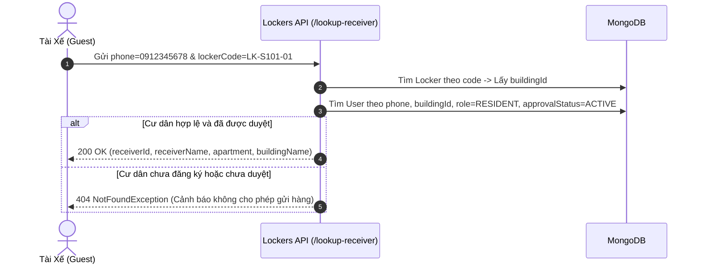

# Module Quản Lý Trạm Tủ & Ngăn Tủ (Lockers Module)

## 1. Tổng Quan Module

Module `Lockers` chịu trách nhiệm quản trị toàn bộ hạ tầng phần cứng vật lý trong hệ sinh thái Smart Locker, bao gồm:
- **Trạm Tủ Thông Minh (`Locker`)**: Thiết bị Kiosk đặt tại sảnh chung cư tích hợp bộ điều khiển vi xử lý (ESP32/Industrial PC).
- **Ngăn Tủ Con (`Box`)**: Các ô tủ vật lý với kích cỡ khác nhau (S/M/L), chốt khóa điện từ (Solenoid Lock), cảm biến từ tính phát hiện trạng thái cánh cửa (`doorStatus`) và cảm biến hồng ngoại phát hiện bưu phẩm (`hasItem`).
- **Nhật Ký Mở Khóa (`LockerLog`)**: Bảng kiểm toán thời gian thực (Audit Trail) ghi nhận mọi xung điện kích hoạt mở chốt cơ học (Shipper gửi hàng, Cư dân nhận hàng qua OTP/QR, BQL mở khẩn cấp từ xa).
- **Dịch Vụ Hỗ Trợ Giao Vận**: Cung cấp các API công khai (không cần đăng nhập) cho tài xế: tra cứu trạm tủ qua QR Code, hiển thị sơ đồ trực quan 2D các ngăn trống và xác thực số điện thoại cư dân hợp lệ trước khi gửi hàng.

---

## 2. Mô Hình Dữ Liệu (Schema Definitions)

Module quản lý 3 thực thể cốt lõi trong cơ sở dữ liệu MongoDB:

### 2.1. Thực Thể Trạm Tủ (`Locker` - Collection `lockers`)

| Trường Dữ Liệu | Kiểu Dữ Liệu | Ràng Buộc | Mô Tả & Ý Nghĩa Nghiệp Vụ |
| :--- | :--- | :--- | :--- |
| `_id` | `Types.ObjectId` | Tự động sinh | Khóa chính duy nhất của trạm tủ |
| `name` | `String` | `required, trim` | Tên hiển thị của trạm tủ (ví dụ: *Trạm Tủ Sảnh Chính Tòa S1.01*) |
| `code` | `String` | `required, unique, uppercase, trim` | Mã định danh duy nhất (in trên decal QR dán trên thân tủ, ví dụ: `LK-S101-01`) |
| `buildingId` | `Types.ObjectId` | `ref: 'Building', required, index` | Liên kết đến Tòa nhà nơi trạm tủ được lắp đặt |
| `totalBoxes` | `Number` | `required, min: 1` | Tổng số lượng ngăn tủ vật lý của trạm (ví dụ: 11, 16, 24 ngăn) |
| `macAddress` | `String` | `required, unique, trim` | Địa chỉ MAC phần cứng của board điều khiển IoT/Kiosk |
| `apiKey` | `String` | `required, unique` | Khóa bí mật dùng để xác thực các bản tin MQTT/HTTP giữa ESP32 và Server |
| `status` | `String (Enum)` | `enum: LockerStatus, default: ONLINE` | Trạng thái trạm tủ: `ONLINE`, `OFFLINE`, `MAINTENANCE` |
| `locationDescription` | `String` | `optional, trim` | Mô tả vị trí chi tiết (ví dụ: *Cạnh quầy lễ tân sảnh A tầng 1*) |
| `coordinates` | `Object` | `optional` | Tọa độ GPS của trạm tủ `{ latitude: Number, longitude: Number }` |
| `createdAt` / `updatedAt`| `Date` | `timestamps: true` | Thời gian khởi tạo và cập nhật cấu hình trạm tủ |

### 2.2. Thực Thể Ngăn Tủ Con (`Box` - Collection `boxes`)

| Trường Dữ Liệu | Kiểu Dữ Liệu | Ràng Buộc | Mô Tả & Ý Nghĩa Nghiệp Vụ |
| :--- | :--- | :--- | :--- |
| `_id` | `Types.ObjectId` | Tự động sinh | Khóa chính duy nhất của ngăn tủ |
| `lockerId` | `Types.ObjectId` | `ref: 'Locker', required, index` | Trạm tủ trực thuộc sở hữu ngăn này |
| `boxNumber` | `Number` | `required, min: 1` | Số thứ tự in trên cánh cửa ngăn tủ (1, 2, 3...) |
| `size` | `String (Enum)` | `enum: BoxSize, required` | Phân loại cỡ tủ: `SMALL` (10x40x45cm), `MEDIUM` (20x40x45cm), `LARGE` (35x40x45cm) |
| `status` | `String (Enum)` | `enum: BoxStatus, default: AVAILABLE` | Tình trạng sử dụng: `AVAILABLE` (Trống), `OCCUPIED` (Đang chứa hàng), `MAINTENANCE` (Lỗi khóa) |
| `doorStatus` | `String (Enum)` | `enum: DoorStatus, default: CLOSED` | Trạng thái cánh cửa từ cảm biến từ: `CLOSED` (Đang đóng chốt), `OPEN` (Đang mở) |
| `hasItem` | `Boolean` | `default: false` | Tín hiệu từ cảm biến hồng ngoại IR: `true` nếu trong ngăn có vật cản |
| `currentPackageId` | `Types.ObjectId` | `ref: 'Package', optional` | Mã bưu kiện hiện đang lưu trữ bên trong ngăn tủ |

### 2.3. Thực Thể Nhật Ký Mở Khóa (`LockerLog` - Collection `locker_logs`)

| Trường Dữ Liệu | Kiểu Dữ Liệu | Ràng Buộc | Mô Tả & Ý Nghĩa Nghiệp Vụ |
| :--- | :--- | :--- | :--- |
| `_id` | `Types.ObjectId` | Tự động sinh | Khóa chính của bản ghi nhật ký |
| `lockerId` | `Types.ObjectId` | `ref: 'Locker', required, index` | Trạm tủ diễn ra thao tác |
| `boxNumber` | `Number` | `required, min: 1` | Ngăn tủ cụ thể bị kích hoạt chốt khóa |
| `packageId` | `Types.ObjectId` | `ref: 'Package', optional, index` | Mã bưu phẩm liên quan (nếu mở tủ vì mục đích gửi/nhận hàng) |
| `action` | `String (Enum)` | `enum: LockerAction, required` | Hành động: `DROP_OFF`, `PICKUP_OTP`, `PICKUP_QR`, `REMOTE_OPEN`, `FORCE_OPEN`, `OVERDUE_RETRIEVAL` |
| `performedBy` | `String` | `required, trim` | Số điện thoại tài xế vãng lai, hoặc mã định danh người thao tác |
| `status` | `String` | `enum: ['SUCCESS', 'FAILED']` | Kết quả thực thi xung điện chốt khóa |
| `metadata` | `Object` | `optional` | Dữ liệu ngữ cảnh mở rộng (mã vận đơn, đơn vị vận chuyển, mã lỗi) |
| `createdAt` | `Date` | `timestamps: true` | Thời điểm chính xác thao tác diễn ra |

### 2.4. Chiến Lược Đánh Chỉ Mục Tối Ưu (Indexing Strategy)

- **`Locker`**:
  - `code`: Unique Index (Tìm trạm tủ khi quét QR).
  - `macAddress`: Unique Index (IoT Kiosk kết nối định danh).
  - `buildingId`: Single Index (Lọc trạm tủ theo tòa nhà).
- **`Box`**:
  - `{ lockerId: 1, boxNumber: 1 }`: **Compound Unique Index** (Đảm bảo mỗi trạm tủ không bao giờ có 2 ngăn trùng số).
  - `{ lockerId: 1, status: 1, size: 1 }`: **Compound Query Index** (Tối ưu tìm kiếm ngăn trống theo kích thước).
- **`LockerLog`**:
  - `{ lockerId: 1, createdAt: -1 }`: Compound Index (BQL tra cứu lịch sử mở tủ mới nhất của trạm).
  - `{ packageId: 1, createdAt: -1 }`: Compound Index (Đối soát vòng đời của một kiện hàng).

---

## 3. Các Enum Định Danh (`locker.enums.ts`)

```typescript
// Trạng thái vận hành trạm tủ
export enum LockerStatus {
  ONLINE = 'ONLINE',          // Trạm tủ đang kết nối mạng và hoạt động bình thường
  OFFLINE = 'OFFLINE',        // Trạm tủ mất kết nối Internet hoặc mất nguồn điện
  MAINTENANCE = 'MAINTENANCE',// Toàn bộ trạm tủ tạm dừng phục vụ bảo trì
}

// Trạng thái sử dụng của ngăn tủ con
export enum BoxStatus {
  AVAILABLE = 'AVAILABLE',    // Ngăn trống sẵn sàng nhận bưu phẩm mới
  OCCUPIED = 'OCCUPIED',      // Ngăn đang lưu trữ bưu phẩm chờ nhận
  MAINTENANCE = 'MAINTENANCE',// Ngăn hỏng chốt Solenoid hoặc lỗi cảm biến
}

// Phân loại kích cỡ vật lý ngăn tủ
export enum BoxSize {
  SMALL = 'SMALL',            // 10 x 40 x 45 cm (Tài liệu, điện thoại, phụ kiện)
  MEDIUM = 'MEDIUM',          // 20 x 40 x 45 cm (Hộp giày, quần áo, bưu phẩm chuẩn)
  LARGE = 'LARGE',            // 35 x 40 x 45 cm (Thùng hàng to, thiết bị gia dụng)
}

// Trạng thái cơ học của cánh cửa ngăn tủ
export enum DoorStatus {
  CLOSED = 'CLOSED',          // Cánh cửa đang đóng kín chốt từ
  OPEN = 'OPEN',              // Cánh cửa đang bật mở
}

// Loại hành động tác động cơ học đóng/mở chốt khóa
export enum LockerAction {
  DROP_OFF = 'DROP_OFF',                 // Tài xế mở tủ gửi hàng
  PICKUP_OTP = 'PICKUP_OTP',             // Cư dân nhập OTP tại màn hình Kiosk
  PICKUP_QR = 'PICKUP_QR',               // Cư dân quét QR tại camera Kiosk
  REMOTE_OPEN = 'REMOTE_OPEN',           // Ban Quản Lý mở khóa khẩn cấp từ xa
  FORCE_OPEN = 'FORCE_OPEN',             // Kỹ thuật viên mở cưỡng bức cơ học
  OVERDUE_RETRIEVAL = 'OVERDUE_RETRIEVAL',// BQL thu hồi kiện hàng quá hạn
}
```

---

## 4. Danh Sách API & Ma Trận Phân Quyền

| Endpoint | Method | Quyền Hạn | Chức Năng Nghiệp Vụ |
| :--- | :---: | :---: | :--- |
| `/lockers/lookup-receiver` | `GET` | **Public** | Tra cứu cư dân theo SĐT và trạm tủ trước khi mở ngăn |
| `/lockers/:code/boxes` | `GET` | **Public** | Lấy sơ đồ 2D các ngăn tủ thời gian thực (trống/bận, cỡ S/M/L) |
| `/lockers/:code` | `GET` | **Public** | Lấy thông tin trạm tủ khi quét QR trên thân tủ |
| `/lockers` | `GET` | `ADMIN` *(JWT)* | Quản trị viên xem mạng lưới trạm tủ toàn hệ sinh thái |
| `/lockers` | `POST` | `SYSTEM_ADMIN` *(JWT)* | Khởi tạo trạm tủ mới kèm tự động sinh các ngăn tủ con |

---

## 5. Các Thuật Toán Nghiệp Vụ Cốt Lõi

### 5.1. Thuật Toán Tự Động Phân Bổ Ngăn Tủ (Auto-generate Boxes)
Khi System Admin tạo trạm tủ với `totalBoxes: N` (ví dụ: 16 ngăn) mà không truyền cấu hình tùy biến `boxesConfig`:
- **35% ngăn cỡ Nhỏ (SMALL)**: `1` đến `Math.round(totalBoxes * 0.35)`.
- **45% ngăn cỡ Vừa (MEDIUM)**: Từ sau Small đến `Math.round(totalBoxes * 0.80)`.
- **20% ngăn cỡ Lớn (LARGE)**: Các ngăn còn lại đến hết `totalBoxes`.
Toàn bộ ngăn tủ được sinh tự động trong một lệnh `insertMany` duy nhất với trạng thái ban đầu: `AVAILABLE`, `DoorStatus.CLOSED`, `hasItem: false`.

### 5.2. Luồng Tra Cứu Đối Soát Cư Dân (`lookupReceiver`)


---

## 6. Bảo Mật Phần Cứng & Giao Thức IoT (IoT Architecture)

1. **Xác thực trạm tủ (`apiKey`)**: Mỗi trạm tủ sở hữu một `apiKey` độc bản kết hợp `macAddress` mã hóa, đảm bảo chỉ có phần cứng chính hãng mới được phép gửi tín hiệu đóng mở chốt về Cloud.
2. **Cơ chế cảm biến kép (Dual Sensors)**:
   - Cảm biến từ (Reed Switch): Kiểm tra cánh cửa đã được đóng kín cơ học chưa.
   - Cảm biến hồng ngoại (IR Sensor): Xác minh shipper có thực sự bỏ bưu phẩm vào hay chỉ đóng cửa tủ rỗng nhằm gian lận bưu kiện.
