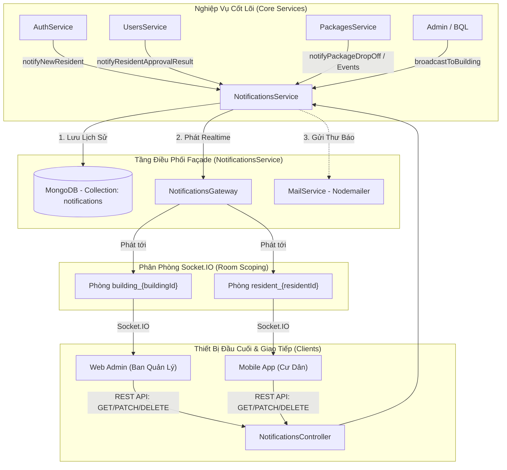
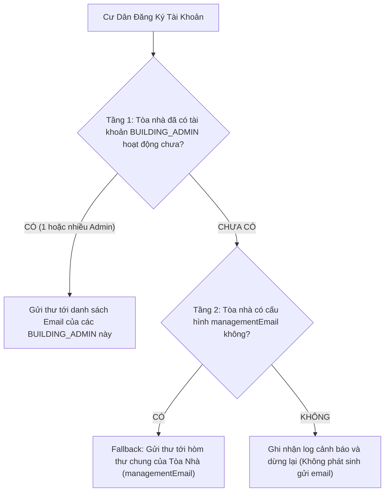

# Module Thông Báo Thời Gian Thực (Notifications Module)

## 1. Tổng Quan Module

Module `Notifications` chịu trách nhiệm điều phối và truyền tải các sự kiện thời gian thực (Real-time Events) giữa máy chủ Backend, giao diện quản trị Web Admin (`Smart-Locker-Admin`) và ứng dụng di động của cư dân (`Smart-Locker-Mobile`).

Hệ thống sử dụng thư viện **Socket.IO** trên nền tảng NestJS WebSockets Gateway, kết hợp cùng mô hình kiến trúc **Façade Pattern** (`NotificationsService`) để chuẩn hóa điểm điều phối tập trung, sẵn sàng tích hợp thêm các kênh thông báo đẩy (Expo Push Notification, Firebase Cloud Messaging) trong tương lai.

---

## 2. Kiến Trúc Kỹ Thuật (Architecture & Scoping)



### Thông Số Kết Nối WebSocket:
- **Giao thức**: WebSocket / HTTP Long-polling (Socket.IO v4)
- **Namespace**: `/notifications`
- **Cổng kết nối**: Cùng cổng với HTTP Server (`http://localhost:5005` hoặc `process.env.PORT`)
- **CORS**: `origin: '*'`, `credentials: true`

---

## 3. Cơ Chế Phân Phòng (Multi-tenant Room Scoping)

Để đảm bảo bảo mật dữ liệu và tránh tình trạng phát tán thông báo sai tòa nhà (Noise Pollution), hệ thống phân tách kết nối thành các phòng riêng biệt:

| Tên Phòng (Room Key) | Đối Tượng Tham Gia | Mục Đích Sử Dụng |
| :--- | :--- | :--- |
| `building_{buildingId}` | Ban Quản Lý tòa nhà (`BUILDING_ADMIN`) | Nhận cảnh báo cư dân mới đăng ký chờ duyệt, thông báo kiện hàng giao tại tủ của tòa nhà, cảnh báo kiện hàng quá hạn. |
| `resident_{residentId}` | Tài khoản Cư Dân (`RESIDENT`) trên Mobile | Nhận thông báo phê duyệt hồ sơ cá nhân, mã OTP nhận hàng, thông báo khi shipper gửi đồ vào tủ. |

---

## 4. Đặc Tả Sự Kiện WebSocket (Socket.IO Events Specification)

### 4.1. Sự Kiện Từ Client Gửi Lên Server (Inbound Messages)

#### 1. `join_building` - Tham gia phòng thông báo của Tòa Nhà
Dành cho Web Admin đăng ký nhận thông báo thuộc phạm vi tòa nhà mình quản trị ngay sau khi đăng nhập.

- **Payload gửi lên**:
```json
{
  "buildingId": "6a978676c4f29c7ea2913b13"
}
```
- **Sự kiện phản hồi từ Server (`joined_building`)**:
```json
{
  "room": "building_6a978676c4f29c7ea2913b13",
  "message": "Tham gia phòng nhận thông báo tòa nhà thành công"
}
```

---

#### 2. `leave_building` - Rời khỏi phòng nhận tin của Tòa Nhà
Sử dụng khi Quản trị viên đăng xuất hoặc chuyển đổi vùng giám sát.

- **Payload gửi lên**:
```json
{
  "buildingId": "6a978676c4f29c7ea2913b13"
}
```

---

#### 3. `join_resident` - Tham gia phòng cá nhân của Cư Dân
Dành cho ứng dụng di động của cư dân lắng nghe kết quả hồ sơ hoặc mã nhận đồ cá nhân.

- **Payload gửi lên**:
```json
{
  "residentId": "6543210fedcba98765432101"
}
```

---

### 4.2. Sự Kiện Từ Server Phát Xuống Client (Outbound Events)

#### 1. `NEW_PENDING_RESIDENT` - Thông báo hồ sơ cư dân mới chờ duyệt
- **Thời điểm kích hoạt**: Khi cư dân hoàn tất gọi API `POST /auth/register/resident`.
- **Kênh phát**: Toàn bộ socket client nằm trong phòng `building_{buildingId}`.
- **Cấu trúc Payload**:
```json
{
  "type": "NEW_PENDING_RESIDENT",
  "title": "Hồ sơ cư dân mới chờ duyệt",
  "message": "Cư dân Trần Xuân Phát (Căn hộ: A1204) vừa hoàn tất đăng ký",
  "resident": {
    "id": "6a982931a789123bca012984",
    "name": "Trần Xuân Phát",
    "phone": "0987654321",
    "email": "resident@gmail.com",
    "apartment": "A1204",
    "buildingId": "6a978676c4f29c7ea2913b13",
    "createdAt": "2026-09-02T03:25:19.000Z"
  },
  "timestamp": "2026-09-02T03:25:19.012Z"
}
```

---

#### 2. `RESIDENT_APPROVAL_RESULT` - Kết quả xét duyệt hồ sơ cư dân
- **Thời điểm kích hoạt**: Khi Ban Quản Lý gọi `PATCH /users/:id/approve` hoặc `PATCH /users/:id/reject`.
- **Kênh phát**: Phòng `building_{buildingId}` (để cập nhật bảng danh sách trên Web Admin) và phòng `resident_{residentId}` (để mở khóa màn hình trên Mobile App).
- **Cấu trúc Payload**:
```json
{
  "type": "RESIDENT_APPROVAL_RESULT",
  "residentId": "6a982931a789123bca012984",
  "status": "ACTIVE",
  "apartment": "A1204",
  "reason": null,
  "timestamp": "2026-09-02T03:30:00.000Z"
}
```
*Trường hợp bị từ chối (`REJECTED`):*
```json
{
  "type": "RESIDENT_APPROVAL_RESULT",
  "residentId": "6a982931a789123bca012984",
  "status": "REJECTED",
  "apartment": "A1204",
  "reason": "Thông tin hợp đồng thuê chưa trùng khớp với số CCCD.",
  "timestamp": "2026-09-02T03:30:00.000Z"
}
```

---

## 5. Hướng Dẫn Tích Hợp Phía Client (Client Integration Guide)

### 5.1. Dành Cho Web Admin (`Smart-Locker-Admin` - React / Vite)

Cài đặt thư viện:
```bash
npm install socket.io-client
```

Khởi tạo kết nối và lắng nghe trong Hook hoặc Component Dashboard:
```typescript
import { useEffect } from 'react';
import { io, Socket } from 'socket.io-client';

let socket: Socket | null = null;

export const useAdminNotifications = (buildingId?: string) => {
  useEffect(() => {
    if (!buildingId) return;

    // 1. Kết nối tới namespace /notifications
    socket = io('http://localhost:5005/notifications', {
      transports: ['websocket'],
      withCredentials: true,
    });

    socket.on('connect', () => {
      console.log('Đã kết nối tới máy chủ Socket thông báo:', socket?.id);
      // 2. Gia nhập phòng của tòa nhà
      socket?.emit('join_building', { buildingId });
    });

    // 3. Lắng nghe thông báo cư dân đăng ký mới
    socket.on('NEW_PENDING_RESIDENT', (data) => {
      console.log('Có cư dân mới:', data);
      // Gọi hàm hiển thị thông báo Toast và cập nhật lại danh sách PENDING
    });

    // 4. Lắng nghe kết quả cập nhật trạng thái duyệt
    socket.on('RESIDENT_APPROVAL_RESULT', (data) => {
      console.log('Cập nhật trạng thái duyệt:', data);
    });

    return () => {
      if (socket) {
        socket.emit('leave_building', { buildingId });
        socket.disconnect();
      }
    };
  }, [buildingId]);
};
```

---

### 5.2. Dành Cho Ứng Dụng Di Động (`Smart-Locker-Mobile` - React Native / Expo)

```typescript
import { useEffect } from 'react';
import { io, Socket } from 'socket.io-client';

export const useResidentSocket = (residentId?: string) => {
  useEffect(() => {
    if (!residentId) return;

    const socket: Socket = io('http://192.168.1.x:5005/notifications', {
      transports: ['websocket'],
    });

    socket.on('connect', () => {
      socket.emit('join_resident', { residentId });
    });

    socket.on('RESIDENT_APPROVAL_RESULT', (payload) => {
      if (payload.status === 'ACTIVE') {
        // Tự động chuyển hướng màn hình hoặc thông báo thành công
      } else {
        // Hiển thị thông báo từ chối kèm lý do
      }
    });

    return () => {
      socket.disconnect();
    };
  }, [residentId]);
};
```

---

## 6. Dịch Vụ Gửi Email Thông Báo (Email Notification Service)

Bên cạnh kênh truyền thời gian thực qua WebSocket, hệ thống tích hợp dịch vụ gửi Email thông báo qua giao thức SMTP (`MailService` sử dụng thư viện `nodemailer`) nhằm phục vụ lưu trữ văn bản chính thức và thông báo ngoại tuyến (Offline Notification) cho Ban Quản Lý và Cư Dân.

### 6.1. Chiến Lược Điều Phối Người Nhận 2 Tầng (2-Tier Email Routing)

Để đảm bảo email thông báo luôn đến đúng người phụ trách trực tiếp và không gửi thư rác tới Quản trị viên hệ thống:



---

### 6.2. Danh Sách Các Mẫu Email Thông Báo (Email Templates)

#### 1. Thông Báo Tiếp Nhận Hồ Sơ Cư Dân Mới (Gửi Ban Quản Lý)
- **Mục đích**: Thông báo cho BQL tòa nhà khi có cư dân đăng ký căn hộ mới để vào xét duyệt.
- **Tiêu đề thư**: `[SMART LOCKER] Yêu cầu phê duyệt cư dân mới - Căn hộ <số căn hộ>`
- **Nội dung hiển thị**: Bảng thông tin định danh (*Họ tên, SĐT, Căn hộ, Tòa nhà, Email cá nhân*) kèm nút bấm chuyển hướng trực tiếp: `[ TRUY CẬP BẢNG QUẢN TRỊ XÉT DUYỆT ]` trỏ tới `${ADMIN_DASHBOARD_URL}/residents`.

#### 2. Thông Báo Phê Duyệt Hồ Sơ Thành Công (Gửi Cư Dân)
- **Mục đích**: Chúc mừng cư dân sau khi Ban Quản Lý bấm duyệt hồ sơ (`PATCH /users/:id/approve`).
- **Tiêu đề thư**: `🎉 Hồ sơ cư dân căn hộ <số căn hộ> đã được phê duyệt thành công!`
- **Nội dung hiển thị**: Banner xanh lá (`#10B981`), thông báo kích hoạt tài khoản và hướng dẫn đăng nhập ứng dụng di động Smart Locker để nhận mã OTP mở tủ.

#### 3. Thông Báo Từ Chối Hồ Sơ Cư Dân (Gửi Cư Dân)
- **Mục đích**: Giải thích rõ lý do hồ sơ bị từ chối (`PATCH /users/:id/reject`) để cư dân liên hệ BQL điều chỉnh.
- **Tiêu đề thư**: `Thông báo về hồ sơ đăng ký cư dân tại <tên tòa nhà>`
- **Nội dung hiển thị**: Banner đỏ (`#EF4444`), khối cảnh báo hiển thị chính xác lý do do BQL nhập và hotline liên hệ sảnh tòa nhà.

---

### 6.3. Cấu Hình Biến Môi Trường (.env Parameters)

Các biến cấu hình bắt buộc để kích hoạt tính năng gửi email trong tệp `server/.env`:

```env
# Địa chỉ máy chủ SMTP
MAIL_HOST=smtp.gmail.com

# Cổng kết nối SMTP (587 cho TLS hoặc 465 cho SSL)
MAIL_PORT=587

# Tài khoản Gmail gửi thư
MAIL_USER=bql.smartlocker@gmail.com

# Mật khẩu ứng dụng 16 ký tự của Google (Google App Password)
MAIL_PASS=xxxx xxxx xxxx xxxx

# Tên hiển thị thương hiệu của người gửi
MAIL_FROM="Smart Locker System <no-reply@smartlocker.vn>"

# Địa chỉ Web Admin để gắn vào nút bấm điều hướng trong email
ADMIN_DASHBOARD_URL=http://localhost:5173
```

---

## 7. Xử Lý Ngoại Lệ & Độ Tin Cậy Hệ Thống (Reliability & Fault Tolerance)

1. **Thực Thi Bất Đồng Bộ Không Gây Nghẽn (Non-blocking Execution)**:
   - Quá trình gửi email qua SMTP thường mất từ 2 đến 6 giây do độ trễ mạng của máy chủ bưu chính. Toàn bộ logic gửi thư trong `AuthService` và `UsersService` được thực thi dưới dạng **Promise không block (`.catch()`)**, đảm bảo API HTTP phản hồi mã `201 Created` ngay lập tức cho ứng dụng di động mà không phải chờ gửi mail xong.
2. **Chế Độ Mô Phỏng An Toàn (Mock Simulation Mode)**:
   - Khi chạy dưới môi trường phát triển (Local Development) hoặc khi chưa điền thông số `MAIL_USER`/`MAIL_PASS`, `MailService` tự động phát hiện và chuyển sang chế độ mô phỏng, xuất nội dung thư ra console terminal thay vì ném ngoại lệ làm sập server.
3. **Bọc Lỗi Tách Biệt (Isolated Error Boundaries)**:
   - Mọi thao tác phát sự kiện từ `NotificationsService` và gửi email từ `MailService` được cô lập riêng biệt. Sự cố rớt mạng của một kênh thông báo không bao giờ làm gián đoạn kênh còn lại hoặc ảnh hưởng đến dữ liệu đã lưu trong MongoDB.
4. **Mở Rộng Quy Mô (Future Scaling)**:
   - Đối với WebSocket: Sẵn sàng cấu hình Redis Adapter (`@socket.io/redis-adapter`) khi nhân rộng nhiều cụm server chạy sau Nginx Load Balancer.
   - Đối với Email: Sẵn sàng chuyển đổi phương thức `sendMail` sang REST API của các nhà cung cấp như Resend hoặc SendGrid mà không làm thay đổi giao diện gọi hàm của các service nghiệp vụ.

---

## 8. Thiết Kế Cơ Sở Dữ Liệu & Lưu Trữ (MongoDB Schema & Indexes)

Bên cạnh kênh truyền tải thời gian thực Socket.IO, các thông báo được lưu trữ bền vững trong MongoDB (Collection: `notifications`) nhằm phục vụ màn hình Hộp Thư Thông Báo (Notification Center / Inbox) trên Mobile App và Web Admin.

### 8.1. Cấu Trúc Bảng `notifications` (Notification Schema)

| Tên Trường (Field) | Kiểu Dữ Liệu | Bắt Buộc | Mô Tả & Ý Nghĩa Nghiệp Vụ |
| :--- | :--- | :--- | :--- |
| `recipientId` | `ObjectId` (Ref: `User`) | **Có** | Định danh người dùng nhận thông báo (Cư dân hoặc Quản trị viên). |
| `buildingId` | `ObjectId` (Ref: `Building`) | Không | Định danh tòa nhà liên quan tới thông báo (nếu có). |
| `title` | `String` | **Có** | Tiêu đề ngắn gọn hiển thị trên thông báo hoặc banner. |
| `message` | `String` | **Có** | Nội dung chi tiết của thông báo. |
| `category` | `Enum (NotificationCategory)` | **Có** | Nhóm danh mục: `ACCOUNT`, `HARDWARE`, `PACKAGE`, `SYSTEM`. |
| `type` | `Enum (NotificationType)` | **Có** | Mã sự kiện cụ thể (ví dụ: `PACKAGE_ARRIVED`, `LOCKER_OFFLINE`). |
| `priority` | `Enum (NotificationPriority)` | **Có** | Mức độ ưu tiên: `LOW`, `NORMAL`, `HIGH`, `CRITICAL` (Mặc định: `NORMAL`). |
| `isRead` | `Boolean` | **Có** | Trạng thái đã đọc hay chưa (Mặc định: `false`). |
| `readAt` | `Date` | Không | Thời điểm người dùng nhấn vào đọc thông báo. |
| `actionUrl` | `String` | Không | Đường dẫn Deep Link để điều hướng trên App (ví dụ: `/locker/pickup?box=3`). |
| `metadata` | `Record<string, any>` | Không | Dữ liệu mở rộng linh hoạt (Mã OTP, mã kiện, số ngăn, thông số IoT). |
| `createdAt` / `updatedAt` | `Date` | Tự động | Thời điểm tạo và cập nhật do Mongoose Timestamps quản lý. |

### 8.2. Hệ Thống Chỉ Mục Tối Ưu Hóa (Indexes & TTL)

Nhằm đảm bảo hiệu năng truy vấn cao nhất khi số lượng thông báo tăng trưởng theo thời gian:
1. **Chỉ mục kết hợp lấy danh sách hộp thư theo thời gian**: `{ recipientId: 1, createdAt: -1 }`
2. **Chỉ mục đếm nhanh số lượng chưa đọc**: `{ recipientId: 1, isRead: 1 }`
3. **Chỉ mục truy vấn thông báo theo tòa nhà**: `{ buildingId: 1, createdAt: -1 }`
4. **Chỉ mục lọc theo danh mục lĩnh vực**: `{ recipientId: 1, category: 1 }`
5. **Chỉ mục tự động dọn rác (TTL Index - 90 ngày)**: `{ createdAt: 1 }` với `expireAfterSeconds: 7776000` (90 * 24 * 3600), tự động xóa các thông báo cũ sau 90 ngày nhằm tiết kiệm dung lượng lưu trữ.

---

## 9. Danh Mục Phân Loại Sự Kiện (Notification Enums)

### 9.1. Nhóm Lĩnh Vực (`NotificationCategory`)
- `ACCOUNT`: Sự kiện liên quan tới tài khoản cư dân, đăng ký, duyệt hồ sơ.
- `HARDWARE`: Sự kiện cảm biến IoT, trạng thái đóng mở cửa, mất kết nối trạm tủ.
- `PACKAGE`: Sự kiện chu trình giao nhận bưu kiện, mã OTP, quá hạn lưu tủ.
- `SYSTEM`: Thông báo bảo trì, phát thanh từ Ban Quản Lý, cảnh báo hệ thống.

### 9.2. Mức Độ Ưu Tiên (`NotificationPriority`)
- `LOW`: Thông báo thường nhật, báo cáo định kỳ (không rung/chuông khẩn).
- `NORMAL`: Thông báo tiêu chuẩn (kết quả duyệt hồ sơ, tin tức tòa nhà).
- `HIGH`: Thông báo có bưu kiện mới đến kèm mã OTP, nhắc nhở lấy hàng.
- `CRITICAL`: Cảnh báo xâm nhập trái phép tủ, cạy cửa, trạm tủ mất kết nối.

### 9.3. Chi Tiết Mã Sự Kiện (`NotificationType`)

| Danh Mục | Mã Sự Kiện (`NotificationType`) | Đối Tượng Nhận | Ý Nghĩa Kích Hoạt |
| :--- | :--- | :--- | :--- |
| **ACCOUNT** | `RESIDENT_REGISTRATION_PENDING` | Quản Trị Viên (BQL) | Có cư dân mới gửi hồ sơ đăng ký chờ duyệt. |
| | `RESIDENT_APPROVED` | Cư Dân | Hồ sơ cư dân được Ban Quản Lý phê duyệt thành công. |
| | `RESIDENT_REJECTED` | Cư Dân | Hồ sơ cư dân bị từ chối kèm lý do. |
| | `RESIDENT_ACCOUNT_UPDATED` | Cư Dân / BQL | Thông tin căn hộ hoặc tài khoản được cập nhật. |
| **PACKAGE** | `PACKAGE_ARRIVED` | Cư Dân | Shipper gửi kiện hàng thành công vào ngăn tủ, sinh mã OTP. |
| | `PACKAGE_PICKED_UP` | Cư Dân | Cư dân đã mở ngăn và hoàn tất nhận kiện hàng. |
| | `PACKAGE_OVERDUE` | Cư Dân / BQL | Kiện hàng lưu trữ trong ngăn tủ vượt quá thời hạn quy định. |
| | `PACKAGE_DAMAGED_REPORTED` | BQL / Shipper | Cư dân báo cáo kiện hàng bị móp méo, hư hại. |
| | `PACKAGE_MANUAL_OVERRIDE` | BQL | Quản trị viên sử dụng quyền cưỡng chế mở ngăn tủ. |
| **HARDWARE** | `LOCKER_OFFLINE` | BQL / Kỹ Thuật | Trạm tủ bị ngắt kết nối mạng hoặc mất nguồn. |
| | `LOCKER_ONLINE` | BQL / Kỹ Thuật | Trạm tủ đã kết nối lại bình thường. |
| | `LOCKER_DOOR_FORCED` | BQL / An Ninh | Phát hiện cửa ngăn tủ bị cạy mở trái phép. |
| | `LOCKER_DOOR_LEFT_OPEN` | BQL | Cửa ngăn tủ bị mở quên quá thời gian cho phép. |
| | `LOCKER_HARDWARE_FAULT` | Kỹ Thuật | Lỗi cảm biến, kẹt chốt khóa điện từ tử locker. |
| | `LOCKER_CAPACITY_WARNING` | BQL / Shipper | Trạm tủ sắp đầy ngăn chứa (trên 90% công suất). |
| **SYSTEM** | `SYSTEM_ANNOUNCEMENT` | Toàn Bộ Cư Dân | Ban Quản Lý phát thông báo bảo trì, tin tức nội khu. |
| | `SECURITY_ALERT` | BQL / An Ninh | Cảnh báo an ninh hoặc sự cố khẩn cấp. |

---

## 10. Đặc Tả REST API Hộp Thư Thông Báo (REST API Specification)

Tất cả các API yêu cầu gắn Header xác thực: `Authorization: Bearer <access_token>`.

### 10.1. `GET /notifications` - Lấy danh sách thông báo phân trang
- **Mô tả**: Trả về danh sách thông báo của người dùng hiện tại kèm phân trang và tổng số chưa đọc.
- **Query Parameters**:
  - `page` (number, default: 1): Trang hiện tại.
  - `limit` (number, default: 20): Số lượng bản ghi trên một trang.
  - `category` (string, optional): Lọc theo nhóm (`ACCOUNT`, `HARDWARE`, `PACKAGE`, `SYSTEM`).
  - `priority` (string, optional): Lọc theo độ ưu tiên (`LOW`, `NORMAL`, `HIGH`, `CRITICAL`).
  - `isRead` (boolean, optional): `true` (đã đọc) hoặc `false` (chưa đọc).
- **Phản hồi mẫu (200 OK)**:
```json
{
  "data": [
    {
      "_id": "66d6a1b2c4f29c7ea2913b99",
      "recipientId": "66d6a1b2c4f29c7ea2913b10",
      "buildingId": "66d6a1b2c4f29c7ea2913b01",
      "title": "Bưu kiện mới tại Ngăn #3!",
      "message": "Đơn hàng SPX-8829103 từ Shopee Express đã được đặt tại Ngăn #3. Mã OTP nhận hàng: 482910",
      "category": "PACKAGE",
      "type": "PACKAGE_ARRIVED",
      "priority": "HIGH",
      "isRead": false,
      "readAt": null,
      "actionUrl": "/locker/pickup?box=3&otp=482910",
      "metadata": {
        "boxNumber": 3,
        "trackingNumber": "SPX-8829103",
        "pinCode": "482910"
      },
      "createdAt": "2026-09-05T03:30:00.000Z"
    }
  ],
  "pagination": {
    "page": 1,
    "limit": 20,
    "total": 1,
    "totalPages": 1,
    "hasNext": false,
    "hasPrev": false
  },
  "unreadCount": 1
}
```

### 10.2. `GET /notifications/unread-count` - Đếm nhanh số lượng chưa đọc
- **Mô tả**: Phục vụ hiển thị chấm đỏ (Badge counter) trên thanh Header / Tab bar của ứng dụng.
- **Phản hồi mẫu (200 OK)**:
```json
{
  "unreadCount": 3
}
```

### 10.3. `PATCH /notifications/:id/read` - Đánh dấu một thông báo đã đọc
- **Mô tả**: Cập nhật trạng thái `isRead = true` và `readAt = new Date()` cho thông báo sở hữu bởi người dùng.
- **Phản hồi mẫu (200 OK)**: Trả về Document thông báo vừa cập nhật.

### 10.4. `PATCH /notifications/read-all` - Đánh dấu tất cả là đã đọc
- **Mô tả**: Chuyển toàn bộ thông báo chưa đọc của người dùng hiện tại sang trạng thái đã đọc.
- **Phản hồi mẫu (200 OK)**:
```json
{
  "modifiedCount": 4
}
```

### 10.5. `DELETE /notifications/:id` - Xóa một thông báo khỏi hộp thư
- **Mô tả**: Xóa vĩnh viễn một thông báo thuộc sở hữu của người dùng hiện tại.
- **Phản hồi mẫu (200 OK)**:
```json
{
  "message": "Đã xóa thông báo thành công"
}
```

### 10.6. `POST /notifications/broadcast` - Ban Quản Lý phát thông báo toàn tòa nhà
- **Phân quyền**: Yêu cầu vai trò `BUILDING_ADMIN` hoặc `SYSTEM_ADMIN`.
- **Request Body**:
```json
{
  "buildingId": "66d6a1b2c4f29c7ea2913b01",
  "title": "Thông báo diễn tập phòng cháy chữa cháy",
  "message": "Tòa nhà sẽ tổ chức diễn tập PCCC vào lúc 09:00 sáng Thứ 7 tuần này.",
  "priority": "HIGH",
  "actionUrl": "/announcements/pccc"
}
```
- **Phản hồi mẫu (201 Created)**:
```json
{
  "message": "Phát thông báo tới cư dân tòa nhà thành công",
  "sentCount": 128
}
```

---

## 11. Dữ Liệu Mẫu & Hướng Dẫn Gieo Mầm (Seed & Testing Guide)

Dữ liệu mẫu thông báo được tích hợp sẵn trong tệp `server/src/scripts/seed.ts`. Để gieo mầm dữ liệu mẫu vào MongoDB:

```bash
cd server
npm run seed
```

### Danh Sách Tài Khoản Mẫu Để Kiểm Thử Hộp Thư:

1. **Cư Dân Mẫu**:
   - **Tài khoản**: SĐT `0912345678` / Mật khẩu: `Resident@123`
   - **Email**: `resident.vinhomes@smartlocker.vn` (Căn hộ: A1204 - Tòa S1.01)
   - **Dữ liệu thông báo có sẵn**:
     - 1 thông báo bưu kiện mới đến có mã OTP và nút nhận hàng (`PACKAGE_ARRIVED`, chưa đọc, ưu tiên `HIGH`).
     - 1 thông báo cảnh báo kiện hàng quá 24h (`PACKAGE_OVERDUE`, chưa đọc, ưu tiên `HIGH`).
     - 1 thông báo hồ sơ cư dân đã được BQL duyệt (`RESIDENT_APPROVED`, đã đọc, ưu tiên `NORMAL`).
     - 1 thông báo bảo trì hệ thống tủ định kỳ (`SYSTEM_ANNOUNCEMENT`, đã đọc, ưu tiên `LOW`).

2. **Quản Trị Viên Hệ Thống (Admin)**:
   - **Tài khoản**: Email `admin@smartlocker.vn` / Mật khẩu: `AdminPassword@123`
   - **Dữ liệu thông báo có sẵn**:
     - 1 yêu cầu cư dân mới đăng ký căn hộ chờ duyệt (`RESIDENT_REGISTRATION_PENDING`, chưa đọc, ưu tiên `NORMAL`).
     - 1 cảnh báo khẩn cấp trạm tủ mất kết nối mạng (`LOCKER_OFFLINE`, chưa đọc, ưu tiên `CRITICAL`).
     - 1 báo cáo tổng kết vận hành hệ thống hàng ngày (`SYSTEM_ANNOUNCEMENT`, đã đọc, ưu tiên `LOW`).

