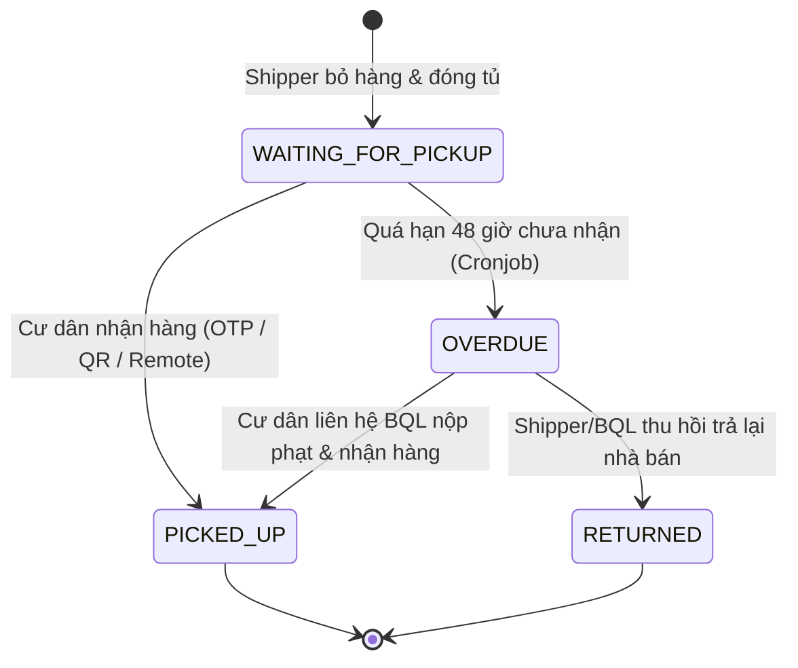
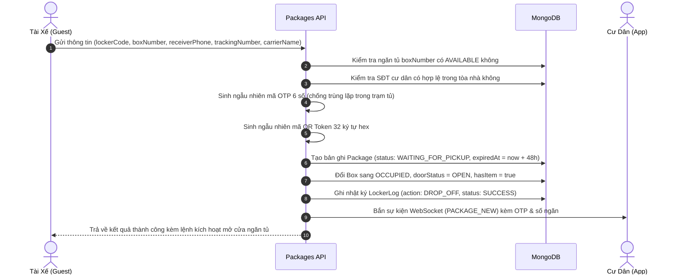
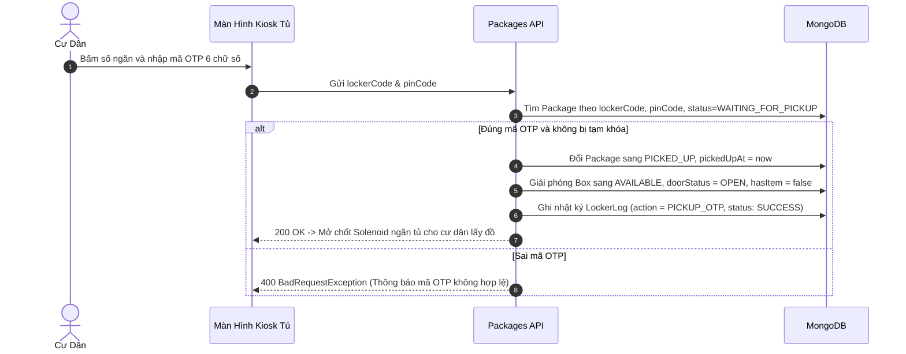
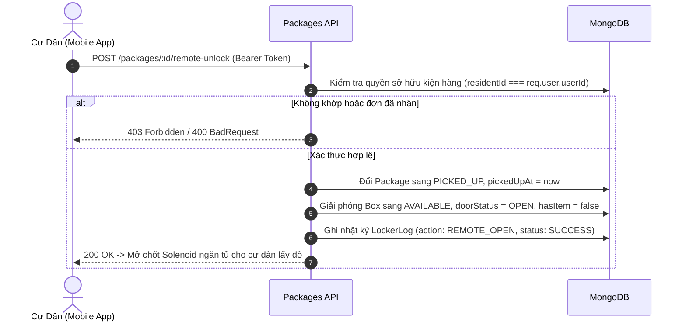

# Module Quản Lý Bưu Kiện & Giao Nhận (Packages Module)

## 1. Tổng Quan Module

Module `Packages` là trái tim nghiệp vụ của hệ thống Smart Locker, điều phối toàn bộ chu trình xử lý bưu phẩm từ khi hàng tới chung cư cho đến khi đến tay cư dân:
- **Tài xế giao hàng không cần tài khoản (No-Auth Guest Shipper)**: Cho phép tài xế của mọi đơn vị vận chuyển (Shopee Xpress, GHTK, GHN, Viettel Post, GrabExpress...) quét mã QR trên thân tủ để gửi hàng mà không cần cài ứng dụng hay đăng ký tài khoản.
- **Hệ thống sinh mã kép (Dual Retrieval Methods)**: Sinh đồng thời mã OTP 6 số bảo mật (dùng nhập trên bàn phím/màn hình Kiosk) và mã QR Token động (dùng quét trước camera của trạm tủ).
- **Thông báo thời gian thực (Real-time Notifications)**: Ngay khi shipper hoàn tất đóng tủ, hệ thống tự động phát sự kiện WebSocket tới phòng riêng của cư dân (`resident_{residentId}`) để gửi thông báo tức thì lên điện thoại.
- **Tác vụ nền tự động hóa (Automated Cronjobs)**: Tự động rà soát bưu kiện theo từng giờ bằng `@nestjs/schedule`, chuyển trạng thái các đơn quá 48 giờ chưa lấy sang `OVERDUE` để Ban Quản Lý có kế hoạch xử lý.
- **Ghi vết kiểm toán (Audit Trail)**: Mọi thao tác gửi hàng, lấy hàng bằng OTP/QR đều được lưu vết sang bảng `LockerLog` phục vụ giải quyết khiếu nại.

---

## 2. Mô Hình Dữ Liệu (Package Schema Definition)

Bảng dữ liệu `packages` trong MongoDB:

| Trường Dữ Liệu | Kiểu Dữ Liệu | Ràng Buộc | Ý Nghĩa Nghiệp Vụ & Thiết Kế |
| :--- | :--- | :--- | :--- |
| `_id` | `Types.ObjectId` | Tự động sinh | Khóa chính duy nhất của bưu kiện |
| `trackingNumber` | `String` | `required, uppercase, trim, index` | Mã vận đơn của nhà vận chuyển (ví dụ: `SPX839201948`) |
| `lockerId` | `Types.ObjectId` | `ref: 'Locker', required, index` | Trạm tủ đang lưu giữ bưu phẩm |
| `boxId` | `Types.ObjectId` | `ref: 'Box', required, index` | Ngăn tủ con cụ thể chứa bưu phẩm |
| `boxNumber` | `Number` | `required, min: 1` | Số thứ tự ngăn tủ (in trên mặt ngoài cánh tủ) |
| `boxSize` | `String (Enum)` | `enum: BoxSize, required` | Phân loại cỡ ngăn tủ (`SMALL`, `MEDIUM`, `LARGE`) |
| `buildingId` | `Types.ObjectId` | `ref: 'Building', required, index` | Tòa nhà của cư dân thụ hưởng |
| `residentId` | `Types.ObjectId` | `ref: 'User', required, index` | Tài khoản cư dân (dùng để phân quyền truy cập) |
| `receiverPhone` | `String` | `required, trim` | **Snapshot**: SĐT người nhận tại thời điểm gửi hàng |
| `receiverName` | `String` | `required, trim` | **Snapshot**: Họ tên người nhận tại thời điểm gửi hàng |
| `apartment` | `String` | `required, trim` | **Snapshot**: Số căn hộ người nhận tại thời điểm gửi hàng |
| `shipperPhone` | `String` | `required, trim, index` | Số điện thoại của tài xế thực hiện gửi hàng |
| `shipperName` | `String` | `optional, trim` | Tên của tài xế (nếu có cung cấp) |
| `carrierName` | `String` | `required, trim` | Đơn vị vận chuyển (ví dụ: *Shopee Xpress, GHTK*) |
| `pinCode` | `String` | `required, index, trim` | Mã OTP nhận hàng gồm 6 số ngẫu nhiên duy nhất trong trạm |
| `qrCodeToken` | `String` | `required, unique, index` | Chuỗi token bảo mật 32 ký tự hex render mã QR động |
| `failedAttempts` | `Number` | `default: 0` | Số lần nhập sai mã OTP liên tiếp tại trạm tủ |
| `lockedUntil` | `Date` | `optional` | Thời điểm mở khóa nếu bị tạm khóa do nhập sai quá 5 lần |
| `status` | `String (Enum)` | `enum: PackageStatus, default: WAITING_FOR_PICKUP` | Trạng thái: `WAITING_FOR_PICKUP`, `PICKED_UP`, `OVERDUE`, `RETURNED` |
| `droppedOffAt` | `Date` | `required, default: Date.now` | Thời điểm tài xế gửi hàng vào ngăn tủ thành công |
| `pickedUpAt` | `Date` | `optional` | Thời điểm cư dân mở tủ lấy hàng ra |
| `expiredAt` | `Date` | `required` | Hạn chót lấy hàng (mặc định = `droppedOffAt` + 48 giờ) |
| `note` | `String` | `optional, trim` | Ghi chú thêm về kiện hàng (ví dụ: *Hàng dễ vỡ*) |

> **Thiết kế Snapshotting (Extended Reference Pattern):**
> Ba trường `receiverPhone`, `receiverName`, `apartment` được lưu snapshot trực tiếp bên cạnh `residentId` nhằm đảm bảo **tính toàn vẹn lịch sử bất biến**. Nếu sau này cư dân chuyển căn hộ hoặc xóa tài khoản, lịch sử bưu kiện trong quá khứ vẫn giữ nguyên thông tin đúng với thời điểm giao hàng mà không bị sai lệch hay trả về `null`.

### Chỉ Mục Cơ Sở Dữ Liệu Tối Ưu (Indexes):
- `{ lockerId: 1, pinCode: 1, status: 1 }`: **Compound Index** (Cư dân bấm OTP tại Kiosk $\rightarrow$ Tìm kiếm bản ghi trong < 2ms).
- `{ residentId: 1, status: 1 }`: **Compound Index** (Tối ưu truy vấn danh sách kiện hàng đang chờ của cư dân trên Mobile App).
- `{ qrCodeToken: 1 }`: **Unique Index** (Quét mã QR token mở tủ tức thì).
- `{ status: 1, expiredAt: 1 }`: **Index** (Cronjob rà soát đơn hàng quá hạn 48 giờ).

---

## 3. Vòng Đời Bưu Kiện (Package Lifecycle State Machine)

---

## 4. Danh Sách API Endpoints (RBAC)

| Endpoint | Method | Phân Quyền (RBAC) | Mô Tả Nghiệp Vụ |
| :--- | :---: | :---: | :--- |
| `/packages/drop-off` | `POST` | **Public (Guest)** | Tài xế gửi hàng vào ngăn tủ, khóa Box, sinh OTP 6 số |
| `/packages/pickup/otp` | `POST` | **Public / Kiosk** | Cư dân nhập OTP 6 số tại màn hình trạm tủ để mở chốt |
| `/packages/pickup/qr` | `POST` | **Public / Kiosk** | Quét mã QR token trước camera trạm tủ để mở chốt |
| `/packages/:id/remote-unlock` | `POST` | `RESIDENT` *(JWT)* | Cư dân nhấn nút mở ngăn tủ từ xa trên Mobile App |
| `/packages/my-packages`| `GET` | `RESIDENT` *(JWT)* | Cư dân xem danh sách các kiện hàng của chính mình |
| `/packages/:id` | `GET` | `RESIDENT` *(JWT)* | Xem chi tiết bưu kiện, ngăn chứa, hạn lấy |
| `/packages/:id/qr-token`| `GET`| `RESIDENT` *(JWT)* | Lấy mã QR Token động hiển thị trên ứng dụng di động |

---

## 5. Các Luồng Nghiệp Vụ Cốt Lõi

### 5.1. Luồng Tài Xế Gửi Hàng (`POST /packages/drop-off`)

### 5.2. Luồng Nhận Hàng Bằng Mã OTP Tại Màn Hình Kiosk (`POST /packages/pickup/otp`)

### 5.3. Luồng Cư Dân Mở Tủ Từ Xa Trên Ứng Dụng Di Động (`POST /packages/:id/remote-unlock`)

---

## 6. Cơ Chế Bảo Mật & Chống Gian Lận (Security Rules)

1. **Chống Xung Đột Mã OTP (PIN Collision Avoidance)**:
   - Hệ thống đảm bảo tại một thời điểm, **không bao giờ có 2 bưu kiện khác nhau trong cùng một trạm tủ sở hữu chung mã OTP 6 số**. Thuật toán tạo mã có vòng lặp đối soát với cơ sở dữ liệu trước khi cấp phát.
2. **Chống Tấn Công Dò Mã (Brute-force Protection)**:
   - Mỗi bưu kiện ghi nhận số lần nhập sai liên tiếp (`failedAttempts`). Nếu nhập sai quá 5 lần, ngăn tủ sẽ tự động kích hoạt thời gian khóa tạm thời (`lockedUntil: +15 phút`) để ngăn chặn việc dò mã tại bàn phím Kiosk.
3. **Mã QR Động 32 Ký Tự Hex**:
   - Thay vì dùng ID đơn hàng cố định dễ bị đoán, mã QR Token được mã hóa từ nguồn ngẫu nhiên `crypto.randomBytes(16).toString('hex')`, chỉ có giá trị khi đơn hàng đang ở trạng thái `WAITING_FOR_PICKUP`.
4. **Xác thực Chủ Sở Hữu Khi Mở Từ Xa (Ownership Verification)**:
   - Endpoint mở tủ từ xa bắt buộc chứng thực qua Access Token JWT, đối soát chặt chẽ `package.residentId === req.user.userId`, ngăn chặn tuyệt đối việc cư dân mở trộm ngăn tủ của căn hộ khác.
